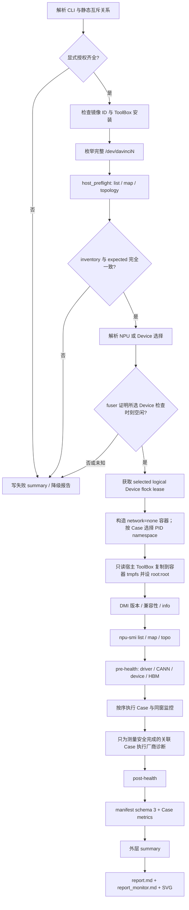

<!--
 Copyright 2026 FlagOS Contributors

 Licensed under the Apache License, Version 2.0 (the "License");
 you may not use this file except in compliance with the License.
 You may obtain a copy of the License at

     http://www.apache.org/licenses/LICENSE-2.0

 Unless required by applicable law or agreed to in writing, software
 distributed under the License is distributed on an "AS IS" BASIS,
 WITHOUT WARRANTIES OR CONDITIONS OF ANY KIND, either express or implied.
 See the License for the specific language governing permissions and
 limitations under the License.
 -->

# Ascend A3 / 910C Base Toolkit 当前测试机制与使用手册

本文面向需要运行、审阅或扩展 `base/toolkits/**/ascend/A3/` 的用户。它以当前代码为主线，回答：

1. 脚本会在什么环境、哪些 Device 上运行；
2. 每个 Case 的真实 workload、参数、指标和诊断是什么；
3. 如何安全选卡、运行和读取结果；
4. 哪些结论已有实机证据，哪些仍只是实现或离线验证。

公开环境、验证边界及维护方法见 [Ascend 指南](../../docs/ascend/README.md)。历史摘要不代表本次重验。

---

## 1. 三十秒掌握：推荐入口、默认范围与结论边界

### 1.1 推荐从空闲物理 NPU 的最小闭环开始

以下示例选择物理 NPU 1。当前已知本机映射中，它对应逻辑 Device 2、3；真正执行前仍以当次
`npu-smi info -m` 为准：

```bash
cd FlagPerf

python3 base/run.py toolkit run \
  --npu-ids 1 \
  --allow-privileged-root \
  --allow-disruptive-dmi
```

这不是“无副作用查询”。算力、带宽、时延和诊断命令会主动占用所选设备；两个授权参数要求操作者
明确接受 privileged root 容器和 DMI workload 的影响。脚本会先做宿主机 inventory 与占用检查，
随后会为解析出的 logical Device 获取基于 `flock` 的跨进程 lease。该 lease 能阻止遵守同一协议的
FlagPerf 进程互相抢卡，但不能阻止外部程序，因此不能替代调度器的资源授权。

容器始终使用 host IPC namespace。默认 Toolkit 集合或显式选择
`interconnect-P2P_intraserver-latency` 时，还会使用 host PID namespace：DMI 的 P2P 时延实现需要在
父/子进程间通过 `aclrtIpcMemImportByKey` 导入设备内存，私有 PID namespace 会使驱动校验宿主 PID
失败。只运行其他 Toolkit Case 时继续保留私有 PID namespace；外层 summary 的
`container_namespaces` 记录本轮实际选择。

### 1.2 当前 Case 层级必须区分

| 层级 | 数量 | 当前含义 |
|---|---:|---|
| `base/toolkits/*/ascend/A3/` 目录库存 | 15 | 13 个单节点入口和 2 个旧跨节点入口 |
| 共享 `evidence_runner.py` 支持 | 13 | 当前可审计的单节点实现 |
| `base/run.py toolkit run` 默认 Case 集 | 12 | 13 个单节点 Case 中排除高成本 HCCL Case；设备必须显式选择 |
| 显式 opt-in | 1 | `interconnect-MPI_intraserver` |
| 当前协议之外 | 2 | `interconnect-P2P_interserver`、`interconnect-MPI_interserver` |

默认 12 个 Case 为四种计算、D2D、HBM 容量、H2D/D2H 带宽、H2D/D2H/P2P 时延、单机 P2P
带宽。单节点 MPI/HCCL AllReduce 只有显式传入 `--case interconnect-MPI_intraserver` 才运行。

### 1.3 当前软件基线

| 组件 | 当前口径 |
|---|---|
| 镜像 | `flagrt/ascend-operator-runtime:0.2.0-cann9.0-py311-torch2.10-arm64` |
| 镜像本机 ID | `sha256:892284fecf448ea354b0630dc8de6762f78b1e7adfc8d0227be9ea901fc4aa92` |
| CANN | 9.0.0 |
| MindCluster ToolBox / Ascend DMI | 26.1.0 |
| Python / PyTorch | 3.11.15 / 2.10 |
| MPI/HCCL | MPICH 4.1.3 + CANN 9.0.0 随包 `hccl_test` |

0.2.0 在 0.1.0 软件栈上补入 MPI 和 `all_reduce_test`；0.1.0 现在是回滚镜像，不能运行本文的
HCCL Case。跨机器发布仍应使用 registry digest；本机 image ID 只证明本机镜像身份。

事实源依次是 [`VERSIONS.md`](../../../VERSIONS.md)、
[`ascend910_cann9_local.yaml`](../configs/ascend910_cann9_local.yaml)、本轮 `summary.json` 和原始证据。
升级任一层后，都必须重新验证兼容性、解析器、健康、Case 与报告链路。

### 1.4 最重要的阅读规则

```text
实现存在 ≠ 离线测试通过 ≠ 当前代码版本已实机运行 ≠ 已建立稳定性能基线
```

同样：

```text
measurement_status ≠ monitoring_status ≠ diagnosis_status ≠ health coverage
```

必须结合四层事实解释结果，不能只看顶层 `status` 或一行 `[FlagPerf Result]`。

---

## 2. 从第一性原理理解可信 Toolkit 结果

### 2.1 不可省略的事实

| 事实 | 为什么不可省略 | 当前保存位置 |
|---|---|---|
| 软件与镜像身份 | 工具 ABI、命令和输出 schema 会随版本变化 | 外层 `summary.json`、`environment/` |
| 设备与拓扑范围 | 同一个数值可能是 chip、Device、card、pair 或整机 | host preflight、`topology/`、selection |
| workload 与参数 | dtype、size、方向、执行次数决定测量含义 | command 数组、stdout、Case scope |
| 原始指标与单位 | 无法从一个聚合数恢复完整序列和方向 | `metrics.json`、stdout、manifest |
| 正确性与健康 | 命令完成不代表结果正确或设备健康 | HCCL correctness、pre/post health |
| 监控与诊断 | 利用率旁证和厂商阈值诊断回答不同问题 | monitor、diagnostics |
| 时间与完整性 | 需要判断超时、采样窗和文件是否被改写 | UTC、单调时钟、墙钟、SHA-256 |

固定行号、删除原始日志、把不同单位压成一个数、把 Docker 可见性当成隔离，都不是硬约束。当前
实现保留原 Case 目录和 `main.sh` 入口，但把事实收敛到共享 runner 与 manifest。

### 2.2 三种工具不要混称为“Toolkit”

| 名称 | 当前职责 | 不应被误解为 |
|---|---|---|
| CANN Ascend Toolkit | 编译、运行库和 `hccl_test` 所在的软件栈 | MindCluster ToolBox |
| MindCluster ToolBox / Ascend DMI | 算力、带宽、时延、诊断和环境查询 | PyTorch 端到端 benchmark |
| FlagPerf `base/toolkits` | 对厂商工具的 Case 入口、调度、解析和归档 | 自己重新实现的统一 microbenchmark |

四类计算和大多数传输 Case 由 `ascend-dmi` 执行；容量和监控使用 `npu-smi`；单节点集合通信由
`mpirun` 启动 CANN 的 `hccl_test/all_reduce_test`。

---

## 3. 当前架构与完整控制流

### 3.1 组件职责

| 组件 | 职责 |
|---|---|
| [`run.py`](../run.py) | 统一 CLI facade；构造强类型请求并路由到 ToolkitExecutor |
| [`executors/toolkit.py`](../executors/toolkit.py) | Toolkit 授权、镜像检查、宿主 preflight、设备 lease、容器启动、外层 summary、报告触发 |
| [`run_toolkit.py`](../run_toolkit.py) | 迁移期 Toolkit 兼容命令；`run_local.py` 是更旧的弃用 shim |
| [`host_preflight.py`](_common/ascend/A3/host_preflight.py) | 完整 inventory、实时 NPU→Device 映射、selected-only 占用检查 |
| [`evidence_runner.py`](_common/ascend/A3/evidence_runner.py) | 单节点 13 Case、环境/健康、测量、监控、诊断、manifest 与退出码 |
| 各 Case `main.sh` | 保留原目录入口，转发至共享 runner |
| [`generate_toolkit_report.py`](../generate_toolkit_report.py) | 将 JSON 证据确定性投影为 Markdown 和静态 SVG |

### 3.2 端到端流程



### 3.3 失败也要尽量形成证据

`ToolkitExecutor` 在配置可解析后立即创建 `base/result/<UTC_RUN_ID>/`。授权、镜像、宿主环境、preflight
或容器阶段失败时，会记录 `failure_stage`、异常类型和错误；Toolkit suite 还会尝试生成没有 manifest
的降级报告。报告生成失败只写入 `summary.json.report_generation`，不得改变实验状态或退出码。

---

## 4. 安全门禁与设备选择

### 4.1 host preflight 实际证明什么

preflight 依次：

1. 从独立配置读取完整 `expected_device_ids`；
2. 枚举 `/dev/davinciN`；
3. 执行并归档 `npu-smi info -l/-m/-t topo`；
4. 要求 Device node 集合和 map 中的逻辑 ID 都与期望集合完全一致；
5. 将物理 `--npu-ids` 展开为实时映射下的逻辑 Device；
6. 仅对选中的 `/dev/davinciN` 执行 `fuser`；
7. 保存命令、stdout/stderr、rc、时间和 SHA-256。

缺失 Device、map 不一致、`fuser` 不存在、命令失败或占用状态不可解释时全部 fail closed。被排除的
Device 可以有负载，不会阻塞本轮；所选 Device 有负载则拒绝启动。

它不能证明检查后没有其他进程抢占，也不能检测运行中掉卡。容器内 DMI health 的
`result=passed` 与 lost-card 等能力的 `coverage=partial` 会分别记录。

### 4.2 三套 ID 集合

| 集合 | 含义 |
|---|---|
| `expected_device_ids` | 主机应有的完整逻辑 Device inventory |
| `requested_ids` | 用户通过 `--npu-ids` 或 `--device-ids` 输入的集合 |
| `selected_device_ids` | 按当次 map 解析后，所有主动命令必须遵守的权威目标 |

privileged 容器可能看见全部设备节点，因此 `--device` 挂载不是隔离边界。真正的边界是 compute、
bandwidth、health、diagnosis、P2P 和 HCCL 命令都消费同一 selection，并将 selected/excluded 写入证据。

### 4.3 物理 NPU 与逻辑 Device 的差异

当前实机是 8 个物理 NPU、每个两个 chip/逻辑 Device，共 16 个逻辑 Device。A3 DMI 算力的执行粒度
是完整双-die 物理 NPU：例如 `-d 2` 的厂商目标可能显示 `2/3`。因此：

- `--npu-ids 1` 会自然选中 `[2, 3]`；
- `--device-ids 2,3` 对算力合法，每个物理 NPU 只运行一次代表命令；
- 只选 `--device-ids 2` 时，算力 Case 在命令前记为 `partial`，不会静默扩选 Device 3；
- D2D、H2D、D2H、容量等仍可按其自身粒度处理已选 Device；
- P2P 和 HCCL 少于两个 Device 时为 `partial`。

---

## 5. 使用方式与参数设置

### 5.1 常用命令

运行默认 12 Case，显式选择一个已确认空闲的物理 NPU：

```bash
python3 base/run.py toolkit run \
  --npu-ids 1 \
  --allow-privileged-root --allow-disruptive-dmi
```

选择物理 NPU，支持逗号和闭区间：

```bash
python3 base/run.py toolkit run --npu-ids 1,3-4 \
  --allow-privileged-root --allow-disruptive-dmi
```

直接选择逻辑 Device：

```bash
python3 base/run.py toolkit run --device-ids 2,3,6-9 \
  --allow-privileged-root --allow-disruptive-dmi
```

只运行一个或多个 Case：

```bash
python3 base/run.py toolkit run \
  --case computation-FP16 \
  --case interconnect-P2P_intraserver \
  --npu-ids 1 \
  --allow-privileged-root --allow-disruptive-dmi
```

显式运行两 rank HCCL 小探针，将最大消息限制为 64 MiB：

```bash
python3 base/run.py toolkit run \
  --case interconnect-MPI_intraserver \
  --npu-ids 1 \
  --hccl-min-bytes 8K --hccl-max-bytes 64M \
  --allow-privileged-root --allow-disruptive-dmi
```

只为评估监控开销关闭某一监控层：

```bash
python3 base/run.py toolkit run \
  --case computation-FP16 --npu-ids 1 \
  --compute-monitor off \
  --allow-privileged-root --allow-disruptive-dmi

python3 base/run.py toolkit run \
  --case interconnect-h2d --npu-ids 1 \
  --data-movement-monitor off \
  --allow-privileged-root --allow-disruptive-dmi
```

为已有结果补生成报告，不重新执行硬件测试：

```bash
python3 base/run.py report --run-id <RUN_ID>
```

### 5.2 参数表

| 参数 | 默认 | 作用与约束 |
|---|---|---|
| `--suite` | 不适用 | 只存在于已弃用 `run_local.py`；统一入口不接受该参数 |
| `--case NAME` | 默认 Case 集 | 可重复；名称必须属于 13 个 runner Case |
| `--npu-ids SPEC` | 二选一必填 | 物理 NPU；与 `--device-ids` 互斥，只适用于 Toolkit |
| `--device-ids SPEC` | 二选一必填 | 逻辑 Device；与 `--npu-ids` 互斥，只适用于 Toolkit |
| `--allow-privileged-root` | 关闭 | 当前主机 legacy driver 路径要求；缺少时拒绝启动 |
| `--allow-disruptive-dmi` | 关闭 | 主动性能/诊断命令授权；缺少时拒绝启动 |
| `--compute-monitor on/off` | `on` | 计算 Case 的 `npu-smi usages` 同窗采样；只适用于 Toolkit |
| `--data-movement-monitor on/off` | `on` | 搬运链路或静态 HBM 作证；只适用于 Toolkit |
| `--latency-sizes SPEC` | `512,4096,65536,1048576` | 支持 K/M/G 二进制后缀；必须非空且不重复 |
| `--hccl-min-bytes` | `8K` | 自定义时必须显式选择 HCCL Case |
| `--hccl-max-bytes` | `1G` | 必须不小于最小值 |
| `--legacy-probe` | 关闭 | 迁移审计旧命令；禁止和显式选卡组合 |
| `--config PATH` | 本机 CANN 9 配置 | 镜像、inventory、设备节点、ToolBox、结果根目录 |
| `--result-root PATH` | host config 中的 `result_root` | 本次运行的结果根；每次仍创建独立 UTC run-id |
| `--timeout SEC` | `3600` | Toolkit 容器硬超时；超时按失败保存外层证据并释放设备 lease |
| `--dry-run` | 关闭 | 只输出静态计划，不检查 Docker/NPU；NPU→Device 映射延迟到正式 preflight |

`--legacy-probe` 不是日常测试模式。旧命令可能落回 Device 0 或全量范围，因此显式选卡时禁止使用。

---

## 6. 13 个单节点 Case 总览

| Case | 默认 | 主 workload | 权威指标 | 同次作证 | 厂商诊断 |
|---|:---:|---|---|---|---|
| `computation-BF16` | 是 | DMI BF16 GEMM，`--et 80` | TFLOPS | AIC/AIV/HBM/NPU usage | aiflops |
| `computation-FP16` | 是 | DMI FP16 GEMM，`--et 80` | TFLOPS | 同上 | aiflops |
| `computation-FP32` | 是 | DMI FP32 GEMM，`--et 80` | TFLOPS | 同上 | aiflops |
| `computation-INT8` | 是 | DMI INT8 GEMM，`--et 80` | TOPS | 同上 | aiflops |
| `main_memory-bandwidth` | 是 | DMI D2D | 每 Device GB/s 序列 | HBM BW usage | bandwidth |
| `main_memory-capacity` | 是 | `npu-smi memory` | 每 chip MB | memory/ECC 静态字段 | hbm |
| `interconnect-h2d` | 是 | 512 MiB × 50 | H2D GB/s | HCCS Rx/Tx | bandwidth |
| `interconnect-d2h` | 是 | 512 MiB × 50 | D2H GB/s | HCCS Rx/Tx | bandwidth |
| `interconnect-h2d-latency` | 是 | 逐 Device size sweep | ns | 当前无同窗搬运监控 | 无直接阈值 |
| `interconnect-d2h-latency` | 是 | 逐 Device size sweep | ns | 当前无同窗搬运监控 | 无直接阈值 |
| `interconnect-P2P_intraserver` | 是 | card 矩阵或 Device pair | 单/双向 GB/s | HCCS Rx/Tx + route | signalQuality |
| `interconnect-P2P_intraserver-latency` | 是 | 矩阵或有向 pair sweep | ns | 当前无同窗搬运监控 | signalQuality |
| `interconnect-MPI_intraserver` | 否 | FP32/SUM AllReduce | us + alg GB/s + correctness | HCCS Rx/Tx + route | 无直接阈值 |

---

## 7. 计算 Case：BF16、FP16、FP32、INT8

### 7.1 权威命令与执行粒度

全量默认命令：

```bash
ascend-dmi -f -t <bf16|fp16|fp32|int8> --all --et 80 -q --fmt json
```

显式选卡时，每个完整物理 NPU 组只用组内最小逻辑 ID 运行一次：

```bash
ascend-dmi -f -t <dtype> -d <representative_device> --et 80 -q --fmt json
```

runner 保存厂商实际目标（例如 `2/3`）、矩阵执行 `duration`、`execute_times`、`power` 和原始结果。
BF16/FP16/FP32 单位是 TFLOPS；INT8 必须是 TOPS，不能沿用原脚本的错误 TFLOPS 标签。

### 7.2 计算作证监控

主 DMI 进程运行时，runner 按物理 NPU 并行轮询 `npu-smi info -t usages -i <npu_id>`，逐
NPU/chip/逻辑 Device 保存以下源字段，不求平均、不除以理论峰值：

- `Aicore Usage Rate(%)`；
- `Aivector Usage Rate(%)`；
- `HBM Bandwidth Usage Rate(%)`；
- `NPU Utilization(%)`。

采样目标间隔为 1 秒、单命令超时 5 秒。每个目标 chip 要求 workload 窗口内至少 10 个有效样本，
并且主 DMI 窗口至少有一个样本。如果已有有效样本但不足 10 个，最多追加一次完全相同的 DMI 负载。
追加负载的 TFLOPS/TOPS 仅作监控证据，不覆盖、不平均、也不择优替换主结果。

### 7.3 判定边界

- 主测量命令、解析和物理 NPU 覆盖成功，`measurement_status=passed`；
- 监控缺字段或样本不足，`monitoring_status=partial`，主 DMI 值仍保持测量通过；
- aiflops 阈值缺少当前 A3/910C 匹配项时为 `unsupported`，最终 Case 为 `partial`；
- AIVector 低不能自动判失败，DMI GEMM 的主要活动单元可能是 AIC/Cube；
- 单轮 DMI 数值不是理论峰值，也不是跨轮稳定基线。

---

## 8. D2D、HBM 容量与 Host↔Device

### 8.1 D2D 主存带宽

默认先执行 `ascend-dmi --bw -t d2d -q --fmt json`。DMI 26.1 的 A3 D2D 模式固定 size 和
execute-times，显式传入会被拒绝。如果默认输出不能证明全部逻辑 Device 覆盖，runner 对缺失 Device
追加 `-d ID`；显式选卡则从一开始逐 selected Device 运行。

每条 DMI GB/s 都标记 `scope=logical-device`、`aggregation=none`。当前协议不做旧脚本 `×2`，不把
一个 Device 的值声称为双 chip/card 并发，也不把 `2S/t` 派生口径冒充厂商原始值。D2D 同窗作证
使用 `HBM Bandwidth Usage Rate(%)`；NPU utilization 只是上下文。

### 8.2 HBM 容量

runner 按实时 map 枚举所选 Device 对应的 NPU/chip：

```bash
npu-smi info -t memory -i <npu_id> -c <chip_id>
npu-smi info -t ecc    -i <npu_id> -c <chip_id>
```

权威值是源字段 `HBM Capacity(MB)`，scope 为 chip，不乘二、不改标 MiB、不隐式聚合为 card 或整机。
memory 的时钟、温度等字段及 ECC/隔离页字段作为静态 guard；容量是属性，不生成虚假的时间线。
ECC 查询失败会使监控证据为 `partial`，不会修改已成功读取的容量原值。

### 8.3 H2D 与 D2H 带宽

```bash
ascend-dmi --bw -t h2d -s 536870912 --et 50 -q --fmt json
ascend-dmi --bw -t d2h -s 536870912 --et 50 -q --fmt json
```

即单次 512 MiB、执行 50 次。H2D 是 Host→Device，D2H 是 Device→Host；二者不能合并成一个“PCIe
带宽”。默认输出覆盖不足时逐 Device fallback，显式选卡始终逐 selected Device 执行。

同窗作证执行 `npu-smi info -t hccs-bw -i <npu_id> -c <chip_id> -time 1000`，原样保存逐 link 和
total 的 Rx/Tx GB/S。若接口超时或无可解析样本，DMI 测量可通过而监控为 `partial`；不能用 HBM
usage 替代 Host↔Device 链路计数。

---

## 9. 单机 P2P 带宽与时延

### 9.1 P2P 带宽的两种模式

未显式选卡时执行 card 模式完整矩阵：

```bash
ascend-dmi --bw -t p2p -m card -q
```

runner 语义解析单向和双向区段，并要求参与 card 和全部有向 pair 覆盖完整。DMI 26.1 的 card 模式
可能忽略 JSON format，因此保留文本 parser，但不再读取固定行。

显式选择时，对每个无序逻辑 Device 组合只执行一次升序命令：

```bash
ascend-dmi --bw -t p2p --ds <lower> --dd <higher> -q --fmt json
```

例如 `[2,3]` 只执行 `2→3`。ToolBox JSON 同时包含单/双向、多个传输尺寸、耗时和执行次数；parser
只读取明确的 `bandwidth` 字段，并保留最大传输尺寸 32 MiB 的单/双向值。不会生成未执行的
`3→2`，也不会把 size、elapsed_time 或 execute_times 误当 GB/s。

### 9.2 P2P 时延是独立测量

默认全量只执行第一个配置尺寸（默认 512 B）的矩阵：

```bash
ascend-dmi -l -t p2p -s 512 -q
```

显式选择时，对所有有向排列和所有 `--latency-sizes` 执行：

```bash
ascend-dmi -l -t p2p -s <bytes> --ds <source> --dd <destination> -q --fmt json
```

`2→3` 与 `3→2` 都实测，不相互推断。时延必须来自明确的 ns 字段；不能由 `size / bandwidth` 反推。
DMI 可能进程 rc=0 但 JSON 内返回错误码，parser 会将其视为无有效指标并形成 `partial`。P2P 时延
容器必须同时具有 `--ipc=host` 与 `--pid=host`：缺少后者时，DMI 日志显示
`aclrtIpcMemImportByKey` 返回 `507899`（`ACL_ERROR_RT_DRV_INTERNAL_ERROR`），不是有效时延结果。
修复后 `20260829T092548Z` 在 NPU 7/Device 14、15 的两方向 512 B 探针均通过。

### 9.3 路由作证边界

P2P 带宽将 `npu-smi topo` 关系和两端 HCCS Rx/Tx 一起归档：

- `HCCS` / `HCCS_SW` 可由当前 hccs-bw collector 作证；
- `SIO` 在锁定栈中没有对应动态带宽计数，必须 `partial`；
- 未知 route 同样不能伪装成已覆盖；
- signalQuality 是物理链路诊断，不等于性能值。

---

## 10. H2D/D2H 时延与单节点 MPI/HCCL

### 10.1 H2D/D2H 时延 sweep

对每个 selected Device 和配置 size 分别执行：

```bash
ascend-dmi -l -t h2d -s <bytes> -d <device> -q --fmt json
ascend-dmi -l -t d2h -s <bytes> -d <device> -q --fmt json
```

默认尺寸为 512 B、4 KiB、64 KiB、1 MiB。每个点都有独立 command/stdout/stderr；中途失败不删除
已完成点，最终根据 expected/completed/missing points 记为 `passed` 或 `partial`。当前没有对应的
同窗搬运监控，也没有直接厂商阈值；`diagnosis_status=not-run` 不代表测量失败。

### 10.2 MPI 只负责启动，HCCL 才执行 collective

HCCL Case 的实际命令等价于：

```bash
env HCCL_TEST_USE_DEVS=<selected_devices> HCCL_BUFFSIZE=<derived_mib> \
  mpirun -n <rank_count> \
  /usr/local/Ascend/ascend-toolkit/latest/tools/hccl_test/bin/all_reduce_test \
  -p <rank_count> -b <min_bytes> -e <max_bytes> -f 2 \
  -d fp32 -o sum -w 10 -n 20 -c 1
```

| 参数 | 当前协议 |
|---|---|
| collective | AllReduce |
| datatype / op | FP32 / SUM |
| rank 数 | selected Device 数量 |
| rank→Device | selected Device 升序映射 |
| size | 默认 8 KiB–1 GiB，倍增因子 2 |
| warmup / measurement | 10 / 20 |
| correctness | 开启，任一点失败即 Case `failed` |
| 权威带宽 | `alg_bandwidth(GB/s)`；同时保存 `aveg_time(us)` |

当前不派生 bus bandwidth。`HCCL_BUFFSIZE` 至少 128 MiB，并随最大消息调整。HCCL Case 默认不运行。
少于两个 Device、输出缺 size 或命令失败为 `partial`；correctness 明确失败为 `failed`。若 topology
含 SIO、未知 route 或 hccs-bw 样本不足，主 AllReduce 可通过而监控为 `partial`。

---

## 11. 测量、监控、诊断、健康与最终状态

### 11.1 四层状态

| 层 | 回答的问题 | 典型状态 |
|---|---|---|
| `measurement_status` | workload、解析和设备/点位覆盖是否满足 | passed / partial / failed |
| `monitoring_status` | 同窗或静态作证是否达到字段、样本、route 要求 | passed / partial / not-run |
| `diagnosis_status` | 厂商阈值/诊断是否执行并通过 | passed / unsupported / failed / not-run |
| health `result/coverage` | 已执行健康项是否通过、能力是否完整覆盖 | passed/failed + complete/partial/unknown |

| 条件 | 最终 Case 状态 |
|---|---|
| 测量 failed 或诊断 failed | `failed` |
| 测量 partial、监控 partial 或诊断 unsupported | `partial` |
| 测量 passed，监控 passed/not-run，诊断 passed/not-run | `passed` |

阈值缺失型 `partial` 不否定已经保存的连续指标，但不能写成厂商诊断通过。监控 `partial` 也不能
自动否定主测量；它只表示归因证据不完整。

### 11.2 进程退出码

| 退出码 | 含义 |
|---:|---|
| 0 | 总体 `passed` |
| 1 | Case/健康/容器等总体 `failed` |
| 2 | 总体 `partial`，或外层准备阶段失败 |

自动化不能把所有非零都解释为同一种失败。退出码 2 时先读 `summary.json.status`、`failure_stage`
和 manifest。

---

## 12. 证据目录和报告读取方法

```text
base/result/<UTC_RUN_ID>/
├── summary.json
├── runner.log
├── ascend-dmi-log/
├── host-preflight/<hostname>/
├── toolkit-evidence/
│   ├── manifest.json                 # 当前 schema 3
│   ├── environment/
│   ├── topology/
│   ├── health/{pre,post}/
│   ├── diagnostics/<item>/
│   ├── cases/<case>/{metrics.json,monitor/...}
│   └── legacy-comparison/            # 仅 --legacy-probe
├── report.md
├── report_monitor.md
└── report-assets/*.svg               # 当前报告 schema 6
```

每个 artifact 引用包含相对路径、字节数和 SHA-256；命令记录包含参数数组、shell 展示、UTC、墙钟、
timeout 与 rc。`manifest.json` 是 Case 事实入口，原始 stdout/stderr 是最终审计依据。

| 文件 | 读者首先看什么 |
|---|---|
| `report.md` | 环境、selection、Case 测量/监控/诊断/最终状态、指标、限制与证据索引 |
| `report_monitor.md` | 计算 usage、HCCS/HBM timeline、route coverage、逐样本原值 |

报告是 JSON 证据的确定性视图，不是新的事实源。SVG 静态显示原值，不依赖 hover 或 JavaScript。
当前生成器接受 manifest schema 1、2、3，未知未来 schema fail closed。报告生成失败不改写实验
`status`，可以修复展示层后对原结果目录单独重跑生成器。

长错误列表按稳定签名聚合，报告只内联计数、最多三个执行上下文样例和完整 Case 证据链接；完全
不同的错误还受字符预算限制。“限制与后续动作”只引用总表，不复制错误正文。逐命令
command/stdout/stderr、manifest 和 metrics 保持原样，因此展示压缩不损失审计粒度。

推荐依次阅读：外层 summary → 主报告 → 监控报告 → Case metrics → 原始 stdout/stderr → SHA-256。
`[FlagPerf Result]` 仅为旧聚合器兼容输出，不能替代 selection、序列、方向和错误上下文。

---

## 13. 当前验证证据与未验收边界

### 13.1 当前实现状态

- 共享 runner 支持 13 个单节点 Case，默认集合为 12 个；
- manifest schema 3 与报告 schema 6 已完成代码接入；
- parser、选卡、状态隔离、监控窗口、route、报告、namespace 选择与失败保真已有 76 项离线回归；
- 报告生成器已补齐 schema 3 输入兼容，未知 schema 继续拒绝；
- 两个跨节点入口未迁入当前证据协议。

离线回归验证的是代码协议和 fixture，不执行真实硬件 workload。

### 13.2 可复用的历史实机证据

| 证据 | 已验证范围 | 不能外推到 |
|---|---|---|
| `20260829T092548Z` | NPU 7→Device 14/15；host PID namespace；P2P 512 B 两方向时延、signalQuality、前后健康 passed | 其他尺寸、其他 route、全机或稳定性能基线 |
| `20260827T040345Z` | Device 2/3；四种计算的测量、计算监控、诊断 passed | schema 3 数据搬运监控、全机 16 Device |
| `20260826T134846Z` | Device 2/3；D2H、H2D/D2H 时延、两 rank HCCL 8 KiB–64 MiB；P2P 时延 partial | HCCL 1 GiB、其他 collective、全机或跨机 |
| `20260825T140036Z` | 物理 NPU 1→Device 2/3；FP16/P2P 选卡闭环 | 其他所有选卡组合 |
| 2026-08-25 全机保存结果 | HBM 容量、P2P、INT8、D2D 的当时协议 | 当前 schema 3 监控或跨版本稳定基线 |

### 13.3 仍需保留的限制

- schema 3 数据搬运监控尚无当前代码版本的正向实机闭环；
- 本机 `hccs-bw` 曾超时，运行仍可能形成 measurement passed + monitoring partial；
- SIO route 没有锁定栈可用的动态带宽计数；
- 没有当前版本的 16 Device 全量、HCCL 1 GiB、多轮稳定性或 monitor on/off 开销基线；
- P2P latency 的 PID namespace 故障已在 NPU 7 最小探针闭环；仍未验证其他尺寸、route 或全机；
- 容器内 lost-card diagnosis 可能不受支持；host inventory 只补足启动前完整性；
- 两个跨节点 Case 仍是旧脚本，不能从单机 P2P/HCCL 外推。

“代码支持”只能写成实现状态；“通过”必须绑定具体 result、设备、参数、版本与证据。

---

## 14. 常见问题与排障

| 现象 | 首先检查 | 正确处理 |
|---|---|---|
| 未创建容器 | `summary.failure_stage`、授权参数 | 确认风险后显式授权，不绕过门禁 |
| preflight 失败 | host summary、map、inventory、fuser | 修复缺卡/占用；不要改 expected 去迎合异常 inventory |
| 半个双-die组算力 partial | selection 和实时 map | 选择完整物理 NPU，或接受该 Case 未运行 |
| P2P/HCCL 单 Device partial | selected IDs | 至少选择两个 Device |
| latency rc=0 但无指标 | 原始 JSON、DMI 日志、`container_namespaces.pid` | 若日志为 IPC import 507899，确认使用 host PID namespace；仍按语义失败，不用带宽反推时延 |
| 测量 passed、最终 partial | monitoring/diagnosis | 区分监控缺口与阈值 unsupported，保留有效测量 |
| hccs-bw 超时 | monitor raw JSONL | 标记监控 partial；不用 HBM usage 冒充链路计数 |
| ToolBox ownership 拒绝 | materialization 记录 | 使用受控 privileged 路径；宿主 ToolBox 保持只读 |
| report 缺失但 manifest 存在 | `report_generation` | 单独重跑报告生成器，不重跑硬件 |
| 兼容 Result 有值但报告失败 | metrics、stdout、manifest | 以结构化证据为准，兼容行不是 PASS 门禁 |

---

## 15. 源码与证据索引

| 主题 | 事实源 |
|---|---|
| 统一 CLI | [`base/run.py`](../run.py) |
| Toolkit Executor | [`base/executors/toolkit.py`](../executors/toolkit.py) |
| 迁移期兼容入口 | [`base/run_toolkit.py`](../run_toolkit.py)、[`base/run_local.py`](../run_local.py) |
| 当前本机配置 | [`ascend910_cann9_local.yaml`](../configs/ascend910_cann9_local.yaml) |
| 设备 preflight | [`host_preflight.py`](_common/ascend/A3/host_preflight.py) |
| Case/监控/状态协议 | [`evidence_runner.py`](_common/ascend/A3/evidence_runner.py) |
| Markdown/SVG 投影 | [`generate_toolkit_report.py`](../generate_toolkit_report.py) |
| 离线回归 | [`_common/ascend/A3/tests/`](_common/ascend/A3/tests/) |
| 精简实机摘要 | [`toolkit-validation-summary.json`](../vendors/ascend/torch_fl_2.10/toolkit-validation-summary.json) |
| 当前支持范围 | [Ascend 指南](../../docs/ascend/README.md) |

---

## 16. 维护与验证范围

当前 Toolkit 提供单节点、显式选卡的厂商测量和诊断；默认集合与 HCCL opt-in 以 CLI 为准。
测量、同期监控、厂商诊断和健康状态分别保存，支持 Markdown/SVG 报告。
只有原始证据、选择范围、版本和参数都满足协议时才能解释数值；历史摘要不能证明当前全部 Case 通过。

本次发布整理执行了离线契约回归，没有重新运行硬件。公开验证方法见
[验证与维护](../../docs/ascend/validation.md)，正式文档变更见 [变更记录](../../docs/CHANGELOG.md)。
此前实验摘要保持原有镜像身份和范围，不将其重写成此次源码的硬件验收。
