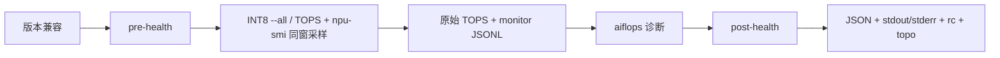

# Ascend A3 INT8 算力实验

本 Case 的正确单位是 **TOPS**。DMI 26.1.0 实际表头为 `TOPS@INT8`；旧脚本把同一数值写成 `TFLOPS`，属于已确认的单位错误，现已修复。

## 测量协议

```bash
ascend-dmi -f -t int8 --all --et 80 -q --fmt json
```

解析器必须找到 `INT8` 与 `TOPS` 语义；若输出声称 `TFLOPS@INT8` 或没有可识别单位，实验失败。已保存的 DMI 26.1.0 原始样例包含：

```text
Device  Execute Times  Duration(ms)  TOPS@INT8  Power(W)
0/1     72,000,000     283           1462.402   342.4
```

该样例用于证明旧标签错误和进行 parser 回归，不代表本次全机结果。
JSON 数值的厂商原始字面量保存为 `value_raw`，报告原样显示；兼容数值字段不用于舍入或替换该原文。

主 INT8 TOPS 测量期间，runner 按物理 NPU 并行轮询 `npu-smi info -t usages`，逐 Chip
保存 AICore、AIVector、HBM Bandwidth、NPU Utilization 原始时序。每个目标 Chip 至少需要
10 个四字段完整样本；不足时最多追加一次相同 `--et 80` 负载。追加 TOPS 原值仅作监控窗口证据，
不替换主 TOPS，也不做任何聚合。



推荐通过 `python3 base/run.py toolkit run --case computation-INT8 --npu-ids 1 --allow-privileged-root --allow-disruptive-dmi` 运行，并按当次 `npu-smi info -m` 调整物理 NPU ID。仅限单机，不含压力、复位和跨机测试。`report_monitor.md` 展示直接标注原值的逐 Chip 静态 timeline 和 `Sxx` 逐样本表；监控完整不等于理论峰值，AIVector 低不自动失败。
