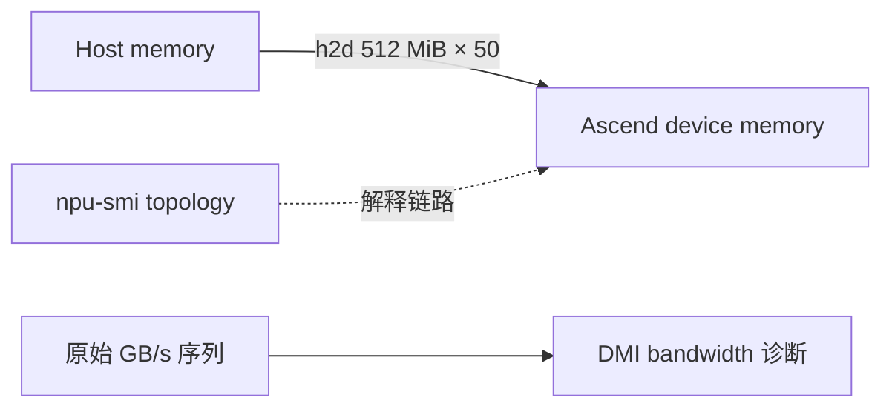

# Ascend A3 Host→Device 带宽实验

`h2d` 的方向是 **Host 内存 → Device 内存**。旧 README 写成 Device→Host，并声称由 HCCL 搬移，均与实际命令语义冲突；本实现以 DMI 26.1.0 的实际定义和拓扑证据为准，不把未证明的物理链路写死。

## 测量协议

```bash
ascend-dmi --bw -t h2d -s 536870912 --et 50 -q --fmt json
```

即每次 512 MiB、50 次。默认命令输出若不能证明全设备覆盖，runner 会按已发现设备追加 `-d <id>` 逐设备执行；覆盖不足返回 `partial`。



H2D 受 Host 内存、NUMA、设备互联和运行时状态共同影响，不等于 HBM D2D，也不能仅凭 case 名推断为 PCIe 或 HCCL。结果保存逐设备 GB/s、stdout/stderr、退出码、拓扑和 bandwidth 诊断。

推荐运行：

```bash
python3 base/run.py toolkit run --case interconnect-h2d --npu-ids 1 \\
  --allow-privileged-root --allow-disruptive-dmi
```

仅处理单机，不包含 D2H 或跨机通信。

默认在 workload 同期对目标 Chip 执行 `npu-smi info -t hccs-bw -time 1000`，保留
逐 HCCS link 及 `total` 的 `rx_bandwidth(GB/S)`、`tx_bandwidth(GB/S)` 原值和 UTC
采样窗口。A3 DMI 的 H2D 数值与 HCCS plane 相关，因此不拿 HBM 利用率替代链路证据。
若命令不支持、超时或不足 10 个有效样本，DMI 测量仍保留为 passed，监控及最终 Case
标为 partial。
