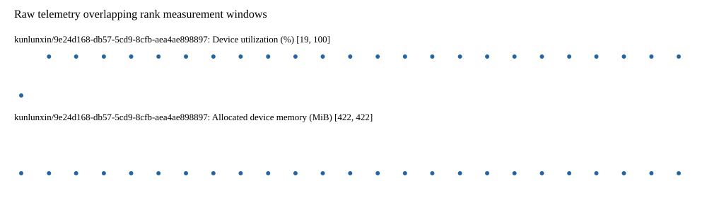

# Benchmark device telemetry

| Field | Evidence |
|---|---|
| vendor | kunlunxin |
| status | passed |
| collector | xpu-smi -m and selected -q |
| reasons | [] |
| policy | {"automatic_workload_extension": false, "collector": "xpu-smi -m and selected -q", "enabled": true, "metric_fields": [{"key": "utilization_percent", "label": "Device utilization", "unit": "%"}, {"key": "used_memory_mib", "label": "Allocated device memory", "unit": "MiB"}], "required_samples_per_target": 10, "target_interval_s": 1.0, "target_resource": "p800-device", "vendor": "kunlunxin"} |
| rank_device_map | not recorded |
| measurement_windows | [{"device_id": "kunlunxin/9e24d168-db57-5cd9-8cfb-aea4ae898897", "finished_monotonic_ns": 3798977111817526, "finished_offset_s": 32.38632699800655, "rank": 0, "role": "measurement", "started_monotonic_ns": 3798952798761743, "started_offset_s": 8.073271214962006}] |
| lifecycle_windows | not recorded |
| raw_samples | {"bytes": 175453, "path": "benchmark-monitor/samples.raw.jsonl", "sha256": "6a0ac5fe3bf2629386df89d5e57213633571c69b0c9f7af532b111964211e1df"} |
| parsed_samples | {"bytes": 11354, "path": "benchmark-monitor/samples.jsonl", "sha256": "8b08f81214017b253308aa895e0a7b42db4e0eae6db39056791b8d2ea68e9a59"} |
| sample_counts | {"kunlunxin/9e24d168-db57-5cd9-8cfb-aea4ae898897": 25} |
| events | not recorded |

| Device | Metric | Unit | Samples | Min | Median | Max |
|---|---|---|---|---|---|---|
| kunlunxin/9e24d168-db57-5cd9-8cfb-aea4ae898897 | Device utilization | % | 25 | 19 | 100 | 100 |
| kunlunxin/9e24d168-db57-5cd9-8cfb-aea4ae898897 | Allocated device memory | MiB | 25 | 422 | 422 | 422 |

Only command intervals overlapping the recorded rank measurement windows are summarized.
Missing or invalid measurements remain missing. Driver integration windows and theoretical utilization are not inferred.
