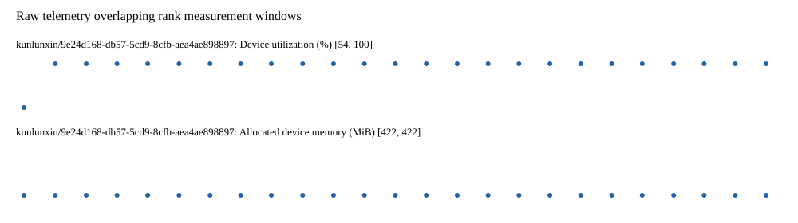

# Benchmark device telemetry

| Field | Evidence |
|---|---|
| vendor | kunlunxin |
| status | passed |
| collector | xpu-smi -m and selected -q |
| reasons | [] |
| policy | {"automatic_workload_extension": false, "collector": "xpu-smi -m and selected -q", "enabled": true, "metric_fields": [{"key": "utilization_percent", "label": "Device utilization", "unit": "%"}, {"key": "used_memory_mib", "label": "Allocated device memory", "unit": "MiB"}], "required_samples_per_target": 10, "target_interval_s": 1.0, "target_resource": "p800-device", "vendor": "kunlunxin"} |
| rank_device_map | not recorded |
| measurement_windows | [{"device_id": "kunlunxin/9e24d168-db57-5cd9-8cfb-aea4ae898897", "finished_monotonic_ns": 3799066135856053, "finished_offset_s": 32.34548521088436, "rank": 0, "role": "measurement", "started_monotonic_ns": 3799041794463790, "started_offset_s": 8.004092948045582}] |
| lifecycle_windows | not recorded |
| raw_samples | {"bytes": 142980, "path": "benchmark-monitor/samples.raw.jsonl", "sha256": "4d2fa4918f86472fc752207558d7bd6f2eddc526995a87c2b74c06a1bdc99912"} |
| parsed_samples | {"bytes": 11362, "path": "benchmark-monitor/samples.jsonl", "sha256": "7d54482562abcf8fd7d27d3872a736524ff50687a200b0897ae1594ca0f85b79"} |
| sample_counts | {"kunlunxin/9e24d168-db57-5cd9-8cfb-aea4ae898897": 25} |
| events | not recorded |

| Device | Metric | Unit | Samples | Min | Median | Max |
|---|---|---|---|---|---|---|
| kunlunxin/9e24d168-db57-5cd9-8cfb-aea4ae898897 | Device utilization | % | 25 | 54 | 100 | 100 |
| kunlunxin/9e24d168-db57-5cd9-8cfb-aea4ae898897 | Allocated device memory | MiB | 25 | 422 | 422 | 422 |

Only command intervals overlapping the recorded rank measurement windows are summarized.
Missing or invalid measurements remain missing. Driver integration windows and theoretical utilization are not inferred.
