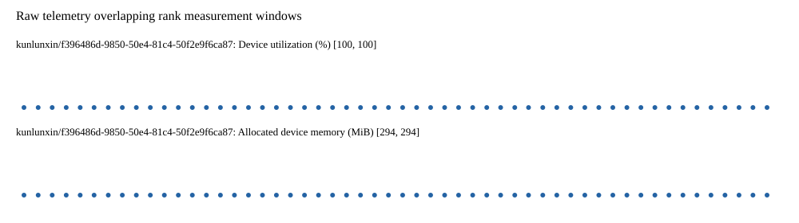

# Benchmark device telemetry

| Field | Evidence |
|---|---|
| vendor | kunlunxin |
| status | passed |
| collector | xpu-smi -m and selected -q |
| reasons | [] |
| policy | {"automatic_workload_extension": false, "collector": "xpu-smi -m and selected -q", "enabled": true, "metric_fields": [{"key": "utilization_percent", "label": "Device utilization", "unit": "%"}, {"key": "used_memory_mib", "label": "Allocated device memory", "unit": "MiB"}], "required_samples_per_target": 10, "target_interval_s": 1.0, "target_resource": "p800-device", "vendor": "kunlunxin"} |
| rank_device_map | not recorded |
| measurement_windows | [{"device_id": "kunlunxin/f396486d-9850-50e4-81c4-50f2e9f6ca87", "finished_monotonic_ns": 3885547299937541, "finished_offset_s": 62.41458391491324, "rank": 0, "role": "measurement", "started_monotonic_ns": 3885493003490131, "started_offset_s": 8.118136504665017}] |
| lifecycle_windows | not recorded |
| raw_samples | {"bytes": 270268, "path": "benchmark-monitor/samples.raw.jsonl", "sha256": "77243ac25b0ed8e5852d42bf6237d03912875465491f05698ed38978f656930b"} |
| parsed_samples | {"bytes": 21388, "path": "benchmark-monitor/samples.jsonl", "sha256": "c5876b7116189ec17625fa2e1c3defdb74370f1e15669801d17b988652d9e077"} |
| sample_counts | {"kunlunxin/f396486d-9850-50e4-81c4-50f2e9f6ca87": 54} |
| events | not recorded |

| Device | Metric | Unit | Samples | Min | Median | Max |
|---|---|---|---|---|---|---|
| kunlunxin/f396486d-9850-50e4-81c4-50f2e9f6ca87 | Device utilization | % | 54 | 100 | 100.0 | 100 |
| kunlunxin/f396486d-9850-50e4-81c4-50f2e9f6ca87 | Allocated device memory | MiB | 54 | 294 | 294.0 | 294 |

Only command intervals overlapping the recorded rank measurement windows are summarized.
Missing or invalid measurements remain missing. Driver integration windows and theoretical utilization are not inferred.
