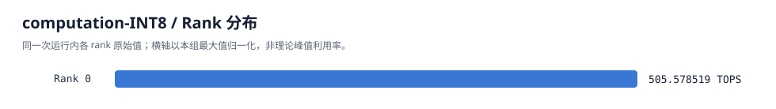

# FlagPerf Base Benchmark

## Run

| Field | Evidence |
|---|---|
| run_id | benchmark-1c58d612eea94550a4614d85c83eae89 |
| vendor | kunlunxin |
| vendor_display_name | Kunlunxin P800 |
| case | computation-INT8:P800 |
| status | passed |
| execution_status | passed |
| measurement_status | passed |
| monitoring_status | passed |
| failure_stage | not recorded |
| error | not recorded |
| skip_reason | not recorded |

## Runtime

| Field | Evidence |
|---|---|
| image | flagtree-xpu3.6-py310-torch2.9.0-flaggems-main-dev:202608 |
| image_id | sha256:cd53efa40eb7ddc49c2ad76a9bfbd252572c5fb01bd10d02cffbf667c34a1975 |
| lock | {"image_manifest": {"image": "flagtree-xpu3.6-py310-torch2.9.0-flaggems-main-dev:202608", "image_id": "sha256:cd53efa40eb7ddc49c2ad76a9bfbd252572c5fb01bd10d02cffbf667c34a1975", "path": "/home/kzhang519/Zhiyu/runtime-team/FlagPerf/base/vendors/kunlunxin/xpytorch_2.9_p800_candidate/image-manifest.json", "release_stage": "candidate", "schema_version": 1, "sha256": "ab59dc1cd14b65a28ffaef7b1b21b1d0b51f5334619301659d4123a5c681acbf", "validated": false, "validation_scope": [], "validation_status": null}, "runtime_profile": "xpytorch_2.9_p800_candidate", "stack_lock": {"path": "/home/kzhang519/Zhiyu/runtime-team/FlagPerf/base/vendors/kunlunxin/xpytorch_2.9_p800_candidate/stack.lock.yaml", "sha256": "8f200d0b955b7e60881bc13ed75c8784c2c38fe2c755d018c618f1dc7b46cded"}, "vendor": "kunlunxin"} |

## Device bindings

| Local rank | Framework ID | Physical ID | Resource | Host node | Container node | PCI | UUID/serial |
|---|---|---|---|---|---|---|---|
| 0 | 0 | 5 | kunlunxin/f396486d-9850-50e4-81c4-50f2e9f6ca87 | /dev/xpu7 | /dev/xpu7 | 0000:9c:00.0 | f396486d-9850-50e4-81c4-50f2e9f6ca87 |

## Rank metrics

| Rank | Metric | Value | Unit |
|---|---|---|---|
| 0 | computation-INT8 | 505.57851946048896 | TOPS |

Missing ranks: []

## Qualification

```json
{
  "max_cv_percent": 5,
  "min_measurement_seconds": 15,
  "mode": "qualification",
  "repetitions_required": 5,
  "scope": "single-card native XPYTORCH computation-INT8:P800; candidate runtime"
}
```

Correctness: passed

Measurement evidence: passed

[Correctness artifact](artifacts/correctness-rank-0.json)

[Raw rank metric and timing](artifacts/metric-rank-0.json)

[Runtime UUID binding](artifacts/runtime-bindings.json)

[Container ownership and mapping](container-inspect.json)

Large-shape correctness checks fixed rows/columns with the full reduction dimension and full-output finiteness.
Native input/output dtype evidence does not certify internal arithmetic or universal CPU-fallback exclusion.



## Case configuration

Precedence: generic < vendor < chip < override.

| Layer | Source | SHA256 | Snapshot |
|---|---|---|---|
| chip | /home/kzhang519/Zhiyu/runtime-team/FlagPerf/base/benchmarks/computation-INT8/kunlunxin/P800/case_config.yaml | 41044be2be54c08651c162a014e81468211632efc8b8ebc3138a6862ae91d266 | not recorded |
| generic | /home/kzhang519/Zhiyu/runtime-team/FlagPerf/base/benchmarks/computation-INT8/case_config.yaml | 3c5e8d18fbe971688ba7c1f8043769d8c30b83dc5b838ab4a8ecccd8b8a19be0 | not recorded |

## Evidence

[Monitor report](report_monitor.md)

- [summary.json](summary.json)
- [resolved-plan.json](resolved-plan.json)
- [case-assets.json](case-assets.json)
- [benchmark-result.json](benchmark-result.json)
- [runner.log](runner.log)
- [container-preflight.json](container-preflight.json)
- [benchmark-monitor/summary.json](benchmark-monitor/summary.json)

Host preflight: host-preflight/summary.json

Host postflight: host-postflight/summary.json

This report preserves the experiment status. Missing evidence is not evidence of success.
