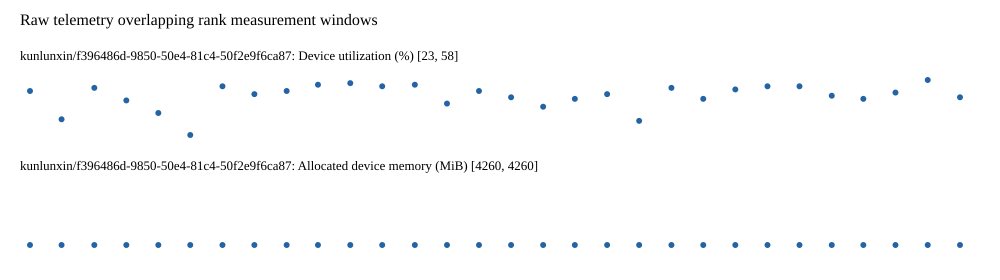

# Benchmark device telemetry

| Field | Evidence |
|---|---|
| vendor | kunlunxin |
| status | passed |
| collector | xpu-smi -m and selected -q |
| reasons | [] |
| policy | {"automatic_workload_extension": false, "collector": "xpu-smi -m and selected -q", "enabled": true, "metric_fields": [{"key": "utilization_percent", "label": "Device utilization", "unit": "%"}, {"key": "used_memory_mib", "label": "Allocated device memory", "unit": "MiB"}], "required_samples_per_target": 10, "target_interval_s": 1.0, "target_resource": "p800-device", "vendor": "kunlunxin"} |
| rank_device_map | not recorded |
| measurement_windows | [{"device_id": "kunlunxin/f396486d-9850-50e4-81c4-50f2e9f6ca87", "finished_monotonic_ns": 3913453476619101, "finished_offset_s": 43.86824015900493, "rank": 0, "role": "measurement", "started_monotonic_ns": 3913423276755975, "started_offset_s": 13.668377032969147}] |
| lifecycle_windows | not recorded |
| raw_samples | {"bytes": 243479, "path": "benchmark-monitor/samples.raw.jsonl", "sha256": "f643d759c00dd741942c416be8efc0f137a8d47903f33f6b3a46423b752a99b6"} |
| parsed_samples | {"bytes": 15659, "path": "benchmark-monitor/samples.jsonl", "sha256": "87fef79824e97c499d463c4773634aea6e10b5bf5a823e78ca2fef033c435402"} |
| sample_counts | {"kunlunxin/f396486d-9850-50e4-81c4-50f2e9f6ca87": 30} |
| events | not recorded |

| Device | Metric | Unit | Samples | Min | Median | Max |
|---|---|---|---|---|---|---|
| kunlunxin/f396486d-9850-50e4-81c4-50f2e9f6ca87 | Device utilization | % | 30 | 23 | 49.5 | 58 |
| kunlunxin/f396486d-9850-50e4-81c4-50f2e9f6ca87 | Allocated device memory | MiB | 30 | 4260 | 4260.0 | 4260 |

Only command intervals overlapping the recorded rank measurement windows are summarized.
Missing or invalid measurements remain missing. Driver integration windows and theoretical utilization are not inferred.
