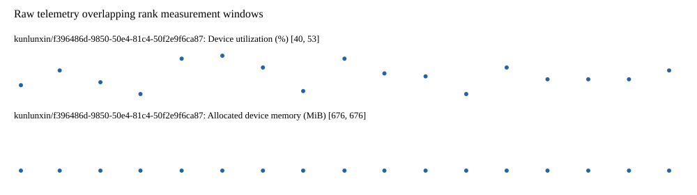

# Benchmark device telemetry

| Field | Evidence |
|---|---|
| vendor | kunlunxin |
| status | passed |
| collector | xpu-smi -m and selected -q |
| reasons | [] |
| policy | {"automatic_workload_extension": false, "collector": "xpu-smi -m and selected -q", "enabled": true, "metric_fields": [{"key": "utilization_percent", "label": "Device utilization", "unit": "%"}, {"key": "used_memory_mib", "label": "Allocated device memory", "unit": "MiB"}], "required_samples_per_target": 10, "target_interval_s": 1.0, "target_resource": "p800-device", "vendor": "kunlunxin"} |
| rank_device_map | not recorded |
| measurement_windows | [{"device_id": "kunlunxin/f396486d-9850-50e4-81c4-50f2e9f6ca87", "finished_monotonic_ns": 3923196393485109, "finished_offset_s": 23.929786293767393, "rank": 0, "role": "measurement", "started_monotonic_ns": 3923178693525282, "started_offset_s": 6.229826467111707}] |
| lifecycle_windows | not recorded |
| raw_samples | {"bytes": 105036, "path": "benchmark-monitor/samples.raw.jsonl", "sha256": "7dffd737986a1e57f86d4f3d618b501f8d1e74956bef27bbdfca90d3a9564933"} |
| parsed_samples | {"bytes": 8321, "path": "benchmark-monitor/samples.jsonl", "sha256": "1319dd67fb291580c9da58829524a2ef0f3404aa79cac80c65f00f274acfc274"} |
| sample_counts | {"kunlunxin/f396486d-9850-50e4-81c4-50f2e9f6ca87": 17} |
| events | not recorded |

| Device | Metric | Unit | Samples | Min | Median | Max |
|---|---|---|---|---|---|---|
| kunlunxin/f396486d-9850-50e4-81c4-50f2e9f6ca87 | Device utilization | % | 17 | 40 | 46 | 53 |
| kunlunxin/f396486d-9850-50e4-81c4-50f2e9f6ca87 | Allocated device memory | MiB | 17 | 676 | 676 | 676 |

Only command intervals overlapping the recorded rank measurement windows are summarized.
Missing or invalid measurements remain missing. Driver integration windows and theoretical utilization are not inferred.
