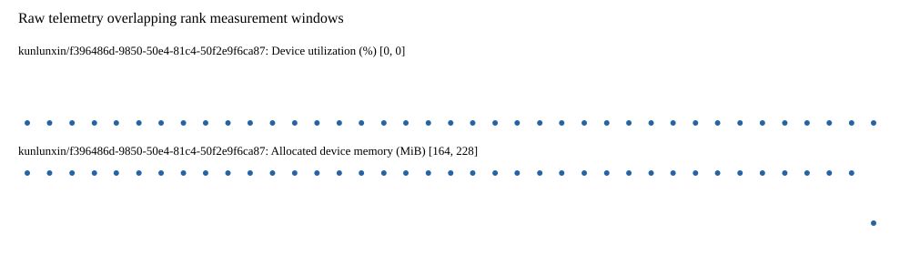

# Benchmark device telemetry

| Field | Evidence |
|---|---|
| vendor | kunlunxin |
| status | passed |
| collector | xpu-smi -m and selected -q |
| reasons | [] |
| policy | {"automatic_workload_extension": false, "collector": "xpu-smi -m and selected -q", "enabled": true, "metric_fields": [{"key": "utilization_percent", "label": "Device utilization", "unit": "%"}, {"key": "used_memory_mib", "label": "Allocated device memory", "unit": "MiB"}], "required_samples_per_target": 10, "target_interval_s": 1.0, "target_resource": "p800-device", "vendor": "kunlunxin"} |
| rank_device_map | not recorded |
| measurement_windows | [{"device_id": "kunlunxin/f396486d-9850-50e4-81c4-50f2e9f6ca87", "finished_monotonic_ns": 3903724020532811, "finished_offset_s": 44.03762340126559, "rank": 0, "role": "measurement", "started_monotonic_ns": 3903685120545474, "started_offset_s": 5.137636064086109}] |
| lifecycle_windows | not recorded |
| raw_samples | {"bytes": 189746, "path": "benchmark-monitor/samples.raw.jsonl", "sha256": "09c835f8fa65ad389985f05da85f64f498b8a2c603835ea92af1f8425f36cdf0"} |
| parsed_samples | {"bytes": 14921, "path": "benchmark-monitor/samples.jsonl", "sha256": "451330ae3ce46ae7c4e3cbd928dea9ccd0b9b202f99f37f460a2024b3a94c9ea"} |
| sample_counts | {"kunlunxin/f396486d-9850-50e4-81c4-50f2e9f6ca87": 39} |
| events | not recorded |

| Device | Metric | Unit | Samples | Min | Median | Max |
|---|---|---|---|---|---|---|
| kunlunxin/f396486d-9850-50e4-81c4-50f2e9f6ca87 | Device utilization | % | 39 | 0 | 0 | 0 |
| kunlunxin/f396486d-9850-50e4-81c4-50f2e9f6ca87 | Allocated device memory | MiB | 39 | 164 | 228 | 228 |

Only command intervals overlapping the recorded rank measurement windows are summarized.
Missing or invalid measurements remain missing. Driver integration windows and theoretical utilization are not inferred.
