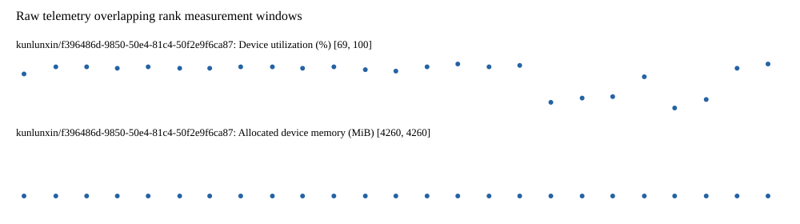

# Benchmark device telemetry

| Field | Evidence |
|---|---|
| vendor | kunlunxin |
| status | passed |
| collector | xpu-smi -m and selected -q |
| reasons | [] |
| policy | {"automatic_workload_extension": false, "collector": "xpu-smi -m and selected -q", "enabled": true, "metric_fields": [{"key": "utilization_percent", "label": "Device utilization", "unit": "%"}, {"key": "used_memory_mib", "label": "Allocated device memory", "unit": "MiB"}], "required_samples_per_target": 10, "target_interval_s": 1.0, "target_resource": "p800-device", "vendor": "kunlunxin"} |
| rank_device_map | not recorded |
| measurement_windows | [{"device_id": "kunlunxin/f396486d-9850-50e4-81c4-50f2e9f6ca87", "finished_monotonic_ns": 3912184125978728, "finished_offset_s": 46.91906064702198, "rank": 0, "role": "measurement", "started_monotonic_ns": 3912158937613457, "started_offset_s": 21.730695376172662}] |
| lifecycle_windows | not recorded |
| raw_samples | {"bytes": 279071, "path": "benchmark-monitor/samples.raw.jsonl", "sha256": "87b658ffaea9b4495aab2ccb5e5d9d4db3e60296ef5ee4cf5e9dd58b4b1a45bb"} |
| parsed_samples | {"bytes": 17984, "path": "benchmark-monitor/samples.jsonl", "sha256": "0a6e6f1c44a97f7a951c60c3ca4b457f337d0e876f3e5776facebf2d00c233a5"} |
| sample_counts | {"kunlunxin/f396486d-9850-50e4-81c4-50f2e9f6ca87": 25} |
| events | not recorded |

| Device | Metric | Unit | Samples | Min | Median | Max |
|---|---|---|---|---|---|---|
| kunlunxin/f396486d-9850-50e4-81c4-50f2e9f6ca87 | Device utilization | % | 25 | 69 | 97 | 100 |
| kunlunxin/f396486d-9850-50e4-81c4-50f2e9f6ca87 | Allocated device memory | MiB | 25 | 4260 | 4260 | 4260 |

Only command intervals overlapping the recorded rank measurement windows are summarized.
Missing or invalid measurements remain missing. Driver integration windows and theoretical utilization are not inferred.
