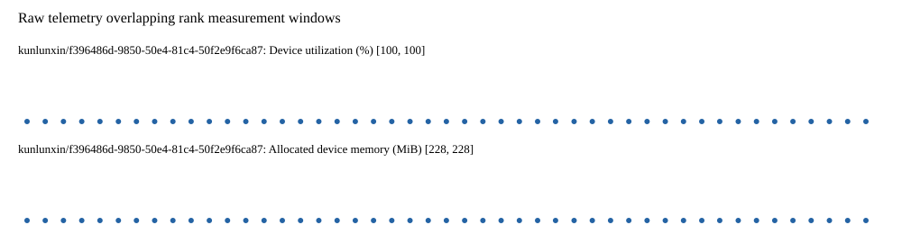

# Benchmark device telemetry

| Field | Evidence |
|---|---|
| vendor | kunlunxin |
| status | passed |
| collector | xpu-smi -m and selected -q |
| reasons | [] |
| policy | {"automatic_workload_extension": false, "collector": "xpu-smi -m and selected -q", "enabled": true, "metric_fields": [{"key": "utilization_percent", "label": "Device utilization", "unit": "%"}, {"key": "used_memory_mib", "label": "Allocated device memory", "unit": "MiB"}], "required_samples_per_target": 10, "target_interval_s": 1.0, "target_resource": "p800-device", "vendor": "kunlunxin"} |
| rank_device_map | not recorded |
| measurement_windows | [{"device_id": "kunlunxin/f396486d-9850-50e4-81c4-50f2e9f6ca87", "finished_monotonic_ns": 3902751365401841, "finished_offset_s": 52.436496073845774, "rank": 0, "role": "measurement", "started_monotonic_ns": 3902704213006392, "started_offset_s": 5.2841006251983345}] |
| lifecycle_windows | not recorded |
| raw_samples | {"bytes": 227763, "path": "benchmark-monitor/samples.raw.jsonl", "sha256": "62dac0a162eeb0ed469eb97dd30f696d7c83405806e33a2e155a6c1604f3105d"} |
| parsed_samples | {"bytes": 18009, "path": "benchmark-monitor/samples.jsonl", "sha256": "766fa0dbf729d7ae80c2399df47f0193fdbe3a414d8ef68b0a9dbbd9686fba43"} |
| sample_counts | {"kunlunxin/f396486d-9850-50e4-81c4-50f2e9f6ca87": 47} |
| events | not recorded |

| Device | Metric | Unit | Samples | Min | Median | Max |
|---|---|---|---|---|---|---|
| kunlunxin/f396486d-9850-50e4-81c4-50f2e9f6ca87 | Device utilization | % | 47 | 100 | 100 | 100 |
| kunlunxin/f396486d-9850-50e4-81c4-50f2e9f6ca87 | Allocated device memory | MiB | 47 | 228 | 228 | 228 |

Only command intervals overlapping the recorded rank measurement windows are summarized.
Missing or invalid measurements remain missing. Driver integration windows and theoretical utilization are not inferred.
