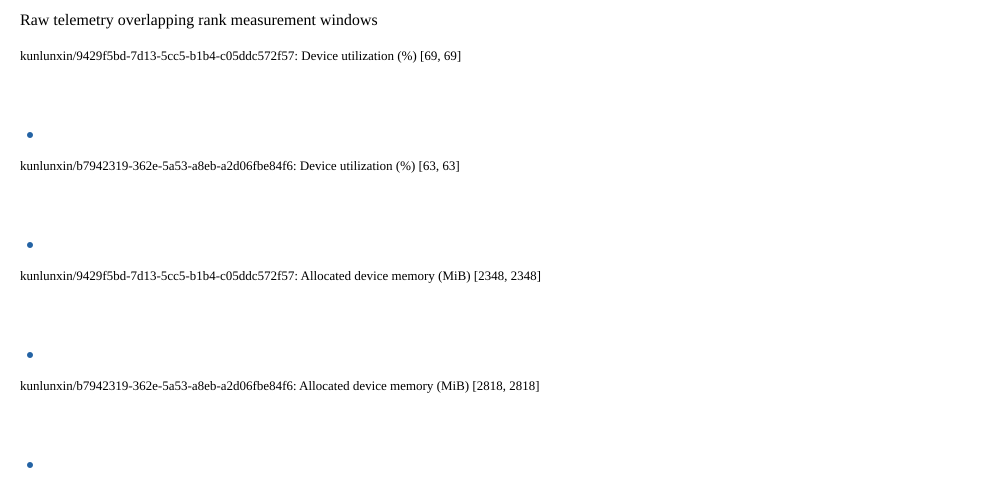

# Benchmark device telemetry

| Field | Evidence |
|---|---|
| vendor | kunlunxin |
| status | partial |
| collector | xpu-smi -m and selected -q |
| reasons | ["kunlunxin/9429f5bd-7d13-5cc5-b1b4-c05ddc572f57: 1/10 valid samples", "kunlunxin/b7942319-362e-5a53-a8eb-a2d06fbe84f6: 1/10 valid samples"] |
| policy | {"automatic_workload_extension": false, "collector": "xpu-smi -m and selected -q", "enabled": true, "metric_fields": [{"key": "utilization_percent", "label": "Device utilization", "unit": "%"}, {"key": "used_memory_mib", "label": "Allocated device memory", "unit": "MiB"}], "required_samples_per_target": 10, "target_interval_s": 1.0, "target_resource": "p800-device", "vendor": "kunlunxin"} |
| rank_device_map | not recorded |
| measurement_windows | [{"device_id": "kunlunxin/9429f5bd-7d13-5cc5-b1b4-c05ddc572f57", "finished_monotonic_ns": 3993180813353106, "finished_offset_s": 9.081015741918236, "rank": 0, "role": "measurement", "started_monotonic_ns": 3993180639403041, "started_offset_s": 8.907065676990896}, {"device_id": "kunlunxin/b7942319-362e-5a53-a8eb-a2d06fbe84f6", "finished_monotonic_ns": 3993180792171359, "finished_offset_s": 9.059833995066583, "rank": 1, "role": "measurement", "started_monotonic_ns": 3993180639403401, "started_offset_s": 8.907066036947072}] |
| lifecycle_windows | not recorded |
| raw_samples | {"bytes": 107263, "path": "benchmark-monitor/samples.raw.jsonl", "sha256": "d71cf5b12d03ceaf7b88dc41032a40dbfa228cb14514bdeb4d571638df3e215c"} |
| parsed_samples | {"bytes": 7331, "path": "benchmark-monitor/samples.jsonl", "sha256": "a9c76845d14eb4c23e97f0de4d2bb8ac10e22585caed3efcf3a2b5dfdd72ab1b"} |
| sample_counts | {"kunlunxin/9429f5bd-7d13-5cc5-b1b4-c05ddc572f57": 1, "kunlunxin/b7942319-362e-5a53-a8eb-a2d06fbe84f6": 1} |
| events | not recorded |

| Device | Metric | Unit | Samples | Min | Median | Max |
|---|---|---|---|---|---|---|
| kunlunxin/9429f5bd-7d13-5cc5-b1b4-c05ddc572f57 | Device utilization | % | 1 | 69 | 69 | 69 |
| kunlunxin/b7942319-362e-5a53-a8eb-a2d06fbe84f6 | Device utilization | % | 1 | 63 | 63 | 63 |
| kunlunxin/9429f5bd-7d13-5cc5-b1b4-c05ddc572f57 | Allocated device memory | MiB | 1 | 2348 | 2348 | 2348 |
| kunlunxin/b7942319-362e-5a53-a8eb-a2d06fbe84f6 | Allocated device memory | MiB | 1 | 2818 | 2818 | 2818 |

Only command intervals overlapping the recorded rank measurement windows are summarized.
Missing or invalid measurements remain missing. Driver integration windows and theoretical utilization are not inferred.
