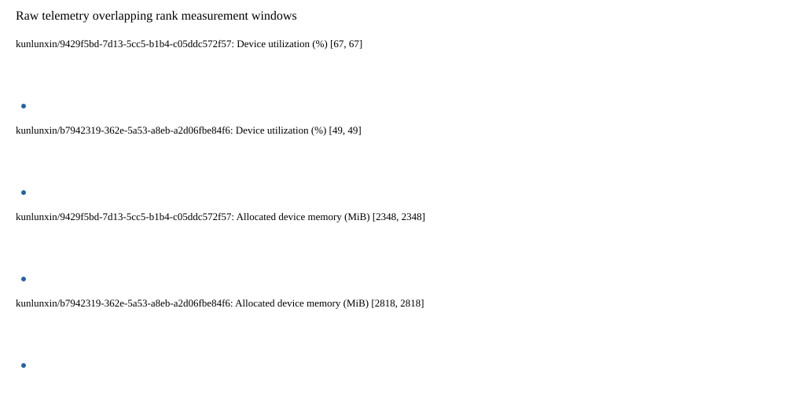

# Benchmark device telemetry

| Field | Evidence |
|---|---|
| vendor | kunlunxin |
| status | partial |
| collector | xpu-smi -m and selected -q |
| reasons | ["kunlunxin/9429f5bd-7d13-5cc5-b1b4-c05ddc572f57: 1/10 valid samples", "kunlunxin/b7942319-362e-5a53-a8eb-a2d06fbe84f6: 1/10 valid samples"] |
| policy | {"automatic_workload_extension": false, "collector": "xpu-smi -m and selected -q", "enabled": true, "metric_fields": [{"key": "utilization_percent", "label": "Device utilization", "unit": "%"}, {"key": "used_memory_mib", "label": "Allocated device memory", "unit": "MiB"}], "required_samples_per_target": 10, "target_interval_s": 1.0, "target_resource": "p800-device", "vendor": "kunlunxin"} |
| rank_device_map | not recorded |
| measurement_windows | [{"device_id": "kunlunxin/9429f5bd-7d13-5cc5-b1b4-c05ddc572f57", "finished_monotonic_ns": 3993198388985706, "finished_offset_s": 9.045756080187857, "rank": 0, "role": "measurement", "started_monotonic_ns": 3993198214199189, "started_offset_s": 8.87096956325695}, {"device_id": "kunlunxin/b7942319-362e-5a53-a8eb-a2d06fbe84f6", "finished_monotonic_ns": 3993198367664103, "finished_offset_s": 9.024434477090836, "rank": 1, "role": "measurement", "started_monotonic_ns": 3993198214142410, "started_offset_s": 8.870912784244865}] |
| lifecycle_windows | not recorded |
| raw_samples | {"bytes": 107973, "path": "benchmark-monitor/samples.raw.jsonl", "sha256": "bbdc9e399b47b34822e6f3853765ae8d388d88a0adb52aa3792cb6e8f14b2ad0"} |
| parsed_samples | {"bytes": 7324, "path": "benchmark-monitor/samples.jsonl", "sha256": "26973a37da27f9f1184563a079aad863feaca2417c7590cb05d824da49cfa17b"} |
| sample_counts | {"kunlunxin/9429f5bd-7d13-5cc5-b1b4-c05ddc572f57": 1, "kunlunxin/b7942319-362e-5a53-a8eb-a2d06fbe84f6": 1} |
| events | not recorded |

| Device | Metric | Unit | Samples | Min | Median | Max |
|---|---|---|---|---|---|---|
| kunlunxin/9429f5bd-7d13-5cc5-b1b4-c05ddc572f57 | Device utilization | % | 1 | 67 | 67 | 67 |
| kunlunxin/b7942319-362e-5a53-a8eb-a2d06fbe84f6 | Device utilization | % | 1 | 49 | 49 | 49 |
| kunlunxin/9429f5bd-7d13-5cc5-b1b4-c05ddc572f57 | Allocated device memory | MiB | 1 | 2348 | 2348 | 2348 |
| kunlunxin/b7942319-362e-5a53-a8eb-a2d06fbe84f6 | Allocated device memory | MiB | 1 | 2818 | 2818 | 2818 |

Only command intervals overlapping the recorded rank measurement windows are summarized.
Missing or invalid measurements remain missing. Driver integration windows and theoretical utilization are not inferred.
