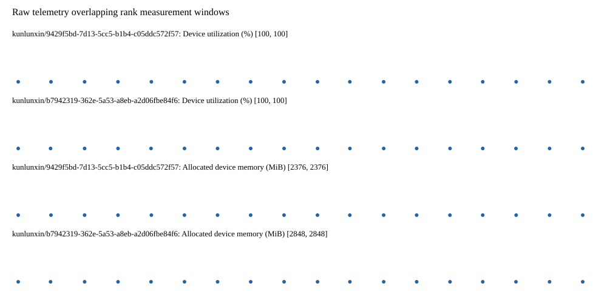

# Benchmark device telemetry

| Field | Evidence |
|---|---|
| vendor | kunlunxin |
| status | passed |
| collector | xpu-smi -m and selected -q |
| reasons | [] |
| policy | {"automatic_workload_extension": false, "collector": "xpu-smi -m and selected -q", "enabled": true, "metric_fields": [{"key": "utilization_percent", "label": "Device utilization", "unit": "%"}, {"key": "used_memory_mib", "label": "Allocated device memory", "unit": "MiB"}], "required_samples_per_target": 10, "target_interval_s": 1.0, "target_resource": "p800-device", "vendor": "kunlunxin"} |
| rank_device_map | not recorded |
| measurement_windows | [{"device_id": "kunlunxin/9429f5bd-7d13-5cc5-b1b4-c05ddc572f57", "finished_monotonic_ns": 3993285219401763, "finished_offset_s": 26.272353074047714, "rank": 0, "role": "measurement", "started_monotonic_ns": 3993267792159543, "started_offset_s": 8.845110854133964}, {"device_id": "kunlunxin/b7942319-362e-5a53-a8eb-a2d06fbe84f6", "finished_monotonic_ns": 3993285200208226, "finished_offset_s": 26.253159537445754, "rank": 1, "role": "measurement", "started_monotonic_ns": 3993267792158833, "started_offset_s": 8.8451101440005}] |
| lifecycle_windows | not recorded |
| raw_samples | {"bytes": 307389, "path": "benchmark-monitor/samples.raw.jsonl", "sha256": "0a21a4ce41029e4a75f30d589e0817df3d0c32289694d8cdfb33472881b9015f"} |
| parsed_samples | {"bytes": 19427, "path": "benchmark-monitor/samples.jsonl", "sha256": "44bd646b588ff668d0b3fc4250fcc7a59542b307e48531bc31b8b0a5d80bd943"} |
| sample_counts | {"kunlunxin/9429f5bd-7d13-5cc5-b1b4-c05ddc572f57": 18, "kunlunxin/b7942319-362e-5a53-a8eb-a2d06fbe84f6": 18} |
| events | not recorded |

| Device | Metric | Unit | Samples | Min | Median | Max |
|---|---|---|---|---|---|---|
| kunlunxin/9429f5bd-7d13-5cc5-b1b4-c05ddc572f57 | Device utilization | % | 18 | 100 | 100.0 | 100 |
| kunlunxin/b7942319-362e-5a53-a8eb-a2d06fbe84f6 | Device utilization | % | 18 | 100 | 100.0 | 100 |
| kunlunxin/9429f5bd-7d13-5cc5-b1b4-c05ddc572f57 | Allocated device memory | MiB | 18 | 2376 | 2376.0 | 2376 |
| kunlunxin/b7942319-362e-5a53-a8eb-a2d06fbe84f6 | Allocated device memory | MiB | 18 | 2848 | 2848.0 | 2848 |

Only command intervals overlapping the recorded rank measurement windows are summarized.
Missing or invalid measurements remain missing. Driver integration windows and theoretical utilization are not inferred.
