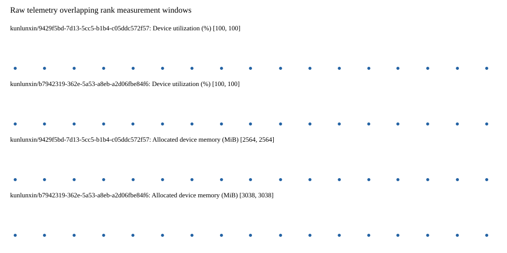

# Benchmark device telemetry

| Field | Evidence |
|---|---|
| vendor | kunlunxin |
| status | passed |
| collector | xpu-smi -m and selected -q |
| reasons | [] |
| policy | {"automatic_workload_extension": false, "collector": "xpu-smi -m and selected -q", "enabled": true, "metric_fields": [{"key": "utilization_percent", "label": "Device utilization", "unit": "%"}, {"key": "used_memory_mib", "label": "Allocated device memory", "unit": "MiB"}], "required_samples_per_target": 10, "target_interval_s": 1.0, "target_resource": "p800-device", "vendor": "kunlunxin"} |
| rank_device_map | not recorded |
| measurement_windows | [{"device_id": "kunlunxin/9429f5bd-7d13-5cc5-b1b4-c05ddc572f57", "finished_monotonic_ns": 3993392993449046, "finished_offset_s": 26.773019142914563, "rank": 0, "role": "measurement", "started_monotonic_ns": 3993375548387340, "started_offset_s": 9.327957436908036}, {"device_id": "kunlunxin/b7942319-362e-5a53-a8eb-a2d06fbe84f6", "finished_monotonic_ns": 3993392690277189, "finished_offset_s": 26.469847286120057, "rank": 1, "role": "measurement", "started_monotonic_ns": 3993375545670497, "started_offset_s": 9.3252405943349}] |
| lifecycle_windows | not recorded |
| raw_samples | {"bytes": 309068, "path": "benchmark-monitor/samples.raw.jsonl", "sha256": "01b93398ff112a52bd285d7b9817b102c3253352ef56f7dd444a533fd67e6cf9"} |
| parsed_samples | {"bytes": 19443, "path": "benchmark-monitor/samples.jsonl", "sha256": "7eaadba23d924fbd07f2f21790002407d522b5107de9006ea5dd7d2970059b43"} |
| sample_counts | {"kunlunxin/9429f5bd-7d13-5cc5-b1b4-c05ddc572f57": 17, "kunlunxin/b7942319-362e-5a53-a8eb-a2d06fbe84f6": 17} |
| events | not recorded |

| Device | Metric | Unit | Samples | Min | Median | Max |
|---|---|---|---|---|---|---|
| kunlunxin/9429f5bd-7d13-5cc5-b1b4-c05ddc572f57 | Device utilization | % | 17 | 100 | 100 | 100 |
| kunlunxin/b7942319-362e-5a53-a8eb-a2d06fbe84f6 | Device utilization | % | 17 | 100 | 100 | 100 |
| kunlunxin/9429f5bd-7d13-5cc5-b1b4-c05ddc572f57 | Allocated device memory | MiB | 17 | 2564 | 2564 | 2564 |
| kunlunxin/b7942319-362e-5a53-a8eb-a2d06fbe84f6 | Allocated device memory | MiB | 17 | 3038 | 3038 | 3038 |

Only command intervals overlapping the recorded rank measurement windows are summarized.
Missing or invalid measurements remain missing. Driver integration windows and theoretical utilization are not inferred.
