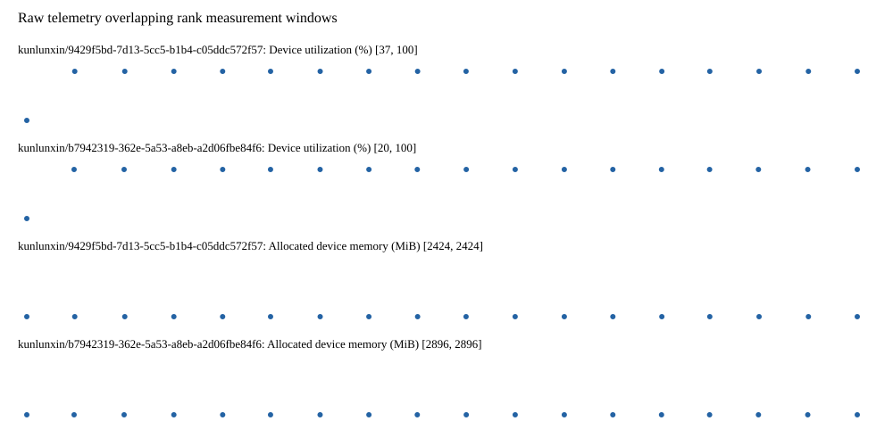

# Benchmark device telemetry

| Field | Evidence |
|---|---|
| vendor | kunlunxin |
| status | passed |
| collector | xpu-smi -m and selected -q |
| reasons | [] |
| policy | {"automatic_workload_extension": false, "collector": "xpu-smi -m and selected -q", "enabled": true, "metric_fields": [{"key": "utilization_percent", "label": "Device utilization", "unit": "%"}, {"key": "used_memory_mib", "label": "Allocated device memory", "unit": "MiB"}], "required_samples_per_target": 10, "target_interval_s": 1.0, "target_resource": "p800-device", "vendor": "kunlunxin"} |
| rank_device_map | not recorded |
| measurement_windows | [{"device_id": "kunlunxin/9429f5bd-7d13-5cc5-b1b4-c05ddc572f57", "finished_monotonic_ns": 3993338620023907, "finished_offset_s": 26.557476799935102, "rank": 0, "role": "measurement", "started_monotonic_ns": 3993321173517391, "started_offset_s": 9.110970283858478}, {"device_id": "kunlunxin/b7942319-362e-5a53-a8eb-a2d06fbe84f6", "finished_monotonic_ns": 3993338542950232, "finished_offset_s": 26.48040312482044, "rank": 1, "role": "measurement", "started_monotonic_ns": 3993321173172078, "started_offset_s": 9.11062497086823}] |
| lifecycle_windows | not recorded |
| raw_samples | {"bytes": 307673, "path": "benchmark-monitor/samples.raw.jsonl", "sha256": "8401fb1649044b48d27125d710ae8d9302f3e5fc86c6ba1e2ae1b2a65d0e0d29"} |
| parsed_samples | {"bytes": 19422, "path": "benchmark-monitor/samples.jsonl", "sha256": "42f73ff85b69c312fab70be83fb8b8419b0d2241a7a0b12a49dc35d3a03ef0ac"} |
| sample_counts | {"kunlunxin/9429f5bd-7d13-5cc5-b1b4-c05ddc572f57": 18, "kunlunxin/b7942319-362e-5a53-a8eb-a2d06fbe84f6": 18} |
| events | not recorded |

| Device | Metric | Unit | Samples | Min | Median | Max |
|---|---|---|---|---|---|---|
| kunlunxin/9429f5bd-7d13-5cc5-b1b4-c05ddc572f57 | Device utilization | % | 18 | 37 | 100.0 | 100 |
| kunlunxin/b7942319-362e-5a53-a8eb-a2d06fbe84f6 | Device utilization | % | 18 | 20 | 100.0 | 100 |
| kunlunxin/9429f5bd-7d13-5cc5-b1b4-c05ddc572f57 | Allocated device memory | MiB | 18 | 2424 | 2424.0 | 2424 |
| kunlunxin/b7942319-362e-5a53-a8eb-a2d06fbe84f6 | Allocated device memory | MiB | 18 | 2896 | 2896.0 | 2896 |

Only command intervals overlapping the recorded rank measurement windows are summarized.
Missing or invalid measurements remain missing. Driver integration windows and theoretical utilization are not inferred.
