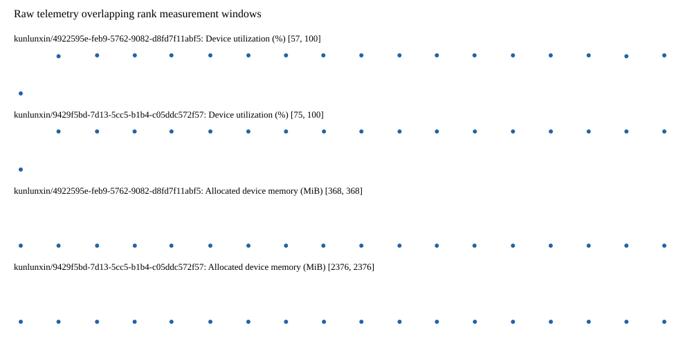

# Benchmark device telemetry

| Field | Evidence |
|---|---|
| vendor | kunlunxin |
| status | passed |
| collector | xpu-smi -m and selected -q |
| reasons | [] |
| policy | {"automatic_workload_extension": false, "collector": "xpu-smi -m and selected -q", "enabled": true, "metric_fields": [{"key": "utilization_percent", "label": "Device utilization", "unit": "%"}, {"key": "used_memory_mib", "label": "Allocated device memory", "unit": "MiB"}], "required_samples_per_target": 10, "target_interval_s": 1.0, "target_resource": "p800-device", "vendor": "kunlunxin"} |
| rank_device_map | not recorded |
| measurement_windows | [{"device_id": "kunlunxin/9429f5bd-7d13-5cc5-b1b4-c05ddc572f57", "finished_monotonic_ns": 3993510064762244, "finished_offset_s": 26.569056605920196, "rank": 0, "role": "measurement", "started_monotonic_ns": 3993492512252944, "started_offset_s": 9.01654730597511}, {"device_id": "kunlunxin/4922595e-feb9-5762-9082-d8fd7f11abf5", "finished_monotonic_ns": 3993510038495174, "finished_offset_s": 26.542789536062628, "rank": 1, "role": "measurement", "started_monotonic_ns": 3993492512201975, "started_offset_s": 9.016496337018907}] |
| lifecycle_windows | not recorded |
| raw_samples | {"bytes": 296917, "path": "benchmark-monitor/samples.raw.jsonl", "sha256": "f9f756ba3faea75623496cf19d475bc485b5d781efeca16de749b4f545a777fd"} |
| parsed_samples | {"bytes": 19372, "path": "benchmark-monitor/samples.jsonl", "sha256": "ff4c67c0db0082e1d26caa8a414d948466d5b1d5555d35e4d574a4d1c065b8d1"} |
| sample_counts | {"kunlunxin/4922595e-feb9-5762-9082-d8fd7f11abf5": 18, "kunlunxin/9429f5bd-7d13-5cc5-b1b4-c05ddc572f57": 18} |
| events | not recorded |

| Device | Metric | Unit | Samples | Min | Median | Max |
|---|---|---|---|---|---|---|
| kunlunxin/4922595e-feb9-5762-9082-d8fd7f11abf5 | Device utilization | % | 18 | 57 | 100.0 | 100 |
| kunlunxin/9429f5bd-7d13-5cc5-b1b4-c05ddc572f57 | Device utilization | % | 18 | 75 | 100.0 | 100 |
| kunlunxin/4922595e-feb9-5762-9082-d8fd7f11abf5 | Allocated device memory | MiB | 18 | 368 | 368.0 | 368 |
| kunlunxin/9429f5bd-7d13-5cc5-b1b4-c05ddc572f57 | Allocated device memory | MiB | 18 | 2376 | 2376.0 | 2376 |

Only command intervals overlapping the recorded rank measurement windows are summarized.
Missing or invalid measurements remain missing. Driver integration windows and theoretical utilization are not inferred.
