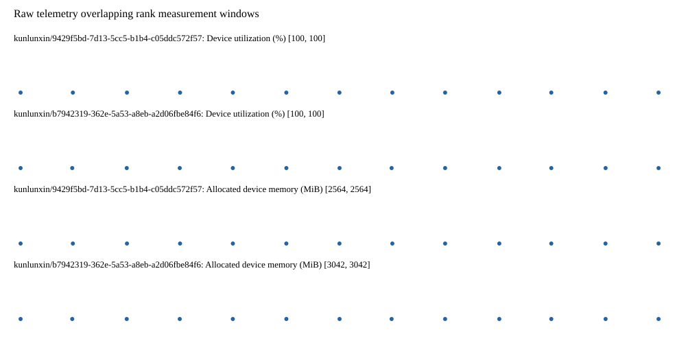

# Benchmark device telemetry

| Field | Evidence |
|---|---|
| vendor | kunlunxin |
| status | passed |
| collector | xpu-smi -m and selected -q |
| reasons | [] |
| policy | {"automatic_workload_extension": false, "collector": "xpu-smi -m and selected -q", "enabled": true, "metric_fields": [{"key": "utilization_percent", "label": "Device utilization", "unit": "%"}, {"key": "used_memory_mib", "label": "Allocated device memory", "unit": "MiB"}], "required_samples_per_target": 10, "target_interval_s": 1.0, "target_resource": "p800-device", "vendor": "kunlunxin"} |
| rank_device_map | not recorded |
| measurement_windows | [{"device_id": "kunlunxin/9429f5bd-7d13-5cc5-b1b4-c05ddc572f57", "finished_monotonic_ns": 3993612451983584, "finished_offset_s": 22.6085023060441, "rank": 0, "role": "measurement", "started_monotonic_ns": 3993599325359072, "started_offset_s": 9.481877794023603}, {"device_id": "kunlunxin/b7942319-362e-5a53-a8eb-a2d06fbe84f6", "finished_monotonic_ns": 3993612149089190, "finished_offset_s": 22.305607912130654, "rank": 1, "role": "measurement", "started_monotonic_ns": 3993599322582501, "started_offset_s": 9.47910122293979}] |
| lifecycle_windows | not recorded |
| raw_samples | {"bytes": 263635, "path": "benchmark-monitor/samples.raw.jsonl", "sha256": "0ced11fd5e66120473c8ab6188fe170f813bec459ca3149298274aecb2fac234"} |
| parsed_samples | {"bytes": 16740, "path": "benchmark-monitor/samples.jsonl", "sha256": "c8a35fc473e31cd7ffcee996a8ca44276f4e9a4cfb4e0f950123f117b588a76a"} |
| sample_counts | {"kunlunxin/9429f5bd-7d13-5cc5-b1b4-c05ddc572f57": 13, "kunlunxin/b7942319-362e-5a53-a8eb-a2d06fbe84f6": 13} |
| events | not recorded |

| Device | Metric | Unit | Samples | Min | Median | Max |
|---|---|---|---|---|---|---|
| kunlunxin/9429f5bd-7d13-5cc5-b1b4-c05ddc572f57 | Device utilization | % | 13 | 100 | 100 | 100 |
| kunlunxin/b7942319-362e-5a53-a8eb-a2d06fbe84f6 | Device utilization | % | 13 | 100 | 100 | 100 |
| kunlunxin/9429f5bd-7d13-5cc5-b1b4-c05ddc572f57 | Allocated device memory | MiB | 13 | 2564 | 2564 | 2564 |
| kunlunxin/b7942319-362e-5a53-a8eb-a2d06fbe84f6 | Allocated device memory | MiB | 13 | 3042 | 3042 | 3042 |

Only command intervals overlapping the recorded rank measurement windows are summarized.
Missing or invalid measurements remain missing. Driver integration windows and theoretical utilization are not inferred.
