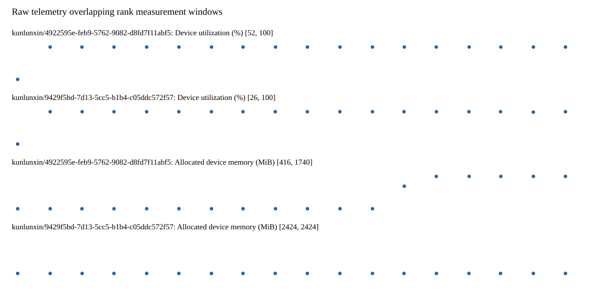

# Benchmark device telemetry

| Field | Evidence |
|---|---|
| vendor | kunlunxin |
| status | passed |
| collector | xpu-smi -m and selected -q |
| reasons | [] |
| policy | {"automatic_workload_extension": false, "collector": "xpu-smi -m and selected -q", "enabled": true, "metric_fields": [{"key": "utilization_percent", "label": "Device utilization", "unit": "%"}, {"key": "used_memory_mib", "label": "Allocated device memory", "unit": "MiB"}], "required_samples_per_target": 10, "target_interval_s": 1.0, "target_resource": "p800-device", "vendor": "kunlunxin"} |
| rank_device_map | not recorded |
| measurement_windows | [{"device_id": "kunlunxin/9429f5bd-7d13-5cc5-b1b4-c05ddc572f57", "finished_monotonic_ns": 3993562777739062, "finished_offset_s": 26.532436522189528, "rank": 0, "role": "measurement", "started_monotonic_ns": 3993545287390059, "started_offset_s": 9.042087519075722}, {"device_id": "kunlunxin/4922595e-feb9-5762-9082-d8fd7f11abf5", "finished_monotonic_ns": 3993562675191030, "finished_offset_s": 26.42988849012181, "rank": 1, "role": "measurement", "started_monotonic_ns": 3993545286871980, "started_offset_s": 9.041569440159947}] |
| lifecycle_windows | not recorded |
| raw_samples | {"bytes": 299697, "path": "benchmark-monitor/samples.raw.jsonl", "sha256": "8277aa7599898caae487e4c9393d53e178e308e0ba0950eb1ffeaf3a8eb4092c"} |
| parsed_samples | {"bytes": 19389, "path": "benchmark-monitor/samples.jsonl", "sha256": "a2f473d39a52832b11024dc86c4ff94df6b058280089096c549e1e762311c884"} |
| sample_counts | {"kunlunxin/4922595e-feb9-5762-9082-d8fd7f11abf5": 18, "kunlunxin/9429f5bd-7d13-5cc5-b1b4-c05ddc572f57": 18} |
| events | not recorded |

| Device | Metric | Unit | Samples | Min | Median | Max |
|---|---|---|---|---|---|---|
| kunlunxin/4922595e-feb9-5762-9082-d8fd7f11abf5 | Device utilization | % | 18 | 52 | 100.0 | 100 |
| kunlunxin/9429f5bd-7d13-5cc5-b1b4-c05ddc572f57 | Device utilization | % | 18 | 26 | 100.0 | 100 |
| kunlunxin/4922595e-feb9-5762-9082-d8fd7f11abf5 | Allocated device memory | MiB | 18 | 416 | 416.0 | 1740 |
| kunlunxin/9429f5bd-7d13-5cc5-b1b4-c05ddc572f57 | Allocated device memory | MiB | 18 | 2424 | 2424.0 | 2424 |

Only command intervals overlapping the recorded rank measurement windows are summarized.
Missing or invalid measurements remain missing. Driver integration windows and theoretical utilization are not inferred.
