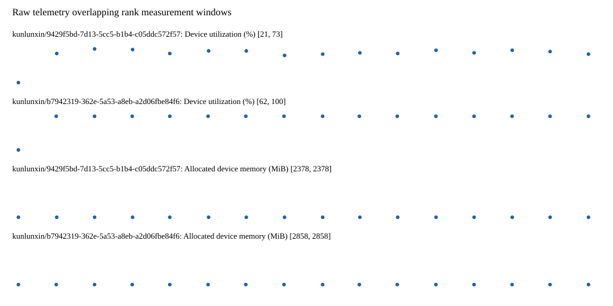

# Benchmark device telemetry

| Field | Evidence |
|---|---|
| vendor | kunlunxin |
| status | passed |
| collector | xpu-smi -m and selected -q |
| reasons | [] |
| policy | {"automatic_workload_extension": false, "collector": "xpu-smi -m and selected -q", "enabled": true, "metric_fields": [{"key": "utilization_percent", "label": "Device utilization", "unit": "%"}, {"key": "used_memory_mib", "label": "Allocated device memory", "unit": "MiB"}], "required_samples_per_target": 10, "target_interval_s": 1.0, "target_resource": "p800-device", "vendor": "kunlunxin"} |
| rank_device_map | not recorded |
| measurement_windows | [{"device_id": "kunlunxin/9429f5bd-7d13-5cc5-b1b4-c05ddc572f57", "finished_monotonic_ns": 3993721688902194, "finished_offset_s": 24.1712820190005, "rank": 0, "role": "measurement", "started_monotonic_ns": 3993706551342620, "started_offset_s": 9.033722444903105}, {"device_id": "kunlunxin/b7942319-362e-5a53-a8eb-a2d06fbe84f6", "finished_monotonic_ns": 3993721689094290, "finished_offset_s": 24.171474114991724, "rank": 1, "role": "measurement", "started_monotonic_ns": 3993706551380299, "started_offset_s": 9.033760123886168}] |
| lifecycle_windows | not recorded |
| raw_samples | {"bytes": 275504, "path": "benchmark-monitor/samples.raw.jsonl", "sha256": "c25dbc73297f304f227f8de485bc1dfffada7ab4e70cb6558c828a53060c6b82"} |
| parsed_samples | {"bytes": 17383, "path": "benchmark-monitor/samples.jsonl", "sha256": "f6ef054987708b273ed476b866ac9ce06c9db4dc25198de768eadb3f2181e632"} |
| sample_counts | {"kunlunxin/9429f5bd-7d13-5cc5-b1b4-c05ddc572f57": 16, "kunlunxin/b7942319-362e-5a53-a8eb-a2d06fbe84f6": 16} |
| events | not recorded |

| Device | Metric | Unit | Samples | Min | Median | Max |
|---|---|---|---|---|---|---|
| kunlunxin/9429f5bd-7d13-5cc5-b1b4-c05ddc572f57 | Device utilization | % | 16 | 21 | 67.0 | 73 |
| kunlunxin/b7942319-362e-5a53-a8eb-a2d06fbe84f6 | Device utilization | % | 16 | 62 | 100.0 | 100 |
| kunlunxin/9429f5bd-7d13-5cc5-b1b4-c05ddc572f57 | Allocated device memory | MiB | 16 | 2378 | 2378.0 | 2378 |
| kunlunxin/b7942319-362e-5a53-a8eb-a2d06fbe84f6 | Allocated device memory | MiB | 16 | 2858 | 2858.0 | 2858 |

Only command intervals overlapping the recorded rank measurement windows are summarized.
Missing or invalid measurements remain missing. Driver integration windows and theoretical utilization are not inferred.
