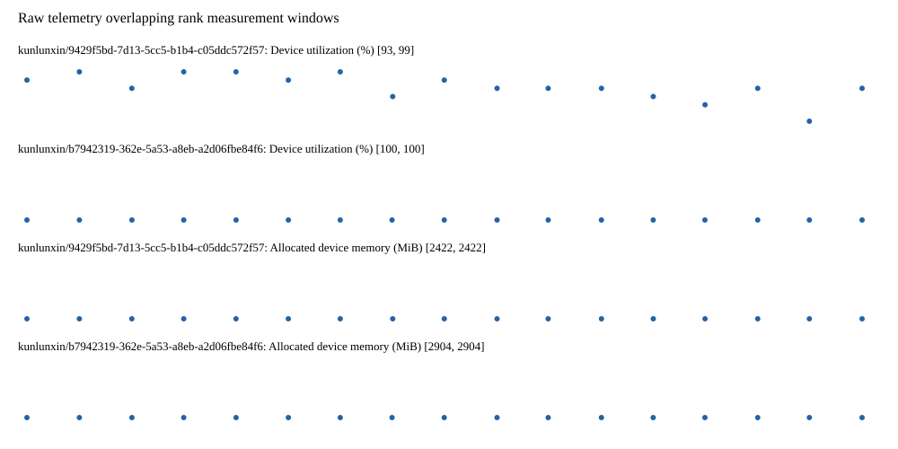

# Benchmark device telemetry

| Field | Evidence |
|---|---|
| vendor | kunlunxin |
| status | passed |
| collector | xpu-smi -m and selected -q |
| reasons | [] |
| policy | {"automatic_workload_extension": false, "collector": "xpu-smi -m and selected -q", "enabled": true, "metric_fields": [{"key": "utilization_percent", "label": "Device utilization", "unit": "%"}, {"key": "used_memory_mib", "label": "Allocated device memory", "unit": "MiB"}], "required_samples_per_target": 10, "target_interval_s": 1.0, "target_resource": "p800-device", "vendor": "kunlunxin"} |
| rank_device_map | not recorded |
| measurement_windows | [{"device_id": "kunlunxin/9429f5bd-7d13-5cc5-b1b4-c05ddc572f57", "finished_monotonic_ns": 3993828849459773, "finished_offset_s": 26.862985766027123, "rank": 0, "role": "measurement", "started_monotonic_ns": 3993811407298401, "started_offset_s": 9.420824394095689}, {"device_id": "kunlunxin/b7942319-362e-5a53-a8eb-a2d06fbe84f6", "finished_monotonic_ns": 3993828848924974, "finished_offset_s": 26.862450967077166, "rank": 1, "role": "measurement", "started_monotonic_ns": 3993811407263442, "started_offset_s": 9.420789435040206}] |
| lifecycle_windows | not recorded |
| raw_samples | {"bytes": 308992, "path": "benchmark-monitor/samples.raw.jsonl", "sha256": "6f0da9591d13b123b774beecc293f7303ff4e4a737b7953f6cd405caf06b30fd"} |
| parsed_samples | {"bytes": 19406, "path": "benchmark-monitor/samples.jsonl", "sha256": "6fbb0d38a80be2b4ab74734618cd0251e0e90333e4f732b16d22e5f8a4c71e14"} |
| sample_counts | {"kunlunxin/9429f5bd-7d13-5cc5-b1b4-c05ddc572f57": 17, "kunlunxin/b7942319-362e-5a53-a8eb-a2d06fbe84f6": 17} |
| events | not recorded |

| Device | Metric | Unit | Samples | Min | Median | Max |
|---|---|---|---|---|---|---|
| kunlunxin/9429f5bd-7d13-5cc5-b1b4-c05ddc572f57 | Device utilization | % | 17 | 93 | 97 | 99 |
| kunlunxin/b7942319-362e-5a53-a8eb-a2d06fbe84f6 | Device utilization | % | 17 | 100 | 100 | 100 |
| kunlunxin/9429f5bd-7d13-5cc5-b1b4-c05ddc572f57 | Allocated device memory | MiB | 17 | 2422 | 2422 | 2422 |
| kunlunxin/b7942319-362e-5a53-a8eb-a2d06fbe84f6 | Allocated device memory | MiB | 17 | 2904 | 2904 | 2904 |

Only command intervals overlapping the recorded rank measurement windows are summarized.
Missing or invalid measurements remain missing. Driver integration windows and theoretical utilization are not inferred.
