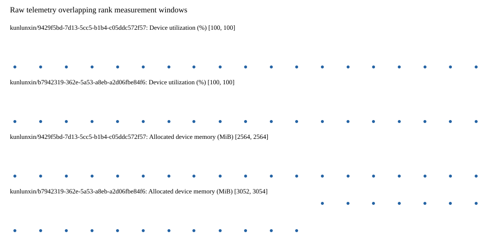

# Benchmark device telemetry

| Field | Evidence |
|---|---|
| vendor | kunlunxin |
| status | passed |
| collector | xpu-smi -m and selected -q |
| reasons | [] |
| policy | {"automatic_workload_extension": false, "collector": "xpu-smi -m and selected -q", "enabled": true, "metric_fields": [{"key": "utilization_percent", "label": "Device utilization", "unit": "%"}, {"key": "used_memory_mib", "label": "Allocated device memory", "unit": "MiB"}], "required_samples_per_target": 10, "target_interval_s": 1.0, "target_resource": "p800-device", "vendor": "kunlunxin"} |
| rank_device_map | not recorded |
| measurement_windows | [{"device_id": "kunlunxin/9429f5bd-7d13-5cc5-b1b4-c05ddc572f57", "finished_monotonic_ns": 3994196936311896, "finished_offset_s": 28.86720708012581, "rank": 0, "role": "measurement", "started_monotonic_ns": 3994177937215697, "started_offset_s": 9.868110881187022}, {"device_id": "kunlunxin/b7942319-362e-5a53-a8eb-a2d06fbe84f6", "finished_monotonic_ns": 3994196633944882, "finished_offset_s": 28.56484006624669, "rank": 1, "role": "measurement", "started_monotonic_ns": 3994177934342077, "started_offset_s": 9.865237261168659}] |
| lifecycle_windows | not recorded |
| raw_samples | {"bytes": 340890, "path": "benchmark-monitor/samples.raw.jsonl", "sha256": "4ff2dd2e64beb31fb04723dcbbc523ac84bed72ac1ccf93a20173d6df8280936"} |
| parsed_samples | {"bytes": 21441, "path": "benchmark-monitor/samples.jsonl", "sha256": "5284862a3187a4e796a889c7877717bb234f18b2c8360dc34e14b08dc2d70402"} |
| sample_counts | {"kunlunxin/9429f5bd-7d13-5cc5-b1b4-c05ddc572f57": 19, "kunlunxin/b7942319-362e-5a53-a8eb-a2d06fbe84f6": 19} |
| events | not recorded |

| Device | Metric | Unit | Samples | Min | Median | Max |
|---|---|---|---|---|---|---|
| kunlunxin/9429f5bd-7d13-5cc5-b1b4-c05ddc572f57 | Device utilization | % | 19 | 100 | 100 | 100 |
| kunlunxin/b7942319-362e-5a53-a8eb-a2d06fbe84f6 | Device utilization | % | 19 | 100 | 100 | 100 |
| kunlunxin/9429f5bd-7d13-5cc5-b1b4-c05ddc572f57 | Allocated device memory | MiB | 19 | 2564 | 2564 | 2564 |
| kunlunxin/b7942319-362e-5a53-a8eb-a2d06fbe84f6 | Allocated device memory | MiB | 19 | 3052 | 3052 | 3054 |

Only command intervals overlapping the recorded rank measurement windows are summarized.
Missing or invalid measurements remain missing. Driver integration windows and theoretical utilization are not inferred.
