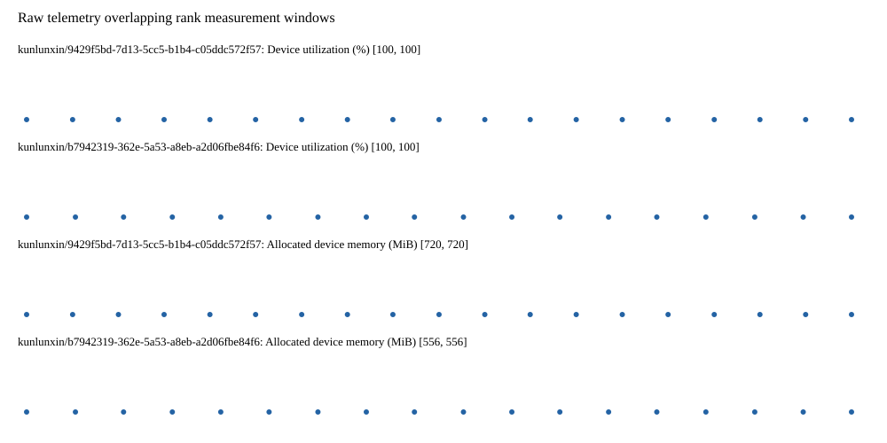

# Benchmark device telemetry

| Field | Evidence |
|---|---|
| vendor | kunlunxin |
| status | passed |
| collector | xpu-smi -m and selected -q |
| reasons | [] |
| policy | {"automatic_workload_extension": false, "collector": "xpu-smi -m and selected -q", "enabled": true, "metric_fields": [{"key": "utilization_percent", "label": "Device utilization", "unit": "%"}, {"key": "used_memory_mib", "label": "Allocated device memory", "unit": "MiB"}], "required_samples_per_target": 10, "target_interval_s": 1.0, "target_resource": "p800-device", "vendor": "kunlunxin"} |
| rank_device_map | not recorded |
| measurement_windows | [{"device_id": "kunlunxin/9429f5bd-7d13-5cc5-b1b4-c05ddc572f57", "finished_monotonic_ns": 4056608131421231, "finished_offset_s": 28.292516532354057, "rank": 0, "role": "measurement", "started_monotonic_ns": 4056589156704533, "started_offset_s": 9.317799834068865}, {"device_id": "kunlunxin/b7942319-362e-5a53-a8eb-a2d06fbe84f6", "finished_monotonic_ns": 4056607829177605, "finished_offset_s": 27.99027290614322, "rank": 1, "role": "measurement", "started_monotonic_ns": 4056589153925181, "started_offset_s": 9.315020482055843}] |
| lifecycle_windows | not recorded |
| raw_samples | {"bytes": 285264, "path": "benchmark-monitor/samples.raw.jsonl", "sha256": "056d7f4ec87d27d8c9e56a9f2ae9341f336872f5fe122cf364c5c351defb4ed2"} |
| parsed_samples | {"bytes": 20004, "path": "benchmark-monitor/samples.jsonl", "sha256": "81317907a03f4b97be32b8c7dbd47a5ac609ebc354b087341f75cfe7d8c0586d"} |
| sample_counts | {"kunlunxin/9429f5bd-7d13-5cc5-b1b4-c05ddc572f57": 19, "kunlunxin/b7942319-362e-5a53-a8eb-a2d06fbe84f6": 18} |
| events | not recorded |

| Device | Metric | Unit | Samples | Min | Median | Max |
|---|---|---|---|---|---|---|
| kunlunxin/9429f5bd-7d13-5cc5-b1b4-c05ddc572f57 | Device utilization | % | 19 | 100 | 100 | 100 |
| kunlunxin/b7942319-362e-5a53-a8eb-a2d06fbe84f6 | Device utilization | % | 18 | 100 | 100.0 | 100 |
| kunlunxin/9429f5bd-7d13-5cc5-b1b4-c05ddc572f57 | Allocated device memory | MiB | 19 | 720 | 720 | 720 |
| kunlunxin/b7942319-362e-5a53-a8eb-a2d06fbe84f6 | Allocated device memory | MiB | 18 | 556 | 556.0 | 556 |

Only command intervals overlapping the recorded rank measurement windows are summarized.
Missing or invalid measurements remain missing. Driver integration windows and theoretical utilization are not inferred.
