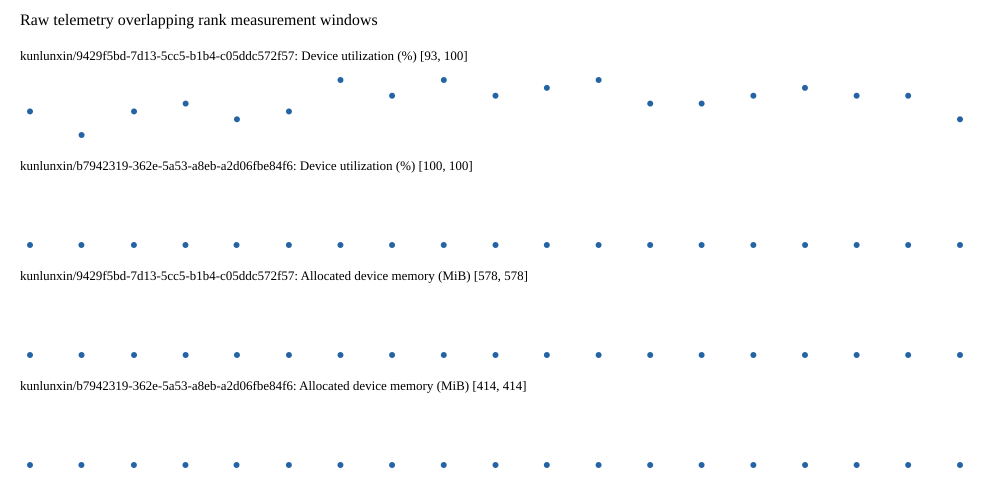

# Benchmark device telemetry

| Field | Evidence |
|---|---|
| vendor | kunlunxin |
| status | passed |
| collector | xpu-smi -m and selected -q |
| reasons | [] |
| policy | {"automatic_workload_extension": false, "collector": "xpu-smi -m and selected -q", "enabled": true, "metric_fields": [{"key": "utilization_percent", "label": "Device utilization", "unit": "%"}, {"key": "used_memory_mib", "label": "Allocated device memory", "unit": "MiB"}], "required_samples_per_target": 10, "target_interval_s": 1.0, "target_resource": "p800-device", "vendor": "kunlunxin"} |
| rank_device_map | not recorded |
| measurement_windows | [{"device_id": "kunlunxin/9429f5bd-7d13-5cc5-b1b4-c05ddc572f57", "finished_monotonic_ns": 4056810891851328, "finished_offset_s": 28.36208372702822, "rank": 0, "role": "measurement", "started_monotonic_ns": 4056792029364326, "started_offset_s": 9.499596725217998}, {"device_id": "kunlunxin/b7942319-362e-5a53-a8eb-a2d06fbe84f6", "finished_monotonic_ns": 4056810891241651, "finished_offset_s": 28.361474050208926, "rank": 1, "role": "measurement", "started_monotonic_ns": 4056792029300347, "started_offset_s": 9.49953274615109}] |
| lifecycle_windows | not recorded |
| raw_samples | {"bytes": 285207, "path": "benchmark-monitor/samples.raw.jsonl", "sha256": "8087c396ca932816a84b2baefe07e68b20f36b3fa8ab5e4593b3dc9189003fb7"} |
| parsed_samples | {"bytes": 19997, "path": "benchmark-monitor/samples.jsonl", "sha256": "79851fc1dda57afd9c7ed9f6c007fd5b080293d1a98a6afed7e6c32e235fd3e9"} |
| sample_counts | {"kunlunxin/9429f5bd-7d13-5cc5-b1b4-c05ddc572f57": 19, "kunlunxin/b7942319-362e-5a53-a8eb-a2d06fbe84f6": 19} |
| events | not recorded |

| Device | Metric | Unit | Samples | Min | Median | Max |
|---|---|---|---|---|---|---|
| kunlunxin/9429f5bd-7d13-5cc5-b1b4-c05ddc572f57 | Device utilization | % | 19 | 93 | 98 | 100 |
| kunlunxin/b7942319-362e-5a53-a8eb-a2d06fbe84f6 | Device utilization | % | 19 | 100 | 100 | 100 |
| kunlunxin/9429f5bd-7d13-5cc5-b1b4-c05ddc572f57 | Allocated device memory | MiB | 19 | 578 | 578 | 578 |
| kunlunxin/b7942319-362e-5a53-a8eb-a2d06fbe84f6 | Allocated device memory | MiB | 19 | 414 | 414 | 414 |

Only command intervals overlapping the recorded rank measurement windows are summarized.
Missing or invalid measurements remain missing. Driver integration windows and theoretical utilization are not inferred.
