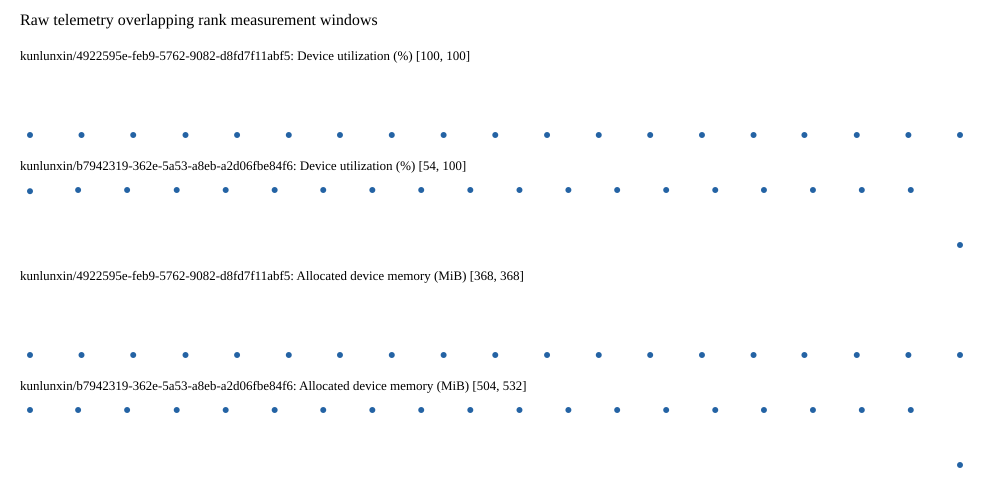

# Benchmark device telemetry

| Field | Evidence |
|---|---|
| vendor | kunlunxin |
| status | passed |
| collector | xpu-smi -m and selected -q |
| reasons | [] |
| policy | {"automatic_workload_extension": false, "collector": "xpu-smi -m and selected -q", "enabled": true, "metric_fields": [{"key": "utilization_percent", "label": "Device utilization", "unit": "%"}, {"key": "used_memory_mib", "label": "Allocated device memory", "unit": "MiB"}], "required_samples_per_target": 10, "target_interval_s": 1.0, "target_resource": "p800-device", "vendor": "kunlunxin"} |
| rank_device_map | not recorded |
| measurement_windows | [{"device_id": "kunlunxin/b7942319-362e-5a53-a8eb-a2d06fbe84f6", "finished_monotonic_ns": 4055220037564789, "finished_offset_s": 28.028373862151057, "rank": 0, "role": "measurement", "started_monotonic_ns": 4055200927493156, "started_offset_s": 8.918302229139954}, {"device_id": "kunlunxin/4922595e-feb9-5762-9082-d8fd7f11abf5", "finished_monotonic_ns": 4055220012383084, "finished_offset_s": 28.00319215701893, "rank": 1, "role": "measurement", "started_monotonic_ns": 4055200927470436, "started_offset_s": 8.918279509060085}] |
| lifecycle_windows | not recorded |
| raw_samples | {"bytes": 285142, "path": "benchmark-monitor/samples.raw.jsonl", "sha256": "408fa41e6181c00bd3e68f460151999de2ab1840761c0dd64ba30e7839868c86"} |
| parsed_samples | {"bytes": 20012, "path": "benchmark-monitor/samples.jsonl", "sha256": "c79c9a383fd0ff444e1594e172da31ad81bd58a832e86daca040b43a7c5bc049"} |
| sample_counts | {"kunlunxin/4922595e-feb9-5762-9082-d8fd7f11abf5": 19, "kunlunxin/b7942319-362e-5a53-a8eb-a2d06fbe84f6": 20} |
| events | not recorded |

| Device | Metric | Unit | Samples | Min | Median | Max |
|---|---|---|---|---|---|---|
| kunlunxin/4922595e-feb9-5762-9082-d8fd7f11abf5 | Device utilization | % | 19 | 100 | 100 | 100 |
| kunlunxin/b7942319-362e-5a53-a8eb-a2d06fbe84f6 | Device utilization | % | 20 | 54 | 100.0 | 100 |
| kunlunxin/4922595e-feb9-5762-9082-d8fd7f11abf5 | Allocated device memory | MiB | 19 | 368 | 368 | 368 |
| kunlunxin/b7942319-362e-5a53-a8eb-a2d06fbe84f6 | Allocated device memory | MiB | 20 | 504 | 532.0 | 532 |

Only command intervals overlapping the recorded rank measurement windows are summarized.
Missing or invalid measurements remain missing. Driver integration windows and theoretical utilization are not inferred.
