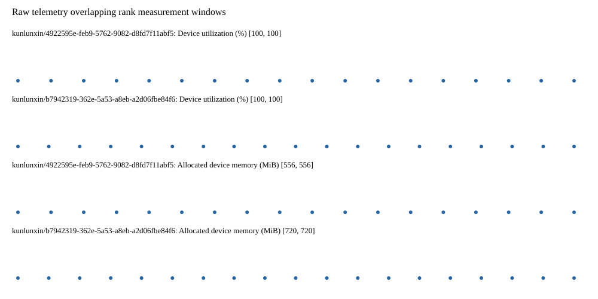

# Benchmark device telemetry

| Field | Evidence |
|---|---|
| vendor | kunlunxin |
| status | passed |
| collector | xpu-smi -m and selected -q |
| reasons | [] |
| policy | {"automatic_workload_extension": false, "collector": "xpu-smi -m and selected -q", "enabled": true, "metric_fields": [{"key": "utilization_percent", "label": "Device utilization", "unit": "%"}, {"key": "used_memory_mib", "label": "Allocated device memory", "unit": "MiB"}], "required_samples_per_target": 10, "target_interval_s": 1.0, "target_resource": "p800-device", "vendor": "kunlunxin"} |
| rank_device_map | not recorded |
| measurement_windows | [{"device_id": "kunlunxin/b7942319-362e-5a53-a8eb-a2d06fbe84f6", "finished_monotonic_ns": 4055318917826691, "finished_offset_s": 28.203311078250408, "rank": 0, "role": "measurement", "started_monotonic_ns": 4055299914416144, "started_offset_s": 9.199900531210005}, {"device_id": "kunlunxin/4922595e-feb9-5762-9082-d8fd7f11abf5", "finished_monotonic_ns": 4055318522361234, "finished_offset_s": 27.807845620904118, "rank": 1, "role": "measurement", "started_monotonic_ns": 4055299910408569, "started_offset_s": 9.195892956107855}] |
| lifecycle_windows | not recorded |
| raw_samples | {"bytes": 285138, "path": "benchmark-monitor/samples.raw.jsonl", "sha256": "aba7612e8136375b3aa9b7c7da7f254dc5aa80618e0c23c92bbde720f3f61a66"} |
| parsed_samples | {"bytes": 20005, "path": "benchmark-monitor/samples.jsonl", "sha256": "e8db19cf693f66ef0ab63b2231de0628ddcdb64a6ceb15f7e9422023e7bd8c5b"} |
| sample_counts | {"kunlunxin/4922595e-feb9-5762-9082-d8fd7f11abf5": 18, "kunlunxin/b7942319-362e-5a53-a8eb-a2d06fbe84f6": 19} |
| events | not recorded |

| Device | Metric | Unit | Samples | Min | Median | Max |
|---|---|---|---|---|---|---|
| kunlunxin/4922595e-feb9-5762-9082-d8fd7f11abf5 | Device utilization | % | 18 | 100 | 100.0 | 100 |
| kunlunxin/b7942319-362e-5a53-a8eb-a2d06fbe84f6 | Device utilization | % | 19 | 100 | 100 | 100 |
| kunlunxin/4922595e-feb9-5762-9082-d8fd7f11abf5 | Allocated device memory | MiB | 18 | 556 | 556.0 | 556 |
| kunlunxin/b7942319-362e-5a53-a8eb-a2d06fbe84f6 | Allocated device memory | MiB | 19 | 720 | 720 | 720 |

Only command intervals overlapping the recorded rank measurement windows are summarized.
Missing or invalid measurements remain missing. Driver integration windows and theoretical utilization are not inferred.
