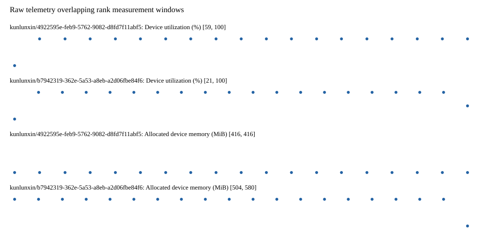

# Benchmark device telemetry

| Field | Evidence |
|---|---|
| vendor | kunlunxin |
| status | passed |
| collector | xpu-smi -m and selected -q |
| reasons | [] |
| policy | {"automatic_workload_extension": false, "collector": "xpu-smi -m and selected -q", "enabled": true, "metric_fields": [{"key": "utilization_percent", "label": "Device utilization", "unit": "%"}, {"key": "used_memory_mib", "label": "Allocated device memory", "unit": "MiB"}], "required_samples_per_target": 10, "target_interval_s": 1.0, "target_resource": "p800-device", "vendor": "kunlunxin"} |
| rank_device_map | not recorded |
| measurement_windows | [{"device_id": "kunlunxin/b7942319-362e-5a53-a8eb-a2d06fbe84f6", "finished_monotonic_ns": 4055268513471333, "finished_offset_s": 28.037253791000694, "rank": 0, "role": "measurement", "started_monotonic_ns": 4055249527379824, "started_offset_s": 9.051162282004952}, {"device_id": "kunlunxin/4922595e-feb9-5762-9082-d8fd7f11abf5", "finished_monotonic_ns": 4055268413586073, "finished_offset_s": 27.93736853124574, "rank": 1, "role": "measurement", "started_monotonic_ns": 4055249526880215, "started_offset_s": 9.050662673078477}] |
| lifecycle_windows | not recorded |
| raw_samples | {"bytes": 285146, "path": "benchmark-monitor/samples.raw.jsonl", "sha256": "573b0f4ed3d7fae6b15c12893ea3905f27f944ab8b48c2197915962b5a56f613"} |
| parsed_samples | {"bytes": 20026, "path": "benchmark-monitor/samples.jsonl", "sha256": "df9da12ac0d959cfd1db7c579589df61245245ee7f6515a42bab445aa5357999"} |
| sample_counts | {"kunlunxin/4922595e-feb9-5762-9082-d8fd7f11abf5": 19, "kunlunxin/b7942319-362e-5a53-a8eb-a2d06fbe84f6": 20} |
| events | not recorded |

| Device | Metric | Unit | Samples | Min | Median | Max |
|---|---|---|---|---|---|---|
| kunlunxin/4922595e-feb9-5762-9082-d8fd7f11abf5 | Device utilization | % | 19 | 59 | 100 | 100 |
| kunlunxin/b7942319-362e-5a53-a8eb-a2d06fbe84f6 | Device utilization | % | 20 | 21 | 100.0 | 100 |
| kunlunxin/4922595e-feb9-5762-9082-d8fd7f11abf5 | Allocated device memory | MiB | 19 | 416 | 416 | 416 |
| kunlunxin/b7942319-362e-5a53-a8eb-a2d06fbe84f6 | Allocated device memory | MiB | 20 | 504 | 580.0 | 580 |

Only command intervals overlapping the recorded rank measurement windows are summarized.
Missing or invalid measurements remain missing. Driver integration windows and theoretical utilization are not inferred.
