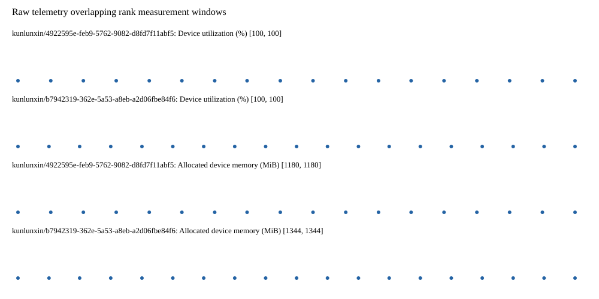

# Benchmark device telemetry

| Field | Evidence |
|---|---|
| vendor | kunlunxin |
| status | passed |
| collector | xpu-smi -m and selected -q |
| reasons | [] |
| policy | {"automatic_workload_extension": false, "collector": "xpu-smi -m and selected -q", "enabled": true, "metric_fields": [{"key": "utilization_percent", "label": "Device utilization", "unit": "%"}, {"key": "used_memory_mib", "label": "Allocated device memory", "unit": "MiB"}], "required_samples_per_target": 10, "target_interval_s": 1.0, "target_resource": "p800-device", "vendor": "kunlunxin"} |
| rank_device_map | not recorded |
| measurement_windows | [{"device_id": "kunlunxin/b7942319-362e-5a53-a8eb-a2d06fbe84f6", "finished_monotonic_ns": 4055380325684584, "finished_offset_s": 29.91330438107252, "rank": 0, "role": "measurement", "started_monotonic_ns": 4055361311310637, "started_offset_s": 10.898930433671921}, {"device_id": "kunlunxin/4922595e-feb9-5762-9082-d8fd7f11abf5", "finished_monotonic_ns": 4055378745713006, "finished_offset_s": 28.333332802634686, "rank": 1, "role": "measurement", "started_monotonic_ns": 4055361293788875, "started_offset_s": 10.881408671848476}] |
| lifecycle_windows | not recorded |
| raw_samples | {"bytes": 313583, "path": "benchmark-monitor/samples.raw.jsonl", "sha256": "7af11f04fadfc28c092559245659b9d1cec6249a8248826845a4dad111d9f11e"} |
| parsed_samples | {"bytes": 22051, "path": "benchmark-monitor/samples.jsonl", "sha256": "8703011c72f866d2cb37381d0ee06d3406bb6bc748c7b6710107e7b3ebff8627"} |
| sample_counts | {"kunlunxin/4922595e-feb9-5762-9082-d8fd7f11abf5": 18, "kunlunxin/b7942319-362e-5a53-a8eb-a2d06fbe84f6": 19} |
| events | not recorded |

| Device | Metric | Unit | Samples | Min | Median | Max |
|---|---|---|---|---|---|---|
| kunlunxin/4922595e-feb9-5762-9082-d8fd7f11abf5 | Device utilization | % | 18 | 100 | 100.0 | 100 |
| kunlunxin/b7942319-362e-5a53-a8eb-a2d06fbe84f6 | Device utilization | % | 19 | 100 | 100 | 100 |
| kunlunxin/4922595e-feb9-5762-9082-d8fd7f11abf5 | Allocated device memory | MiB | 18 | 1180 | 1180.0 | 1180 |
| kunlunxin/b7942319-362e-5a53-a8eb-a2d06fbe84f6 | Allocated device memory | MiB | 19 | 1344 | 1344 | 1344 |

Only command intervals overlapping the recorded rank measurement windows are summarized.
Missing or invalid measurements remain missing. Driver integration windows and theoretical utilization are not inferred.
