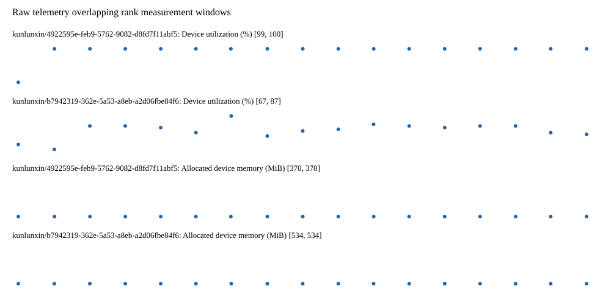

# Benchmark device telemetry

| Field | Evidence |
|---|---|
| vendor | kunlunxin |
| status | passed |
| collector | xpu-smi -m and selected -q |
| reasons | [] |
| policy | {"automatic_workload_extension": false, "collector": "xpu-smi -m and selected -q", "enabled": true, "metric_fields": [{"key": "utilization_percent", "label": "Device utilization", "unit": "%"}, {"key": "used_memory_mib", "label": "Allocated device memory", "unit": "MiB"}], "required_samples_per_target": 10, "target_interval_s": 1.0, "target_resource": "p800-device", "vendor": "kunlunxin"} |
| rank_device_map | not recorded |
| measurement_windows | [{"device_id": "kunlunxin/b7942319-362e-5a53-a8eb-a2d06fbe84f6", "finished_monotonic_ns": 4055426421966634, "finished_offset_s": 25.270465243142098, "rank": 0, "role": "measurement", "started_monotonic_ns": 4055409983984526, "started_offset_s": 8.832483134698123}, {"device_id": "kunlunxin/4922595e-feb9-5762-9082-d8fd7f11abf5", "finished_monotonic_ns": 4055426422031552, "finished_offset_s": 25.27053016098216, "rank": 1, "role": "measurement", "started_monotonic_ns": 4055409983967536, "started_offset_s": 8.832466145046055}] |
| lifecycle_windows | not recorded |
| raw_samples | {"bytes": 255054, "path": "benchmark-monitor/samples.raw.jsonl", "sha256": "918e33b1a109d485900fbc7827bc9c16c21b1cc78e252ca4d94ce37b33ee4f71"} |
| parsed_samples | {"bytes": 17972, "path": "benchmark-monitor/samples.jsonl", "sha256": "299d04518b2e8031db05513a9b5f54a9d45c2d39b12fb558685a27a52509eae7"} |
| sample_counts | {"kunlunxin/4922595e-feb9-5762-9082-d8fd7f11abf5": 17, "kunlunxin/b7942319-362e-5a53-a8eb-a2d06fbe84f6": 17} |
| events | not recorded |

| Device | Metric | Unit | Samples | Min | Median | Max |
|---|---|---|---|---|---|---|
| kunlunxin/4922595e-feb9-5762-9082-d8fd7f11abf5 | Device utilization | % | 17 | 99 | 100 | 100 |
| kunlunxin/b7942319-362e-5a53-a8eb-a2d06fbe84f6 | Device utilization | % | 17 | 67 | 80 | 87 |
| kunlunxin/4922595e-feb9-5762-9082-d8fd7f11abf5 | Allocated device memory | MiB | 17 | 370 | 370 | 370 |
| kunlunxin/b7942319-362e-5a53-a8eb-a2d06fbe84f6 | Allocated device memory | MiB | 17 | 534 | 534 | 534 |

Only command intervals overlapping the recorded rank measurement windows are summarized.
Missing or invalid measurements remain missing. Driver integration windows and theoretical utilization are not inferred.
