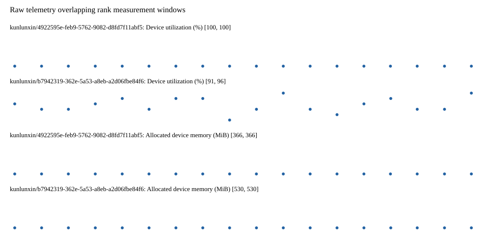

# Benchmark device telemetry

| Field | Evidence |
|---|---|
| vendor | kunlunxin |
| status | passed |
| collector | xpu-smi -m and selected -q |
| reasons | [] |
| policy | {"automatic_workload_extension": false, "collector": "xpu-smi -m and selected -q", "enabled": true, "metric_fields": [{"key": "utilization_percent", "label": "Device utilization", "unit": "%"}, {"key": "used_memory_mib", "label": "Allocated device memory", "unit": "MiB"}], "required_samples_per_target": 10, "target_interval_s": 1.0, "target_resource": "p800-device", "vendor": "kunlunxin"} |
| rank_device_map | not recorded |
| measurement_windows | [{"device_id": "kunlunxin/b7942319-362e-5a53-a8eb-a2d06fbe84f6", "finished_monotonic_ns": 4055473077443190, "finished_offset_s": 26.690753164701164, "rank": 0, "role": "measurement", "started_monotonic_ns": 4055455254075325, "started_offset_s": 8.867385299876332}, {"device_id": "kunlunxin/4922595e-feb9-5762-9082-d8fd7f11abf5", "finished_monotonic_ns": 4055473077767344, "finished_offset_s": 26.69107731897384, "rank": 1, "role": "measurement", "started_monotonic_ns": 4055455254026846, "started_offset_s": 8.867336820811033}] |
| lifecycle_windows | not recorded |
| raw_samples | {"bytes": 273973, "path": "benchmark-monitor/samples.raw.jsonl", "sha256": "726b28a1052c7b9b06043cbdd063fc6214dcacfea583c4744955ed479921f5af"} |
| parsed_samples | {"bytes": 19327, "path": "benchmark-monitor/samples.jsonl", "sha256": "4a78dccccac298401e20a4dfa6d98eb92120c7d865b93a23ab84df06c91b1fed"} |
| sample_counts | {"kunlunxin/4922595e-feb9-5762-9082-d8fd7f11abf5": 18, "kunlunxin/b7942319-362e-5a53-a8eb-a2d06fbe84f6": 18} |
| events | not recorded |

| Device | Metric | Unit | Samples | Min | Median | Max |
|---|---|---|---|---|---|---|
| kunlunxin/4922595e-feb9-5762-9082-d8fd7f11abf5 | Device utilization | % | 18 | 100 | 100.0 | 100 |
| kunlunxin/b7942319-362e-5a53-a8eb-a2d06fbe84f6 | Device utilization | % | 18 | 91 | 93.5 | 96 |
| kunlunxin/4922595e-feb9-5762-9082-d8fd7f11abf5 | Allocated device memory | MiB | 18 | 366 | 366.0 | 366 |
| kunlunxin/b7942319-362e-5a53-a8eb-a2d06fbe84f6 | Allocated device memory | MiB | 18 | 530 | 530.0 | 530 |

Only command intervals overlapping the recorded rank measurement windows are summarized.
Missing or invalid measurements remain missing. Driver integration windows and theoretical utilization are not inferred.
