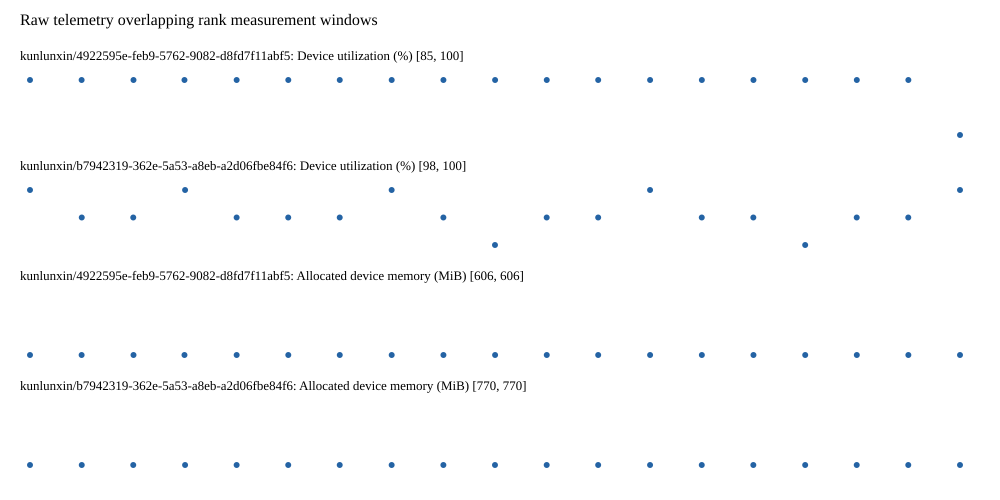

# Benchmark device telemetry

| Field | Evidence |
|---|---|
| vendor | kunlunxin |
| status | passed |
| collector | xpu-smi -m and selected -q |
| reasons | [] |
| policy | {"automatic_workload_extension": false, "collector": "xpu-smi -m and selected -q", "enabled": true, "metric_fields": [{"key": "utilization_percent", "label": "Device utilization", "unit": "%"}, {"key": "used_memory_mib", "label": "Allocated device memory", "unit": "MiB"}], "required_samples_per_target": 10, "target_interval_s": 1.0, "target_resource": "p800-device", "vendor": "kunlunxin"} |
| rank_device_map | not recorded |
| measurement_windows | [{"device_id": "kunlunxin/b7942319-362e-5a53-a8eb-a2d06fbe84f6", "finished_monotonic_ns": 4055586900657377, "finished_offset_s": 30.125585693400353, "rank": 0, "role": "measurement", "started_monotonic_ns": 4055567960451751, "started_offset_s": 11.185380067210644}, {"device_id": "kunlunxin/4922595e-feb9-5762-9082-d8fd7f11abf5", "finished_monotonic_ns": 4055586893389623, "finished_offset_s": 30.11831793934107, "rank": 1, "role": "measurement", "started_monotonic_ns": 4055567960360313, "started_offset_s": 11.185288629028946}] |
| lifecycle_windows | not recorded |
| raw_samples | {"bytes": 313681, "path": "benchmark-monitor/samples.raw.jsonl", "sha256": "ca316b0729717286061f5326071fda54acb4f899045c41ba6c1ab227793becca"} |
| parsed_samples | {"bytes": 21995, "path": "benchmark-monitor/samples.jsonl", "sha256": "f840ff6d9a94849dbe7e02912c05f90e01f798be4ca0fd3de56cbc04fc3f88f4"} |
| sample_counts | {"kunlunxin/4922595e-feb9-5762-9082-d8fd7f11abf5": 19, "kunlunxin/b7942319-362e-5a53-a8eb-a2d06fbe84f6": 19} |
| events | not recorded |

| Device | Metric | Unit | Samples | Min | Median | Max |
|---|---|---|---|---|---|---|
| kunlunxin/4922595e-feb9-5762-9082-d8fd7f11abf5 | Device utilization | % | 19 | 85 | 100 | 100 |
| kunlunxin/b7942319-362e-5a53-a8eb-a2d06fbe84f6 | Device utilization | % | 19 | 98 | 99 | 100 |
| kunlunxin/4922595e-feb9-5762-9082-d8fd7f11abf5 | Allocated device memory | MiB | 19 | 606 | 606 | 606 |
| kunlunxin/b7942319-362e-5a53-a8eb-a2d06fbe84f6 | Allocated device memory | MiB | 19 | 770 | 770 | 770 |

Only command intervals overlapping the recorded rank measurement windows are summarized.
Missing or invalid measurements remain missing. Driver integration windows and theoretical utilization are not inferred.
