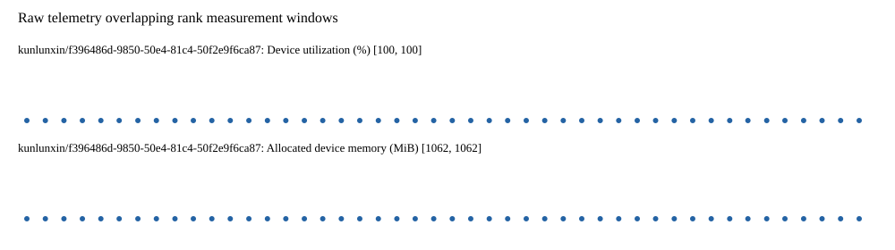

# Benchmark device telemetry

| Field | Evidence |
|---|---|
| vendor | kunlunxin |
| status | passed |
| collector | xpu-smi -m and selected -q |
| reasons | [] |
| policy | {"automatic_workload_extension": false, "collector": "xpu-smi -m and selected -q", "enabled": true, "metric_fields": [{"key": "utilization_percent", "label": "Device utilization", "unit": "%"}, {"key": "used_memory_mib", "label": "Allocated device memory", "unit": "MiB"}], "required_samples_per_target": 10, "target_interval_s": 1.0, "target_resource": "p800-device", "vendor": "kunlunxin"} |
| rank_device_map | not recorded |
| measurement_windows | [{"device_id": "kunlunxin/f396486d-9850-50e4-81c4-50f2e9f6ca87", "finished_monotonic_ns": 4096572481883126, "finished_offset_s": 55.891827852930874, "rank": 0, "role": "measurement", "started_monotonic_ns": 4096526271473657, "started_offset_s": 9.68141838395968}] |
| lifecycle_windows | not recorded |
| raw_samples | {"bytes": 295811, "path": "benchmark-monitor/samples.raw.jsonl", "sha256": "fadf1a94b16f094e5e92d6909c78cb541d7642f2ec42ba9aaa3038476a8e4f25"} |
| parsed_samples | {"bytes": 19099, "path": "benchmark-monitor/samples.jsonl", "sha256": "6e5caf77762d3942c2a050ea5356b60477d93d0aee519200df3e5e8b47b76142"} |
| sample_counts | {"kunlunxin/f396486d-9850-50e4-81c4-50f2e9f6ca87": 46} |
| events | not recorded |

| Device | Metric | Unit | Samples | Min | Median | Max |
|---|---|---|---|---|---|---|
| kunlunxin/f396486d-9850-50e4-81c4-50f2e9f6ca87 | Device utilization | % | 46 | 100 | 100.0 | 100 |
| kunlunxin/f396486d-9850-50e4-81c4-50f2e9f6ca87 | Allocated device memory | MiB | 46 | 1062 | 1062.0 | 1062 |

Only command intervals overlapping the recorded rank measurement windows are summarized.
Missing or invalid measurements remain missing. Driver integration windows and theoretical utilization are not inferred.
