# Kunlunxin P800 Toolkit 测试报告

运行：20260929T043131Z-591f8f07

总体状态：**partial**；测量：**passed**；监控：**partial**；厂商阈值诊断：**not-supported**。

计算使用独立 Toolkit C++ 程序调用 XBLAS；传输调用 XRE。没有导入 PyTorch/Base workload，也没有将官方 fc_effciency 的存在或 help 输出当作测量通过。

计时为 CLOCK_MONOTONIC 的原生 API 调用到同步完成，不包含进程启动、分配、预热及正确性回读；它不是纯 kernel 时间。容量为每卡 HBM 查询值。D2D/单向 P2P 不乘二；双向 P2P 单独运行两个并发方向，以实际两份 payload/两方向完成时间计算，含线程协调开销。

INT8 使用 XBLAS fc_fusion（INT8 输入和 TGEMM、FP32 输出、maxima=127、alpha=1、beta=0、无 bias、LINEAR 激活）。它不是 INT8→INT32 GemmEx；后者在当前镜像的实测返回参数错误。

Pinned 异步模式可能按配置将逻辑 payload 分为多次原生提交，最后统一等待。实际分块大小和 API 次数记录在 metrics 的 async_chunk_bytes / api_calls_per_sample；这是分块端到端带宽，不能与单次整块 API 调用混称。

卡 1 已排除。占用卡数据属于 exploratory；本报告不晋级 candidate，也不替代 Base 双卡/八卡 qualification。

厂商诊断仅有 xpu-smi 观测，不具备 Ascend DMI 的算力/带宽/信号质量阈值判定。xprofiler 的文件及 help 留档不代表采集了 kernel trace。

## 测试条件

```json
{
  "allow_busy_devices": true,
  "allow_candidate_runtime": true,
  "async_chunk_bytes": 1048576,
  "command_timeout": 180,
  "matrix_size": 128,
  "minimum_seconds": 0.0,
  "payload_bytes": 1048576,
  "pinned_api": "register",
  "privilege_command": "",
  "repeat": 1,
  "samples": 25,
  "smoke": true,
  "warmup": 2
}
```

## 状态矩阵

| Case | Measurement | Monitoring | Diagnosis | 有效指标 | 证据 |
| --- | --- | --- | --- | --- | --- |
| computation-BF16 | passed | partial | not-supported | 2 | [metrics](toolkit-evidence/cases/computation-BF16/metrics.json) |
| computation-FP16 | passed | partial | not-supported | 2 | [metrics](toolkit-evidence/cases/computation-FP16/metrics.json) |
| computation-FP32 | passed | partial | not-supported | 2 | [metrics](toolkit-evidence/cases/computation-FP32/metrics.json) |
| computation-INT8 | passed | partial | not-supported | 2 | [metrics](toolkit-evidence/cases/computation-INT8/metrics.json) |
| main_memory-bandwidth | passed | partial | not-supported | 2 | [metrics](toolkit-evidence/cases/main_memory-bandwidth/metrics.json) |
| main_memory-capacity | passed | passed | not-supported | 6 | [metrics](toolkit-evidence/cases/main_memory-capacity/metrics.json) |
| interconnect-h2d | passed | partial | not-supported | 8 | [metrics](toolkit-evidence/cases/interconnect-h2d/metrics.json) |
| interconnect-d2h | passed | partial | not-supported | 8 | [metrics](toolkit-evidence/cases/interconnect-d2h/metrics.json) |
| interconnect-h2d-latency | passed | partial | not-supported | 32 | [metrics](toolkit-evidence/cases/interconnect-h2d-latency/metrics.json) |
| interconnect-d2h-latency | passed | partial | not-supported | 32 | [metrics](toolkit-evidence/cases/interconnect-d2h-latency/metrics.json) |
| interconnect-P2P_intraserver | passed | partial | not-supported | 2 | [metrics](toolkit-evidence/cases/interconnect-P2P_intraserver/metrics.json) |
| interconnect-P2P_intraserver-latency | passed | partial | not-supported | 1 | [metrics](toolkit-evidence/cases/interconnect-P2P_intraserver-latency/metrics.json) |

## computation-BF16

| 设备/模式/载荷 | 重复 | 字段 | 值 | 单位 | 样本数 | 样本 CV | 原始来源 |
| --- | --- | --- | --- | --- | --- | --- | --- |
| card 3 | 1 | P800_METRIC/samples_ns | 0.34952533 | TFLOPS | 25 | 3.3717% | [stdout](toolkit-evidence/cases/computation-BF16/physical-3/repeat-1/microbenchmark.stdout) |
| card 7 | 1 | P800_METRIC/samples_ns | 0.29980729 | TFLOPS | 25 | 282.8839% | [stdout](toolkit-evidence/cases/computation-BF16/physical-7/repeat-1/microbenchmark.stdout) |


重复组（统计各独立进程的结果；单次内部样本不代替五次重复）：

| 点 | 字段 | 独立重复 | 中位数 | 单位 | 组 CV | 稳定性 |
| --- | --- | --- | --- | --- | --- | --- |
| card 3 | P800_METRIC/samples_ns | 1 | 0.34952533 | TFLOPS | N/A | insufficient-repeats |
| card 7 | P800_METRIC/samples_ns | 1 | 0.29980729 | TFLOPS | N/A | insufficient-repeats |

## computation-FP16

| 设备/模式/载荷 | 重复 | 字段 | 值 | 单位 | 样本数 | 样本 CV | 原始来源 |
| --- | --- | --- | --- | --- | --- | --- | --- |
| card 3 | 1 | P800_METRIC/samples_ns | 0.36663497 | TFLOPS | 25 | 8.8125% | [stdout](toolkit-evidence/cases/computation-FP16/physical-3/repeat-1/microbenchmark.stdout) |
| card 7 | 1 | P800_METRIC/samples_ns | 0.36599511 | TFLOPS | 25 | 223.2122% | [stdout](toolkit-evidence/cases/computation-FP16/physical-7/repeat-1/microbenchmark.stdout) |

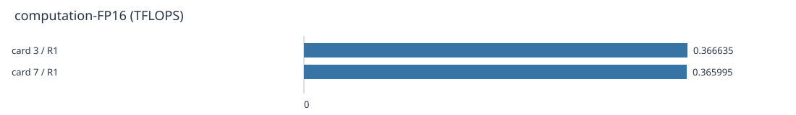


重复组（统计各独立进程的结果；单次内部样本不代替五次重复）：

| 点 | 字段 | 独立重复 | 中位数 | 单位 | 组 CV | 稳定性 |
| --- | --- | --- | --- | --- | --- | --- |
| card 3 | P800_METRIC/samples_ns | 1 | 0.36663497 | TFLOPS | N/A | insufficient-repeats |
| card 7 | P800_METRIC/samples_ns | 1 | 0.36599511 | TFLOPS | N/A | insufficient-repeats |

## computation-FP32

| 设备/模式/载荷 | 重复 | 字段 | 值 | 单位 | 样本数 | 样本 CV | 原始来源 |
| --- | --- | --- | --- | --- | --- | --- | --- |
| card 3 | 1 | P800_METRIC/samples_ns | 0.3539497 | TFLOPS | 25 | 428.1050% | [stdout](toolkit-evidence/cases/computation-FP32/physical-3/repeat-1/microbenchmark.stdout) |
| card 7 | 1 | P800_METRIC/samples_ns | 0.3472106 | TFLOPS | 25 | 266.1628% | [stdout](toolkit-evidence/cases/computation-FP32/physical-7/repeat-1/microbenchmark.stdout) |

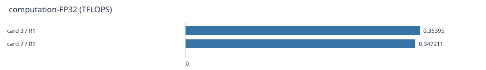


重复组（统计各独立进程的结果；单次内部样本不代替五次重复）：

| 点 | 字段 | 独立重复 | 中位数 | 单位 | 组 CV | 稳定性 |
| --- | --- | --- | --- | --- | --- | --- |
| card 3 | P800_METRIC/samples_ns | 1 | 0.3539497 | TFLOPS | N/A | insufficient-repeats |
| card 7 | P800_METRIC/samples_ns | 1 | 0.3472106 | TFLOPS | N/A | insufficient-repeats |

## computation-INT8

| 设备/模式/载荷 | 重复 | 字段 | 值 | 单位 | 样本数 | 样本 CV | 原始来源 |
| --- | --- | --- | --- | --- | --- | --- | --- |
| card 3 | 1 | P800_METRIC/samples_ns | 0.33581297 | TOPS | 25 | 349.0640% | [stdout](toolkit-evidence/cases/computation-INT8/physical-3/repeat-1/microbenchmark.stdout) |
| card 7 | 1 | P800_METRIC/samples_ns | 0.33000031 | TOPS | 25 | 189.5753% | [stdout](toolkit-evidence/cases/computation-INT8/physical-7/repeat-1/microbenchmark.stdout) |

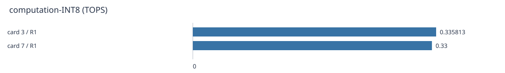


重复组（统计各独立进程的结果；单次内部样本不代替五次重复）：

| 点 | 字段 | 独立重复 | 中位数 | 单位 | 组 CV | 稳定性 |
| --- | --- | --- | --- | --- | --- | --- |
| card 3 | P800_METRIC/samples_ns | 1 | 0.33581297 | TOPS | N/A | insufficient-repeats |
| card 7 | P800_METRIC/samples_ns | 1 | 0.33000031 | TOPS | N/A | insufficient-repeats |

## main_memory-bandwidth

| 设备/模式/载荷 | 重复 | 字段 | 值 | 单位 | 样本数 | 样本 CV | 原始来源 |
| --- | --- | --- | --- | --- | --- | --- | --- |
| card 3 / 1048576 B | 1 | P800_METRIC/samples_ns | 9.3100828 | GB/s | 25 | 8.5709% | [stdout](toolkit-evidence/cases/main_memory-bandwidth/physical-3-1048576B/repeat-1/microbenchmark.stdout) |
| card 7 / 1048576 B | 1 | P800_METRIC/samples_ns | 8.5501721 | GB/s | 25 | 67.7376% | [stdout](toolkit-evidence/cases/main_memory-bandwidth/physical-7-1048576B/repeat-1/microbenchmark.stdout) |

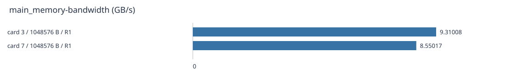


前 25 个实测 D2D 样本（仅图表截取，完整样本仍保留；载荷和参考厂商工具的固定工作集不同）：

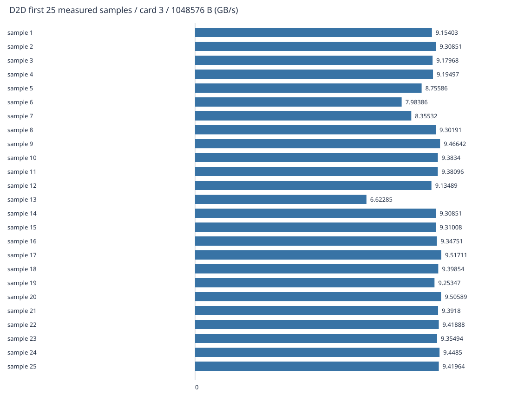

[完整 samples.json](toolkit-evidence/cases/main_memory-bandwidth/physical-3-1048576B/repeat-1/samples.json)


前 25 个实测 D2D 样本（仅图表截取，完整样本仍保留；载荷和参考厂商工具的固定工作集不同）：

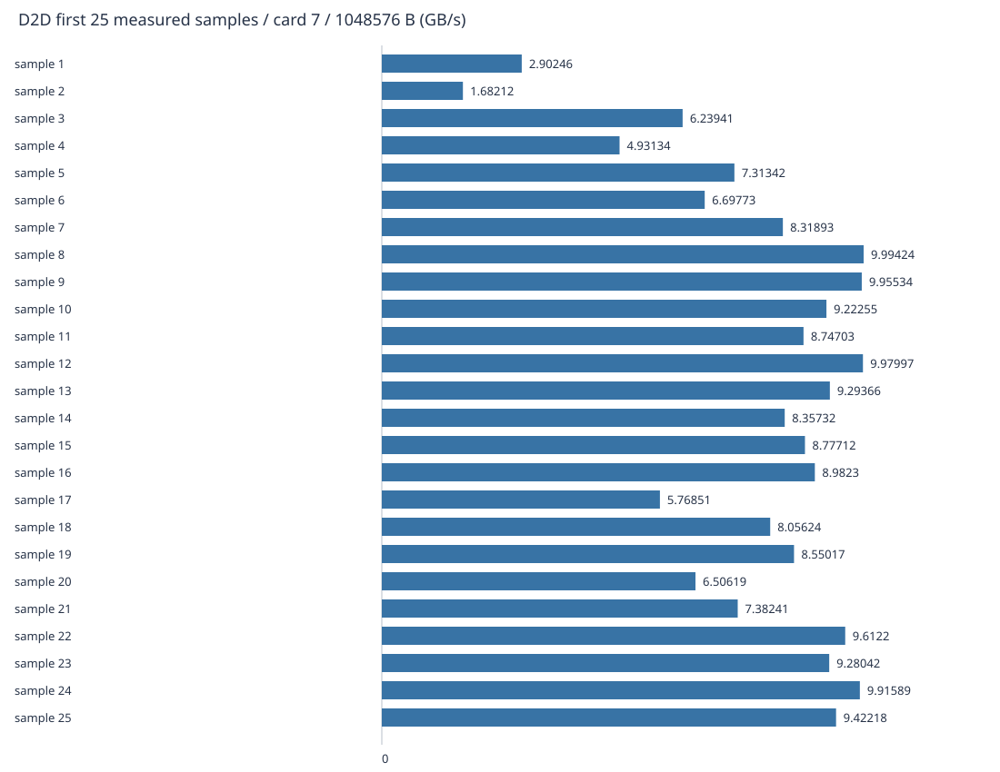

[完整 samples.json](toolkit-evidence/cases/main_memory-bandwidth/physical-7-1048576B/repeat-1/samples.json)


重复组（统计各独立进程的结果；单次内部样本不代替五次重复）：

| 点 | 字段 | 独立重复 | 中位数 | 单位 | 组 CV | 稳定性 |
| --- | --- | --- | --- | --- | --- | --- |
| card 3 / 1048576 B | P800_METRIC/samples_ns | 1 | 9.3100828 | GB/s | N/A | insufficient-repeats |
| card 7 / 1048576 B | P800_METRIC/samples_ns | 1 | 8.5501721 | GB/s | N/A | insufficient-repeats |

## main_memory-capacity

| 设备/模式/载荷 | 重复 | 字段 | 值 | 单位 | 样本数 | 样本 CV | 原始来源 |
| --- | --- | --- | --- | --- | --- | --- | --- |
| card 3 | query | Memory Usage/total_memory_mib | 98304 | MiB | query | N/A | [stdout](toolkit-evidence/cases/main_memory-capacity/physical-3/repeat-1/microbenchmark.stdout) |
| card 3 | query | Memory Usage/used_memory_mib | 20430 | MiB | query | N/A | [stdout](toolkit-evidence/cases/main_memory-capacity/physical-3/repeat-1/microbenchmark.stdout) |
| card 3 | query | Memory Usage/free_memory_mib | 77874 | MiB | query | N/A | [stdout](toolkit-evidence/cases/main_memory-capacity/physical-3/repeat-1/microbenchmark.stdout) |
| card 7 | query | Memory Usage/total_memory_mib | 98304 | MiB | query | N/A | [stdout](toolkit-evidence/cases/main_memory-capacity/physical-7/repeat-1/microbenchmark.stdout) |
| card 7 | query | Memory Usage/used_memory_mib | 75590 | MiB | query | N/A | [stdout](toolkit-evidence/cases/main_memory-capacity/physical-7/repeat-1/microbenchmark.stdout) |
| card 7 | query | Memory Usage/free_memory_mib | 22714 | MiB | query | N/A | [stdout](toolkit-evidence/cases/main_memory-capacity/physical-7/repeat-1/microbenchmark.stdout) |

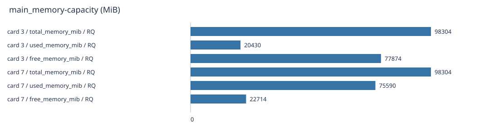


重复组（统计各独立进程的结果；单次内部样本不代替五次重复）：

| 点 | 字段 | 独立重复 | 中位数 | 单位 | 组 CV | 稳定性 |
| --- | --- | --- | --- | --- | --- | --- |
| card 3 | Memory Usage/free_memory_mib | 1 | 77874 | MiB | N/A | insufficient-repeats |
| card 3 | Memory Usage/total_memory_mib | 1 | 98304 | MiB | N/A | insufficient-repeats |
| card 3 | Memory Usage/used_memory_mib | 1 | 20430 | MiB | N/A | insufficient-repeats |
| card 7 | Memory Usage/free_memory_mib | 1 | 22714 | MiB | N/A | insufficient-repeats |
| card 7 | Memory Usage/total_memory_mib | 1 | 98304 | MiB | N/A | insufficient-repeats |
| card 7 | Memory Usage/used_memory_mib | 1 | 75590 | MiB | N/A | insufficient-repeats |

## interconnect-h2d

| 设备/模式/载荷 | 重复 | 字段 | 值 | 单位 | 样本数 | 样本 CV | 原始来源 |
| --- | --- | --- | --- | --- | --- | --- | --- |
| card 3 / 1048576 B / pageable / blocking | 1 | P800_METRIC/samples_ns | 10.676006 | GB/s | 25 | 2.1630% | [stdout](toolkit-evidence/cases/interconnect-h2d/physical-3-1048576B-pageable-blocking/repeat-1/microbenchmark.stdout) |
| card 3 / 1048576 B / pageable / async | 1 | P800_METRIC/samples_ns | 9.599004 | GB/s | 25 | 7.1984% | [stdout](toolkit-evidence/cases/interconnect-h2d/physical-3-1048576B-pageable-nonblocking/repeat-1/microbenchmark.stdout) |
| card 3 / 1048576 B / pinned / blocking | 1 | P800_METRIC/samples_ns | 6.1860701 | GB/s | 25 | 33.3792% | [stdout](toolkit-evidence/cases/interconnect-h2d/physical-3-1048576B-pinned-blocking/repeat-1/microbenchmark.stdout) |
| card 3 / 1048576 B / pinned / async | 1 | P800_METRIC/samples_ns | 5.5646267 | GB/s | 25 | 35.3489% | [stdout](toolkit-evidence/cases/interconnect-h2d/physical-3-1048576B-pinned-nonblocking/repeat-1/microbenchmark.stdout) |
| card 7 / 1048576 B / pageable / blocking | 1 | P800_METRIC/samples_ns | 10.062337 | GB/s | 25 | 60.4313% | [stdout](toolkit-evidence/cases/interconnect-h2d/physical-7-1048576B-pageable-blocking/repeat-1/microbenchmark.stdout) |
| card 7 / 1048576 B / pageable / async | 1 | P800_METRIC/samples_ns | 10.278343 | GB/s | 25 | 5.6853% | [stdout](toolkit-evidence/cases/interconnect-h2d/physical-7-1048576B-pageable-nonblocking/repeat-1/microbenchmark.stdout) |
| card 7 / 1048576 B / pinned / blocking | 1 | P800_METRIC/samples_ns | 5.6705531 | GB/s | 25 | 31.2368% | [stdout](toolkit-evidence/cases/interconnect-h2d/physical-7-1048576B-pinned-blocking/repeat-1/microbenchmark.stdout) |
| card 7 / 1048576 B / pinned / async | 1 | P800_METRIC/samples_ns | 6.2831497 | GB/s | 25 | 30.2160% | [stdout](toolkit-evidence/cases/interconnect-h2d/physical-7-1048576B-pinned-nonblocking/repeat-1/microbenchmark.stdout) |

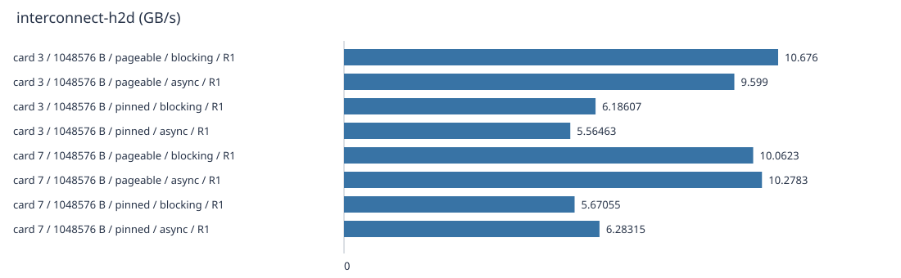


重复组（统计各独立进程的结果；单次内部样本不代替五次重复）：

| 点 | 字段 | 独立重复 | 中位数 | 单位 | 组 CV | 稳定性 |
| --- | --- | --- | --- | --- | --- | --- |
| card 3 / 1048576 B / pageable / async | P800_METRIC/samples_ns | 1 | 9.599004 | GB/s | N/A | insufficient-repeats |
| card 3 / 1048576 B / pageable / blocking | P800_METRIC/samples_ns | 1 | 10.676006 | GB/s | N/A | insufficient-repeats |
| card 3 / 1048576 B / pinned / async | P800_METRIC/samples_ns | 1 | 5.5646267 | GB/s | N/A | insufficient-repeats |
| card 3 / 1048576 B / pinned / blocking | P800_METRIC/samples_ns | 1 | 6.1860701 | GB/s | N/A | insufficient-repeats |
| card 7 / 1048576 B / pageable / async | P800_METRIC/samples_ns | 1 | 10.278343 | GB/s | N/A | insufficient-repeats |
| card 7 / 1048576 B / pageable / blocking | P800_METRIC/samples_ns | 1 | 10.062337 | GB/s | N/A | insufficient-repeats |
| card 7 / 1048576 B / pinned / async | P800_METRIC/samples_ns | 1 | 6.2831497 | GB/s | N/A | insufficient-repeats |
| card 7 / 1048576 B / pinned / blocking | P800_METRIC/samples_ns | 1 | 5.6705531 | GB/s | N/A | insufficient-repeats |

## interconnect-d2h

| 设备/模式/载荷 | 重复 | 字段 | 值 | 单位 | 样本数 | 样本 CV | 原始来源 |
| --- | --- | --- | --- | --- | --- | --- | --- |
| card 3 / 1048576 B / pageable / blocking | 1 | P800_METRIC/samples_ns | 10.412043 | GB/s | 25 | 9.8120% | [stdout](toolkit-evidence/cases/interconnect-d2h/physical-3-1048576B-pageable-blocking/repeat-1/microbenchmark.stdout) |
| card 3 / 1048576 B / pageable / async | 1 | P800_METRIC/samples_ns | 10.311699 | GB/s | 25 | 1.8900% | [stdout](toolkit-evidence/cases/interconnect-d2h/physical-3-1048576B-pageable-nonblocking/repeat-1/microbenchmark.stdout) |
| card 3 / 1048576 B / pinned / blocking | 1 | P800_METRIC/samples_ns | 12.716486 | GB/s | 25 | 8.0638% | [stdout](toolkit-evidence/cases/interconnect-d2h/physical-3-1048576B-pinned-blocking/repeat-1/microbenchmark.stdout) |
| card 3 / 1048576 B / pinned / async | 1 | P800_METRIC/samples_ns | 11.664064 | GB/s | 25 | 41.0112% | [stdout](toolkit-evidence/cases/interconnect-d2h/physical-3-1048576B-pinned-nonblocking/repeat-1/microbenchmark.stdout) |
| card 7 / 1048576 B / pageable / blocking | 1 | P800_METRIC/samples_ns | 8.6296869 | GB/s | 25 | 5.6021% | [stdout](toolkit-evidence/cases/interconnect-d2h/physical-7-1048576B-pageable-blocking/repeat-1/microbenchmark.stdout) |
| card 7 / 1048576 B / pageable / async | 1 | P800_METRIC/samples_ns | 10.587613 | GB/s | 25 | 9.4651% | [stdout](toolkit-evidence/cases/interconnect-d2h/physical-7-1048576B-pageable-nonblocking/repeat-1/microbenchmark.stdout) |
| card 7 / 1048576 B / pinned / blocking | 1 | P800_METRIC/samples_ns | 6.256532 | GB/s | 25 | 9.4614% | [stdout](toolkit-evidence/cases/interconnect-d2h/physical-7-1048576B-pinned-blocking/repeat-1/microbenchmark.stdout) |
| card 7 / 1048576 B / pinned / async | 1 | P800_METRIC/samples_ns | 11.327629 | GB/s | 25 | 24.9012% | [stdout](toolkit-evidence/cases/interconnect-d2h/physical-7-1048576B-pinned-nonblocking/repeat-1/microbenchmark.stdout) |

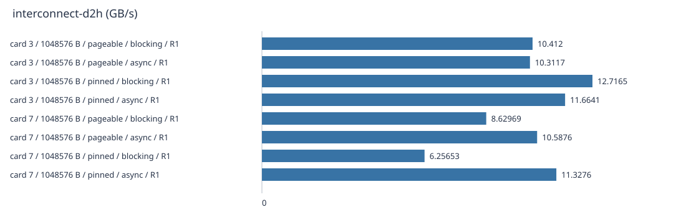


重复组（统计各独立进程的结果；单次内部样本不代替五次重复）：

| 点 | 字段 | 独立重复 | 中位数 | 单位 | 组 CV | 稳定性 |
| --- | --- | --- | --- | --- | --- | --- |
| card 3 / 1048576 B / pageable / async | P800_METRIC/samples_ns | 1 | 10.311699 | GB/s | N/A | insufficient-repeats |
| card 3 / 1048576 B / pageable / blocking | P800_METRIC/samples_ns | 1 | 10.412043 | GB/s | N/A | insufficient-repeats |
| card 3 / 1048576 B / pinned / async | P800_METRIC/samples_ns | 1 | 11.664064 | GB/s | N/A | insufficient-repeats |
| card 3 / 1048576 B / pinned / blocking | P800_METRIC/samples_ns | 1 | 12.716486 | GB/s | N/A | insufficient-repeats |
| card 7 / 1048576 B / pageable / async | P800_METRIC/samples_ns | 1 | 10.587613 | GB/s | N/A | insufficient-repeats |
| card 7 / 1048576 B / pageable / blocking | P800_METRIC/samples_ns | 1 | 8.6296869 | GB/s | N/A | insufficient-repeats |
| card 7 / 1048576 B / pinned / async | P800_METRIC/samples_ns | 1 | 11.327629 | GB/s | N/A | insufficient-repeats |
| card 7 / 1048576 B / pinned / blocking | P800_METRIC/samples_ns | 1 | 6.256532 | GB/s | N/A | insufficient-repeats |

## interconnect-h2d-latency

| 设备/模式/载荷 | 重复 | 字段 | 值 | 单位 | 样本数 | 样本 CV | 原始来源 |
| --- | --- | --- | --- | --- | --- | --- | --- |
| card 3 / 512 B / pageable / blocking | 1 | P800_METRIC/samples_ns | 12379 | ns | 25 | 2.0248% | [stdout](toolkit-evidence/cases/interconnect-h2d-latency/physical-3-512B-pageable-blocking/repeat-1/microbenchmark.stdout) |
| card 3 / 512 B / pageable / async | 1 | P800_METRIC/samples_ns | 14350 | ns | 25 | 1.8877% | [stdout](toolkit-evidence/cases/interconnect-h2d-latency/physical-3-512B-pageable-nonblocking/repeat-1/microbenchmark.stdout) |
| card 3 / 512 B / pinned / blocking | 1 | P800_METRIC/samples_ns | 12209 | ns | 25 | 2.0658% | [stdout](toolkit-evidence/cases/interconnect-h2d-latency/physical-3-512B-pinned-blocking/repeat-1/microbenchmark.stdout) |
| card 3 / 512 B / pinned / async | 1 | P800_METRIC/samples_ns | 12619 | ns | 25 | 2.3038% | [stdout](toolkit-evidence/cases/interconnect-h2d-latency/physical-3-512B-pinned-nonblocking/repeat-1/microbenchmark.stdout) |
| card 3 / 4096 B / pageable / blocking | 1 | P800_METRIC/samples_ns | 12959 | ns | 25 | 170.8317% | [stdout](toolkit-evidence/cases/interconnect-h2d-latency/physical-3-4096B-pageable-blocking/repeat-1/microbenchmark.stdout) |
| card 3 / 4096 B / pageable / async | 1 | P800_METRIC/samples_ns | 15650 | ns | 25 | 12.3377% | [stdout](toolkit-evidence/cases/interconnect-h2d-latency/physical-3-4096B-pageable-nonblocking/repeat-1/microbenchmark.stdout) |
| card 3 / 4096 B / pinned / blocking | 1 | P800_METRIC/samples_ns | 12839 | ns | 25 | 7.3725% | [stdout](toolkit-evidence/cases/interconnect-h2d-latency/physical-3-4096B-pinned-blocking/repeat-1/microbenchmark.stdout) |
| card 3 / 4096 B / pinned / async | 1 | P800_METRIC/samples_ns | 12819 | ns | 25 | 142.0258% | [stdout](toolkit-evidence/cases/interconnect-h2d-latency/physical-3-4096B-pinned-nonblocking/repeat-1/microbenchmark.stdout) |
| card 3 / 65536 B / pageable / blocking | 1 | P800_METRIC/samples_ns | 39160 | ns | 25 | 16.5911% | [stdout](toolkit-evidence/cases/interconnect-h2d-latency/physical-3-65536B-pageable-blocking/repeat-1/microbenchmark.stdout) |
| card 3 / 65536 B / pageable / async | 1 | P800_METRIC/samples_ns | 20769 | ns | 25 | 23.0496% | [stdout](toolkit-evidence/cases/interconnect-h2d-latency/physical-3-65536B-pageable-nonblocking/repeat-1/microbenchmark.stdout) |
| card 3 / 65536 B / pinned / blocking | 1 | P800_METRIC/samples_ns | 21829 | ns | 25 | 4.3116% | [stdout](toolkit-evidence/cases/interconnect-h2d-latency/physical-3-65536B-pinned-blocking/repeat-1/microbenchmark.stdout) |
| card 3 / 65536 B / pinned / async | 1 | P800_METRIC/samples_ns | 22280 | ns | 25 | 137.4306% | [stdout](toolkit-evidence/cases/interconnect-h2d-latency/physical-3-65536B-pinned-nonblocking/repeat-1/microbenchmark.stdout) |
| card 3 / 1048576 B / pageable / blocking | 1 | P800_METRIC/samples_ns | 112557 | ns | 25 | 5.0701% | [stdout](toolkit-evidence/cases/interconnect-h2d-latency/physical-3-1048576B-pageable-blocking/repeat-1/microbenchmark.stdout) |
| card 3 / 1048576 B / pageable / async | 1 | P800_METRIC/samples_ns | 108918 | ns | 25 | 2.2734% | [stdout](toolkit-evidence/cases/interconnect-h2d-latency/physical-3-1048576B-pageable-nonblocking/repeat-1/microbenchmark.stdout) |
| card 3 / 1048576 B / pinned / blocking | 1 | P800_METRIC/samples_ns | 127887 | ns | 25 | 28.3959% | [stdout](toolkit-evidence/cases/interconnect-h2d-latency/physical-3-1048576B-pinned-blocking/repeat-1/microbenchmark.stdout) |
| card 3 / 1048576 B / pinned / async | 1 | P800_METRIC/samples_ns | 170056 | ns | 25 | 23.7308% | [stdout](toolkit-evidence/cases/interconnect-h2d-latency/physical-3-1048576B-pinned-nonblocking/repeat-1/microbenchmark.stdout) |
| card 7 / 512 B / pageable / blocking | 1 | P800_METRIC/samples_ns | 15400 | ns | 25 | 161.1408% | [stdout](toolkit-evidence/cases/interconnect-h2d-latency/physical-7-512B-pageable-blocking/repeat-1/microbenchmark.stdout) |
| card 7 / 512 B / pageable / async | 1 | P800_METRIC/samples_ns | 14990 | ns | 25 | 3.3583% | [stdout](toolkit-evidence/cases/interconnect-h2d-latency/physical-7-512B-pageable-nonblocking/repeat-1/microbenchmark.stdout) |
| card 7 / 512 B / pinned / blocking | 1 | P800_METRIC/samples_ns | 12720 | ns | 25 | 2.3646% | [stdout](toolkit-evidence/cases/interconnect-h2d-latency/physical-7-512B-pinned-blocking/repeat-1/microbenchmark.stdout) |
| card 7 / 512 B / pinned / async | 1 | P800_METRIC/samples_ns | 15940 | ns | 25 | 20.0814% | [stdout](toolkit-evidence/cases/interconnect-h2d-latency/physical-7-512B-pinned-nonblocking/repeat-1/microbenchmark.stdout) |
| card 7 / 4096 B / pageable / blocking | 1 | P800_METRIC/samples_ns | 17390 | ns | 25 | 64.4409% | [stdout](toolkit-evidence/cases/interconnect-h2d-latency/physical-7-4096B-pageable-blocking/repeat-1/microbenchmark.stdout) |
| card 7 / 4096 B / pageable / async | 1 | P800_METRIC/samples_ns | 30720 | ns | 25 | 29.7671% | [stdout](toolkit-evidence/cases/interconnect-h2d-latency/physical-7-4096B-pageable-nonblocking/repeat-1/microbenchmark.stdout) |
| card 7 / 4096 B / pinned / blocking | 1 | P800_METRIC/samples_ns | 20630 | ns | 25 | 50.2704% | [stdout](toolkit-evidence/cases/interconnect-h2d-latency/physical-7-4096B-pinned-blocking/repeat-1/microbenchmark.stdout) |
| card 7 / 4096 B / pinned / async | 1 | P800_METRIC/samples_ns | 19850 | ns | 25 | 38.5908% | [stdout](toolkit-evidence/cases/interconnect-h2d-latency/physical-7-4096B-pinned-nonblocking/repeat-1/microbenchmark.stdout) |
| card 7 / 65536 B / pageable / blocking | 1 | P800_METRIC/samples_ns | 18170 | ns | 25 | 3.1300% | [stdout](toolkit-evidence/cases/interconnect-h2d-latency/physical-7-65536B-pageable-blocking/repeat-1/microbenchmark.stdout) |
| card 7 / 65536 B / pageable / async | 1 | P800_METRIC/samples_ns | 28720 | ns | 25 | 93.7277% | [stdout](toolkit-evidence/cases/interconnect-h2d-latency/physical-7-65536B-pageable-nonblocking/repeat-1/microbenchmark.stdout) |
| card 7 / 65536 B / pinned / blocking | 1 | P800_METRIC/samples_ns | 20409 | ns | 25 | 15.1129% | [stdout](toolkit-evidence/cases/interconnect-h2d-latency/physical-7-65536B-pinned-blocking/repeat-1/microbenchmark.stdout) |
| card 7 / 65536 B / pinned / async | 1 | P800_METRIC/samples_ns | 24859 | ns | 25 | 4.5687% | [stdout](toolkit-evidence/cases/interconnect-h2d-latency/physical-7-65536B-pinned-nonblocking/repeat-1/microbenchmark.stdout) |
| card 7 / 1048576 B / pageable / blocking | 1 | P800_METRIC/samples_ns | 105328 | ns | 25 | 5.5323% | [stdout](toolkit-evidence/cases/interconnect-h2d-latency/physical-7-1048576B-pageable-blocking/repeat-1/microbenchmark.stdout) |
| card 7 / 1048576 B / pageable / async | 1 | P800_METRIC/samples_ns | 108758 | ns | 25 | 4.5566% | [stdout](toolkit-evidence/cases/interconnect-h2d-latency/physical-7-1048576B-pageable-nonblocking/repeat-1/microbenchmark.stdout) |
| card 7 / 1048576 B / pinned / blocking | 1 | P800_METRIC/samples_ns | 151447 | ns | 25 | 12.6692% | [stdout](toolkit-evidence/cases/interconnect-h2d-latency/physical-7-1048576B-pinned-blocking/repeat-1/microbenchmark.stdout) |
| card 7 / 1048576 B / pinned / async | 1 | P800_METRIC/samples_ns | 167667 | ns | 25 | 29.8144% | [stdout](toolkit-evidence/cases/interconnect-h2d-latency/physical-7-1048576B-pinned-nonblocking/repeat-1/microbenchmark.stdout) |

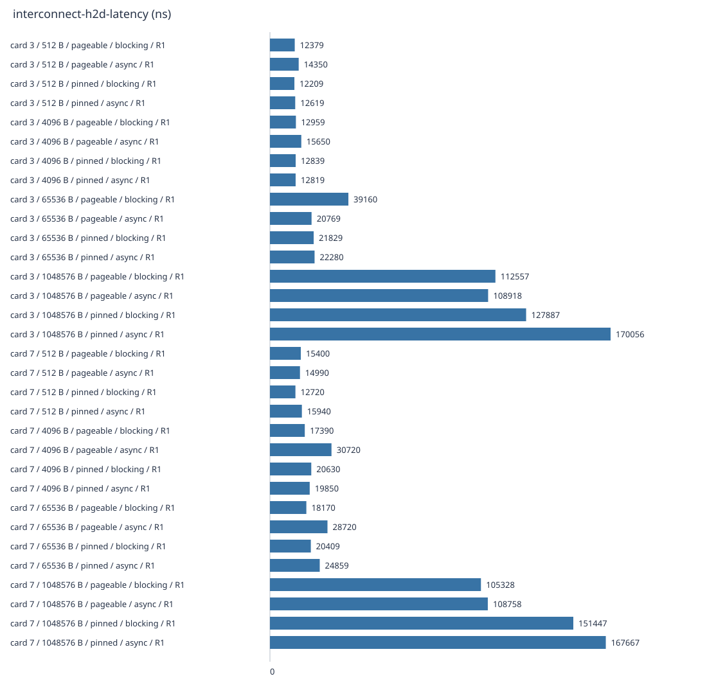


重复组（统计各独立进程的结果；单次内部样本不代替五次重复）：

| 点 | 字段 | 独立重复 | 中位数 | 单位 | 组 CV | 稳定性 |
| --- | --- | --- | --- | --- | --- | --- |
| card 3 / 1048576 B / pageable / async | P800_METRIC/samples_ns | 1 | 108918 | ns | N/A | insufficient-repeats |
| card 3 / 1048576 B / pageable / blocking | P800_METRIC/samples_ns | 1 | 112557 | ns | N/A | insufficient-repeats |
| card 3 / 1048576 B / pinned / async | P800_METRIC/samples_ns | 1 | 170056 | ns | N/A | insufficient-repeats |
| card 3 / 1048576 B / pinned / blocking | P800_METRIC/samples_ns | 1 | 127887 | ns | N/A | insufficient-repeats |
| card 3 / 4096 B / pageable / async | P800_METRIC/samples_ns | 1 | 15650 | ns | N/A | insufficient-repeats |
| card 3 / 4096 B / pageable / blocking | P800_METRIC/samples_ns | 1 | 12959 | ns | N/A | insufficient-repeats |
| card 3 / 4096 B / pinned / async | P800_METRIC/samples_ns | 1 | 12819 | ns | N/A | insufficient-repeats |
| card 3 / 4096 B / pinned / blocking | P800_METRIC/samples_ns | 1 | 12839 | ns | N/A | insufficient-repeats |
| card 3 / 512 B / pageable / async | P800_METRIC/samples_ns | 1 | 14350 | ns | N/A | insufficient-repeats |
| card 3 / 512 B / pageable / blocking | P800_METRIC/samples_ns | 1 | 12379 | ns | N/A | insufficient-repeats |
| card 3 / 512 B / pinned / async | P800_METRIC/samples_ns | 1 | 12619 | ns | N/A | insufficient-repeats |
| card 3 / 512 B / pinned / blocking | P800_METRIC/samples_ns | 1 | 12209 | ns | N/A | insufficient-repeats |
| card 3 / 65536 B / pageable / async | P800_METRIC/samples_ns | 1 | 20769 | ns | N/A | insufficient-repeats |
| card 3 / 65536 B / pageable / blocking | P800_METRIC/samples_ns | 1 | 39160 | ns | N/A | insufficient-repeats |
| card 3 / 65536 B / pinned / async | P800_METRIC/samples_ns | 1 | 22280 | ns | N/A | insufficient-repeats |
| card 3 / 65536 B / pinned / blocking | P800_METRIC/samples_ns | 1 | 21829 | ns | N/A | insufficient-repeats |
| card 7 / 1048576 B / pageable / async | P800_METRIC/samples_ns | 1 | 108758 | ns | N/A | insufficient-repeats |
| card 7 / 1048576 B / pageable / blocking | P800_METRIC/samples_ns | 1 | 105328 | ns | N/A | insufficient-repeats |
| card 7 / 1048576 B / pinned / async | P800_METRIC/samples_ns | 1 | 167667 | ns | N/A | insufficient-repeats |
| card 7 / 1048576 B / pinned / blocking | P800_METRIC/samples_ns | 1 | 151447 | ns | N/A | insufficient-repeats |
| card 7 / 4096 B / pageable / async | P800_METRIC/samples_ns | 1 | 30720 | ns | N/A | insufficient-repeats |
| card 7 / 4096 B / pageable / blocking | P800_METRIC/samples_ns | 1 | 17390 | ns | N/A | insufficient-repeats |
| card 7 / 4096 B / pinned / async | P800_METRIC/samples_ns | 1 | 19850 | ns | N/A | insufficient-repeats |
| card 7 / 4096 B / pinned / blocking | P800_METRIC/samples_ns | 1 | 20630 | ns | N/A | insufficient-repeats |
| card 7 / 512 B / pageable / async | P800_METRIC/samples_ns | 1 | 14990 | ns | N/A | insufficient-repeats |
| card 7 / 512 B / pageable / blocking | P800_METRIC/samples_ns | 1 | 15400 | ns | N/A | insufficient-repeats |
| card 7 / 512 B / pinned / async | P800_METRIC/samples_ns | 1 | 15940 | ns | N/A | insufficient-repeats |
| card 7 / 512 B / pinned / blocking | P800_METRIC/samples_ns | 1 | 12720 | ns | N/A | insufficient-repeats |
| card 7 / 65536 B / pageable / async | P800_METRIC/samples_ns | 1 | 28720 | ns | N/A | insufficient-repeats |
| card 7 / 65536 B / pageable / blocking | P800_METRIC/samples_ns | 1 | 18170 | ns | N/A | insufficient-repeats |
| card 7 / 65536 B / pinned / async | P800_METRIC/samples_ns | 1 | 24859 | ns | N/A | insufficient-repeats |
| card 7 / 65536 B / pinned / blocking | P800_METRIC/samples_ns | 1 | 20409 | ns | N/A | insufficient-repeats |

## interconnect-d2h-latency

| 设备/模式/载荷 | 重复 | 字段 | 值 | 单位 | 样本数 | 样本 CV | 原始来源 |
| --- | --- | --- | --- | --- | --- | --- | --- |
| card 3 / 512 B / pageable / blocking | 1 | P800_METRIC/samples_ns | 12510 | ns | 25 | 2.5347% | [stdout](toolkit-evidence/cases/interconnect-d2h-latency/physical-3-512B-pageable-blocking/repeat-1/microbenchmark.stdout) |
| card 3 / 512 B / pageable / async | 1 | P800_METRIC/samples_ns | 15720 | ns | 25 | 11.7077% | [stdout](toolkit-evidence/cases/interconnect-d2h-latency/physical-3-512B-pageable-nonblocking/repeat-1/microbenchmark.stdout) |
| card 3 / 512 B / pinned / blocking | 1 | P800_METRIC/samples_ns | 12630 | ns | 25 | 2.3957% | [stdout](toolkit-evidence/cases/interconnect-d2h-latency/physical-3-512B-pinned-blocking/repeat-1/microbenchmark.stdout) |
| card 3 / 512 B / pinned / async | 1 | P800_METRIC/samples_ns | 20239 | ns | 25 | 21.1869% | [stdout](toolkit-evidence/cases/interconnect-d2h-latency/physical-3-512B-pinned-nonblocking/repeat-1/microbenchmark.stdout) |
| card 3 / 4096 B / pageable / blocking | 1 | P800_METRIC/samples_ns | 14270 | ns | 25 | 28.6159% | [stdout](toolkit-evidence/cases/interconnect-d2h-latency/physical-3-4096B-pageable-blocking/repeat-1/microbenchmark.stdout) |
| card 3 / 4096 B / pageable / async | 1 | P800_METRIC/samples_ns | 23340 | ns | 25 | 21.6527% | [stdout](toolkit-evidence/cases/interconnect-d2h-latency/physical-3-4096B-pageable-nonblocking/repeat-1/microbenchmark.stdout) |
| card 3 / 4096 B / pinned / blocking | 1 | P800_METRIC/samples_ns | 13170 | ns | 25 | 4.9547% | [stdout](toolkit-evidence/cases/interconnect-d2h-latency/physical-3-4096B-pinned-blocking/repeat-1/microbenchmark.stdout) |
| card 3 / 4096 B / pinned / async | 1 | P800_METRIC/samples_ns | 22450 | ns | 25 | 23.7639% | [stdout](toolkit-evidence/cases/interconnect-d2h-latency/physical-3-4096B-pinned-nonblocking/repeat-1/microbenchmark.stdout) |
| card 3 / 65536 B / pageable / blocking | 1 | P800_METRIC/samples_ns | 19619 | ns | 25 | 31.5809% | [stdout](toolkit-evidence/cases/interconnect-d2h-latency/physical-3-65536B-pageable-blocking/repeat-1/microbenchmark.stdout) |
| card 3 / 65536 B / pageable / async | 1 | P800_METRIC/samples_ns | 22149 | ns | 25 | 7.2829% | [stdout](toolkit-evidence/cases/interconnect-d2h-latency/physical-3-65536B-pageable-nonblocking/repeat-1/microbenchmark.stdout) |
| card 3 / 65536 B / pinned / blocking | 1 | P800_METRIC/samples_ns | 21020 | ns | 25 | 33.2571% | [stdout](toolkit-evidence/cases/interconnect-d2h-latency/physical-3-65536B-pinned-blocking/repeat-1/microbenchmark.stdout) |
| card 3 / 65536 B / pinned / async | 1 | P800_METRIC/samples_ns | 21960 | ns | 25 | 6.8865% | [stdout](toolkit-evidence/cases/interconnect-d2h-latency/physical-3-65536B-pinned-nonblocking/repeat-1/microbenchmark.stdout) |
| card 3 / 1048576 B / pageable / blocking | 1 | P800_METRIC/samples_ns | 95338 | ns | 25 | 3.0423% | [stdout](toolkit-evidence/cases/interconnect-d2h-latency/physical-3-1048576B-pageable-blocking/repeat-1/microbenchmark.stdout) |
| card 3 / 1048576 B / pageable / async | 1 | P800_METRIC/samples_ns | 98458 | ns | 25 | 7.5016% | [stdout](toolkit-evidence/cases/interconnect-d2h-latency/physical-3-1048576B-pageable-nonblocking/repeat-1/microbenchmark.stdout) |
| card 3 / 1048576 B / pinned / blocking | 1 | P800_METRIC/samples_ns | 148827 | ns | 25 | 1.9807% | [stdout](toolkit-evidence/cases/interconnect-d2h-latency/physical-3-1048576B-pinned-blocking/repeat-1/microbenchmark.stdout) |
| card 3 / 1048576 B / pinned / async | 1 | P800_METRIC/samples_ns | 148117 | ns | 25 | 4.9823% | [stdout](toolkit-evidence/cases/interconnect-d2h-latency/physical-3-1048576B-pinned-nonblocking/repeat-1/microbenchmark.stdout) |
| card 7 / 512 B / pageable / blocking | 1 | P800_METRIC/samples_ns | 13260 | ns | 25 | 3.3998% | [stdout](toolkit-evidence/cases/interconnect-d2h-latency/physical-7-512B-pageable-blocking/repeat-1/microbenchmark.stdout) |
| card 7 / 512 B / pageable / async | 1 | P800_METRIC/samples_ns | 30569 | ns | 25 | 40.9814% | [stdout](toolkit-evidence/cases/interconnect-d2h-latency/physical-7-512B-pageable-nonblocking/repeat-1/microbenchmark.stdout) |
| card 7 / 512 B / pinned / blocking | 1 | P800_METRIC/samples_ns | 13200 | ns | 25 | 33.5442% | [stdout](toolkit-evidence/cases/interconnect-d2h-latency/physical-7-512B-pinned-blocking/repeat-1/microbenchmark.stdout) |
| card 7 / 512 B / pinned / async | 1 | P800_METRIC/samples_ns | 13439 | ns | 25 | 68.9812% | [stdout](toolkit-evidence/cases/interconnect-d2h-latency/physical-7-512B-pinned-nonblocking/repeat-1/microbenchmark.stdout) |
| card 7 / 4096 B / pageable / blocking | 1 | P800_METRIC/samples_ns | 23070 | ns | 25 | 41.5047% | [stdout](toolkit-evidence/cases/interconnect-d2h-latency/physical-7-4096B-pageable-blocking/repeat-1/microbenchmark.stdout) |
| card 7 / 4096 B / pageable / async | 1 | P800_METRIC/samples_ns | 14690 | ns | 25 | 24.0515% | [stdout](toolkit-evidence/cases/interconnect-d2h-latency/physical-7-4096B-pageable-nonblocking/repeat-1/microbenchmark.stdout) |
| card 7 / 4096 B / pinned / blocking | 1 | P800_METRIC/samples_ns | 15800 | ns | 25 | 22.4422% | [stdout](toolkit-evidence/cases/interconnect-d2h-latency/physical-7-4096B-pinned-blocking/repeat-1/microbenchmark.stdout) |
| card 7 / 4096 B / pinned / async | 1 | P800_METRIC/samples_ns | 23019 | ns | 25 | 138.0186% | [stdout](toolkit-evidence/cases/interconnect-d2h-latency/physical-7-4096B-pinned-nonblocking/repeat-1/microbenchmark.stdout) |
| card 7 / 65536 B / pageable / blocking | 1 | P800_METRIC/samples_ns | 17750 | ns | 25 | 3.1525% | [stdout](toolkit-evidence/cases/interconnect-d2h-latency/physical-7-65536B-pageable-blocking/repeat-1/microbenchmark.stdout) |
| card 7 / 65536 B / pageable / async | 1 | P800_METRIC/samples_ns | 21420 | ns | 25 | 24.5673% | [stdout](toolkit-evidence/cases/interconnect-d2h-latency/physical-7-65536B-pageable-nonblocking/repeat-1/microbenchmark.stdout) |
| card 7 / 65536 B / pinned / blocking | 1 | P800_METRIC/samples_ns | 36809 | ns | 25 | 22.4234% | [stdout](toolkit-evidence/cases/interconnect-d2h-latency/physical-7-65536B-pinned-blocking/repeat-1/microbenchmark.stdout) |
| card 7 / 65536 B / pinned / async | 1 | P800_METRIC/samples_ns | 68009 | ns | 25 | 82.1136% | [stdout](toolkit-evidence/cases/interconnect-d2h-latency/physical-7-65536B-pinned-nonblocking/repeat-1/microbenchmark.stdout) |
| card 7 / 1048576 B / pageable / blocking | 1 | P800_METRIC/samples_ns | 114767 | ns | 25 | 51.1490% | [stdout](toolkit-evidence/cases/interconnect-d2h-latency/physical-7-1048576B-pageable-blocking/repeat-1/microbenchmark.stdout) |
| card 7 / 1048576 B / pageable / async | 1 | P800_METRIC/samples_ns | 107987 | ns | 25 | 30.9986% | [stdout](toolkit-evidence/cases/interconnect-d2h-latency/physical-7-1048576B-pageable-nonblocking/repeat-1/microbenchmark.stdout) |
| card 7 / 1048576 B / pinned / blocking | 1 | P800_METRIC/samples_ns | 92188 | ns | 25 | 8.7863% | [stdout](toolkit-evidence/cases/interconnect-d2h-latency/physical-7-1048576B-pinned-blocking/repeat-1/microbenchmark.stdout) |
| card 7 / 1048576 B / pinned / async | 1 | P800_METRIC/samples_ns | 168046 | ns | 25 | 8.6421% | [stdout](toolkit-evidence/cases/interconnect-d2h-latency/physical-7-1048576B-pinned-nonblocking/repeat-1/microbenchmark.stdout) |

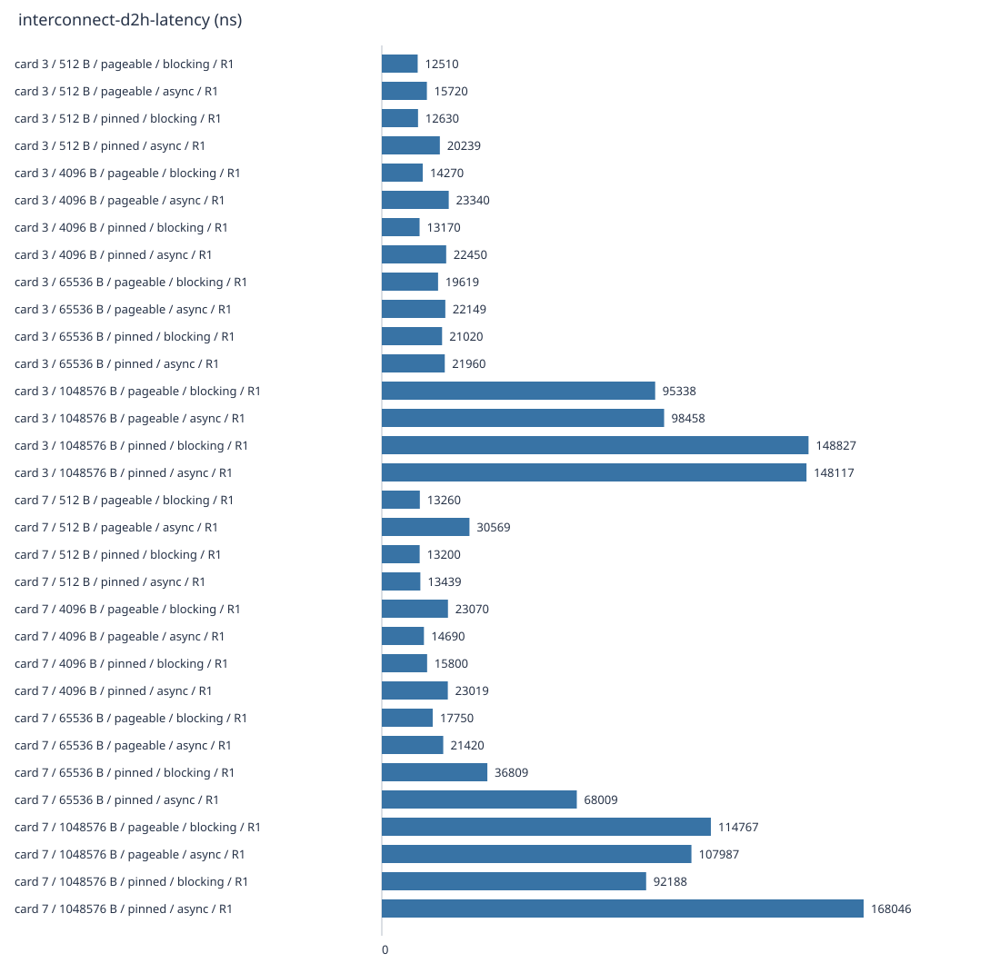


重复组（统计各独立进程的结果；单次内部样本不代替五次重复）：

| 点 | 字段 | 独立重复 | 中位数 | 单位 | 组 CV | 稳定性 |
| --- | --- | --- | --- | --- | --- | --- |
| card 3 / 1048576 B / pageable / async | P800_METRIC/samples_ns | 1 | 98458 | ns | N/A | insufficient-repeats |
| card 3 / 1048576 B / pageable / blocking | P800_METRIC/samples_ns | 1 | 95338 | ns | N/A | insufficient-repeats |
| card 3 / 1048576 B / pinned / async | P800_METRIC/samples_ns | 1 | 148117 | ns | N/A | insufficient-repeats |
| card 3 / 1048576 B / pinned / blocking | P800_METRIC/samples_ns | 1 | 148827 | ns | N/A | insufficient-repeats |
| card 3 / 4096 B / pageable / async | P800_METRIC/samples_ns | 1 | 23340 | ns | N/A | insufficient-repeats |
| card 3 / 4096 B / pageable / blocking | P800_METRIC/samples_ns | 1 | 14270 | ns | N/A | insufficient-repeats |
| card 3 / 4096 B / pinned / async | P800_METRIC/samples_ns | 1 | 22450 | ns | N/A | insufficient-repeats |
| card 3 / 4096 B / pinned / blocking | P800_METRIC/samples_ns | 1 | 13170 | ns | N/A | insufficient-repeats |
| card 3 / 512 B / pageable / async | P800_METRIC/samples_ns | 1 | 15720 | ns | N/A | insufficient-repeats |
| card 3 / 512 B / pageable / blocking | P800_METRIC/samples_ns | 1 | 12510 | ns | N/A | insufficient-repeats |
| card 3 / 512 B / pinned / async | P800_METRIC/samples_ns | 1 | 20239 | ns | N/A | insufficient-repeats |
| card 3 / 512 B / pinned / blocking | P800_METRIC/samples_ns | 1 | 12630 | ns | N/A | insufficient-repeats |
| card 3 / 65536 B / pageable / async | P800_METRIC/samples_ns | 1 | 22149 | ns | N/A | insufficient-repeats |
| card 3 / 65536 B / pageable / blocking | P800_METRIC/samples_ns | 1 | 19619 | ns | N/A | insufficient-repeats |
| card 3 / 65536 B / pinned / async | P800_METRIC/samples_ns | 1 | 21960 | ns | N/A | insufficient-repeats |
| card 3 / 65536 B / pinned / blocking | P800_METRIC/samples_ns | 1 | 21020 | ns | N/A | insufficient-repeats |
| card 7 / 1048576 B / pageable / async | P800_METRIC/samples_ns | 1 | 107987 | ns | N/A | insufficient-repeats |
| card 7 / 1048576 B / pageable / blocking | P800_METRIC/samples_ns | 1 | 114767 | ns | N/A | insufficient-repeats |
| card 7 / 1048576 B / pinned / async | P800_METRIC/samples_ns | 1 | 168046 | ns | N/A | insufficient-repeats |
| card 7 / 1048576 B / pinned / blocking | P800_METRIC/samples_ns | 1 | 92188 | ns | N/A | insufficient-repeats |
| card 7 / 4096 B / pageable / async | P800_METRIC/samples_ns | 1 | 14690 | ns | N/A | insufficient-repeats |
| card 7 / 4096 B / pageable / blocking | P800_METRIC/samples_ns | 1 | 23070 | ns | N/A | insufficient-repeats |
| card 7 / 4096 B / pinned / async | P800_METRIC/samples_ns | 1 | 23019 | ns | N/A | insufficient-repeats |
| card 7 / 4096 B / pinned / blocking | P800_METRIC/samples_ns | 1 | 15800 | ns | N/A | insufficient-repeats |
| card 7 / 512 B / pageable / async | P800_METRIC/samples_ns | 1 | 30569 | ns | N/A | insufficient-repeats |
| card 7 / 512 B / pageable / blocking | P800_METRIC/samples_ns | 1 | 13260 | ns | N/A | insufficient-repeats |
| card 7 / 512 B / pinned / async | P800_METRIC/samples_ns | 1 | 13439 | ns | N/A | insufficient-repeats |
| card 7 / 512 B / pinned / blocking | P800_METRIC/samples_ns | 1 | 13200 | ns | N/A | insufficient-repeats |
| card 7 / 65536 B / pageable / async | P800_METRIC/samples_ns | 1 | 21420 | ns | N/A | insufficient-repeats |
| card 7 / 65536 B / pageable / blocking | P800_METRIC/samples_ns | 1 | 17750 | ns | N/A | insufficient-repeats |
| card 7 / 65536 B / pinned / async | P800_METRIC/samples_ns | 1 | 68009 | ns | N/A | insufficient-repeats |
| card 7 / 65536 B / pinned / blocking | P800_METRIC/samples_ns | 1 | 36809 | ns | N/A | insufficient-repeats |

## interconnect-P2P_intraserver

| 设备/模式/载荷 | 重复 | 字段 | 值 | 单位 | 样本数 | 样本 CV | 原始来源 |
| --- | --- | --- | --- | --- | --- | --- | --- |
| card 3 to 7 / single-direction / 1048576 B | 1 | P800_METRIC/samples_ns | 8.9862281 | GB/s | 25 | 25.3766% | [stdout](toolkit-evidence/cases/interconnect-P2P_intraserver/physical-3-to-7-single-direction-1048576B/repeat-1/microbenchmark.stdout) |
| card 3 to 7 / bidirectional / 1048576 B | 1 | P800_METRIC/samples_ns | 7.9517394 | GB/s | 25 | 11.9991% | [stdout](toolkit-evidence/cases/interconnect-P2P_intraserver/physical-3-to-7-bidirectional-1048576B/repeat-1/microbenchmark.stdout) |

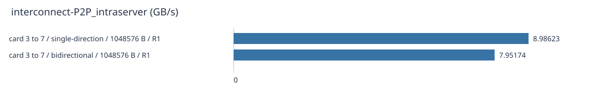


重复组（统计各独立进程的结果；单次内部样本不代替五次重复）：

| 点 | 字段 | 独立重复 | 中位数 | 单位 | 组 CV | 稳定性 |
| --- | --- | --- | --- | --- | --- | --- |
| card 3 to 7 / bidirectional / 1048576 B | P800_METRIC/samples_ns | 1 | 7.9517394 | GB/s | N/A | insufficient-repeats |
| card 3 to 7 / single-direction / 1048576 B | P800_METRIC/samples_ns | 1 | 8.9862281 | GB/s | N/A | insufficient-repeats |

## interconnect-P2P_intraserver-latency

| 设备/模式/载荷 | 重复 | 字段 | 值 | 单位 | 样本数 | 样本 CV | 原始来源 |
| --- | --- | --- | --- | --- | --- | --- | --- |
| card 3 to 7 / single-direction / 65536 B | 1 | P800_METRIC/samples_ns | 27370 | ns | 25 | 30.3799% | [stdout](toolkit-evidence/cases/interconnect-P2P_intraserver-latency/physical-3-to-7-single-direction-65536B/repeat-1/microbenchmark.stdout) |


重复组（统计各独立进程的结果；单次内部样本不代替五次重复）：

| 点 | 字段 | 独立重复 | 中位数 | 单位 | 组 CV | 稳定性 |
| --- | --- | --- | --- | --- | --- | --- |
| card 3 to 7 / single-direction / 65536 B | P800_METRIC/samples_ns | 1 | 27370 | ns | N/A | insufficient-repeats |

## 生命周期和溯源

- cleanup_status：passed
- postflight_status：passed
- lease_released：True
- qualification_status：exploratory

- [Manifest](toolkit-evidence/manifest.json)
- [Native tool provenance](toolkit-evidence/provenance.json)
- [Code identity](code-identity.json)
- [Image identity](image-identity.json)
- [Monitor report](report_monitor.md)
- [Diagnosis coverage](toolkit-evidence/diagnostics/coverage.json)
- [SHA256 index](sha256-index.json)
