# P800 Toolkit 同期监控报告

每个样本保留物理卡、有效性、时间与原值；缺失为 N/A，不补零。曲线只连相邻有效样本。

- [原始命令 JSONL](toolkit-evidence/monitor/samples.raw.jsonl)
- [结构化 JSONL](toolkit-evidence/monitor/samples.jsonl)

## 逐测试点监控覆盖

| Case/target | 状态 | 窗口内完整样本 | 说明 |
| --- | --- | --- | --- |
| computation-BF16/physical-3/repeat-1 | partial | {"3": 0} | 每目标至少 10 个完整落入真实 measurement 窗口的有效样本 |
| computation-BF16/physical-7/repeat-1 | partial | {"7": 0} | 每目标至少 10 个完整落入真实 measurement 窗口的有效样本 |
| computation-FP16/physical-3/repeat-1 | partial | {"3": 0} | 每目标至少 10 个完整落入真实 measurement 窗口的有效样本 |
| computation-FP16/physical-7/repeat-1 | partial | {"7": 0} | 每目标至少 10 个完整落入真实 measurement 窗口的有效样本 |
| computation-FP32/physical-3/repeat-1 | partial | {"3": 0} | 每目标至少 10 个完整落入真实 measurement 窗口的有效样本 |
| computation-FP32/physical-7/repeat-1 | partial | {"7": 0} | 每目标至少 10 个完整落入真实 measurement 窗口的有效样本 |
| computation-INT8/physical-3/repeat-1 | partial | {"3": 0} | 每目标至少 10 个完整落入真实 measurement 窗口的有效样本 |
| computation-INT8/physical-7/repeat-1 | partial | {"7": 0} | 每目标至少 10 个完整落入真实 measurement 窗口的有效样本 |
| main_memory-bandwidth/physical-3-1048576B/repeat-1 | partial | {"3": 0} | 每目标至少 10 个完整落入真实 measurement 窗口的有效样本 |
| main_memory-bandwidth/physical-7-1048576B/repeat-1 | partial | {"7": 0} | 每目标至少 10 个完整落入真实 measurement 窗口的有效样本 |
| main_memory-capacity/physical-3/repeat-1 | passed | {"3": 0} | static capacity/health query, no concurrent-load requirement |
| main_memory-capacity/physical-7/repeat-1 | passed | {"7": 0} | static capacity/health query, no concurrent-load requirement |
| interconnect-h2d/physical-3-1048576B-pageable-blocking/repeat-1 | partial | {"3": 0} | 每目标至少 10 个完整落入真实 measurement 窗口的有效样本 |
| interconnect-h2d/physical-3-1048576B-pageable-nonblocking/repeat-1 | partial | {"3": 0} | 每目标至少 10 个完整落入真实 measurement 窗口的有效样本 |
| interconnect-h2d/physical-3-1048576B-pinned-blocking/repeat-1 | partial | {"3": 0} | 每目标至少 10 个完整落入真实 measurement 窗口的有效样本 |
| interconnect-h2d/physical-3-1048576B-pinned-nonblocking/repeat-1 | partial | {"3": 0} | 每目标至少 10 个完整落入真实 measurement 窗口的有效样本 |
| interconnect-h2d/physical-7-1048576B-pageable-blocking/repeat-1 | partial | {"7": 0} | 每目标至少 10 个完整落入真实 measurement 窗口的有效样本 |
| interconnect-h2d/physical-7-1048576B-pageable-nonblocking/repeat-1 | partial | {"7": 0} | 每目标至少 10 个完整落入真实 measurement 窗口的有效样本 |
| interconnect-h2d/physical-7-1048576B-pinned-blocking/repeat-1 | partial | {"7": 0} | 每目标至少 10 个完整落入真实 measurement 窗口的有效样本 |
| interconnect-h2d/physical-7-1048576B-pinned-nonblocking/repeat-1 | partial | {"7": 0} | 每目标至少 10 个完整落入真实 measurement 窗口的有效样本 |
| interconnect-d2h/physical-3-1048576B-pageable-blocking/repeat-1 | partial | {"3": 0} | 每目标至少 10 个完整落入真实 measurement 窗口的有效样本 |
| interconnect-d2h/physical-3-1048576B-pageable-nonblocking/repeat-1 | partial | {"3": 0} | 每目标至少 10 个完整落入真实 measurement 窗口的有效样本 |
| interconnect-d2h/physical-3-1048576B-pinned-blocking/repeat-1 | partial | {"3": 0} | 每目标至少 10 个完整落入真实 measurement 窗口的有效样本 |
| interconnect-d2h/physical-3-1048576B-pinned-nonblocking/repeat-1 | partial | {"3": 0} | 每目标至少 10 个完整落入真实 measurement 窗口的有效样本 |
| interconnect-d2h/physical-7-1048576B-pageable-blocking/repeat-1 | partial | {"7": 0} | 每目标至少 10 个完整落入真实 measurement 窗口的有效样本 |
| interconnect-d2h/physical-7-1048576B-pageable-nonblocking/repeat-1 | partial | {"7": 0} | 每目标至少 10 个完整落入真实 measurement 窗口的有效样本 |
| interconnect-d2h/physical-7-1048576B-pinned-blocking/repeat-1 | partial | {"7": 0} | 每目标至少 10 个完整落入真实 measurement 窗口的有效样本 |
| interconnect-d2h/physical-7-1048576B-pinned-nonblocking/repeat-1 | partial | {"7": 0} | 每目标至少 10 个完整落入真实 measurement 窗口的有效样本 |
| interconnect-h2d-latency/physical-3-512B-pageable-blocking/repeat-1 | partial | {"3": 0} | 每目标至少 10 个完整落入真实 measurement 窗口的有效样本 |
| interconnect-h2d-latency/physical-3-512B-pageable-nonblocking/repeat-1 | partial | {"3": 0} | 每目标至少 10 个完整落入真实 measurement 窗口的有效样本 |
| interconnect-h2d-latency/physical-3-512B-pinned-blocking/repeat-1 | partial | {"3": 0} | 每目标至少 10 个完整落入真实 measurement 窗口的有效样本 |
| interconnect-h2d-latency/physical-3-512B-pinned-nonblocking/repeat-1 | partial | {"3": 0} | 每目标至少 10 个完整落入真实 measurement 窗口的有效样本 |
| interconnect-h2d-latency/physical-3-4096B-pageable-blocking/repeat-1 | partial | {"3": 0} | 每目标至少 10 个完整落入真实 measurement 窗口的有效样本 |
| interconnect-h2d-latency/physical-3-4096B-pageable-nonblocking/repeat-1 | partial | {"3": 0} | 每目标至少 10 个完整落入真实 measurement 窗口的有效样本 |
| interconnect-h2d-latency/physical-3-4096B-pinned-blocking/repeat-1 | partial | {"3": 0} | 每目标至少 10 个完整落入真实 measurement 窗口的有效样本 |
| interconnect-h2d-latency/physical-3-4096B-pinned-nonblocking/repeat-1 | partial | {"3": 0} | 每目标至少 10 个完整落入真实 measurement 窗口的有效样本 |
| interconnect-h2d-latency/physical-3-65536B-pageable-blocking/repeat-1 | partial | {"3": 0} | 每目标至少 10 个完整落入真实 measurement 窗口的有效样本 |
| interconnect-h2d-latency/physical-3-65536B-pageable-nonblocking/repeat-1 | partial | {"3": 0} | 每目标至少 10 个完整落入真实 measurement 窗口的有效样本 |
| interconnect-h2d-latency/physical-3-65536B-pinned-blocking/repeat-1 | partial | {"3": 0} | 每目标至少 10 个完整落入真实 measurement 窗口的有效样本 |
| interconnect-h2d-latency/physical-3-65536B-pinned-nonblocking/repeat-1 | partial | {"3": 0} | 每目标至少 10 个完整落入真实 measurement 窗口的有效样本 |
| interconnect-h2d-latency/physical-3-1048576B-pageable-blocking/repeat-1 | partial | {"3": 0} | 每目标至少 10 个完整落入真实 measurement 窗口的有效样本 |
| interconnect-h2d-latency/physical-3-1048576B-pageable-nonblocking/repeat-1 | partial | {"3": 0} | 每目标至少 10 个完整落入真实 measurement 窗口的有效样本 |
| interconnect-h2d-latency/physical-3-1048576B-pinned-blocking/repeat-1 | partial | {"3": 0} | 每目标至少 10 个完整落入真实 measurement 窗口的有效样本 |
| interconnect-h2d-latency/physical-3-1048576B-pinned-nonblocking/repeat-1 | partial | {"3": 0} | 每目标至少 10 个完整落入真实 measurement 窗口的有效样本 |
| interconnect-h2d-latency/physical-7-512B-pageable-blocking/repeat-1 | partial | {"7": 0} | 每目标至少 10 个完整落入真实 measurement 窗口的有效样本 |
| interconnect-h2d-latency/physical-7-512B-pageable-nonblocking/repeat-1 | partial | {"7": 0} | 每目标至少 10 个完整落入真实 measurement 窗口的有效样本 |
| interconnect-h2d-latency/physical-7-512B-pinned-blocking/repeat-1 | partial | {"7": 0} | 每目标至少 10 个完整落入真实 measurement 窗口的有效样本 |
| interconnect-h2d-latency/physical-7-512B-pinned-nonblocking/repeat-1 | partial | {"7": 0} | 每目标至少 10 个完整落入真实 measurement 窗口的有效样本 |
| interconnect-h2d-latency/physical-7-4096B-pageable-blocking/repeat-1 | partial | {"7": 0} | 每目标至少 10 个完整落入真实 measurement 窗口的有效样本 |
| interconnect-h2d-latency/physical-7-4096B-pageable-nonblocking/repeat-1 | partial | {"7": 0} | 每目标至少 10 个完整落入真实 measurement 窗口的有效样本 |
| interconnect-h2d-latency/physical-7-4096B-pinned-blocking/repeat-1 | partial | {"7": 0} | 每目标至少 10 个完整落入真实 measurement 窗口的有效样本 |
| interconnect-h2d-latency/physical-7-4096B-pinned-nonblocking/repeat-1 | partial | {"7": 0} | 每目标至少 10 个完整落入真实 measurement 窗口的有效样本 |
| interconnect-h2d-latency/physical-7-65536B-pageable-blocking/repeat-1 | partial | {"7": 0} | 每目标至少 10 个完整落入真实 measurement 窗口的有效样本 |
| interconnect-h2d-latency/physical-7-65536B-pageable-nonblocking/repeat-1 | partial | {"7": 0} | 每目标至少 10 个完整落入真实 measurement 窗口的有效样本 |
| interconnect-h2d-latency/physical-7-65536B-pinned-blocking/repeat-1 | partial | {"7": 0} | 每目标至少 10 个完整落入真实 measurement 窗口的有效样本 |
| interconnect-h2d-latency/physical-7-65536B-pinned-nonblocking/repeat-1 | partial | {"7": 0} | 每目标至少 10 个完整落入真实 measurement 窗口的有效样本 |
| interconnect-h2d-latency/physical-7-1048576B-pageable-blocking/repeat-1 | partial | {"7": 0} | 每目标至少 10 个完整落入真实 measurement 窗口的有效样本 |
| interconnect-h2d-latency/physical-7-1048576B-pageable-nonblocking/repeat-1 | partial | {"7": 0} | 每目标至少 10 个完整落入真实 measurement 窗口的有效样本 |
| interconnect-h2d-latency/physical-7-1048576B-pinned-blocking/repeat-1 | partial | {"7": 0} | 每目标至少 10 个完整落入真实 measurement 窗口的有效样本 |
| interconnect-h2d-latency/physical-7-1048576B-pinned-nonblocking/repeat-1 | partial | {"7": 0} | 每目标至少 10 个完整落入真实 measurement 窗口的有效样本 |
| interconnect-d2h-latency/physical-3-512B-pageable-blocking/repeat-1 | partial | {"3": 0} | 每目标至少 10 个完整落入真实 measurement 窗口的有效样本 |
| interconnect-d2h-latency/physical-3-512B-pageable-nonblocking/repeat-1 | partial | {"3": 0} | 每目标至少 10 个完整落入真实 measurement 窗口的有效样本 |
| interconnect-d2h-latency/physical-3-512B-pinned-blocking/repeat-1 | partial | {"3": 0} | 每目标至少 10 个完整落入真实 measurement 窗口的有效样本 |
| interconnect-d2h-latency/physical-3-512B-pinned-nonblocking/repeat-1 | partial | {"3": 0} | 每目标至少 10 个完整落入真实 measurement 窗口的有效样本 |
| interconnect-d2h-latency/physical-3-4096B-pageable-blocking/repeat-1 | partial | {"3": 0} | 每目标至少 10 个完整落入真实 measurement 窗口的有效样本 |
| interconnect-d2h-latency/physical-3-4096B-pageable-nonblocking/repeat-1 | partial | {"3": 0} | 每目标至少 10 个完整落入真实 measurement 窗口的有效样本 |
| interconnect-d2h-latency/physical-3-4096B-pinned-blocking/repeat-1 | partial | {"3": 0} | 每目标至少 10 个完整落入真实 measurement 窗口的有效样本 |
| interconnect-d2h-latency/physical-3-4096B-pinned-nonblocking/repeat-1 | partial | {"3": 0} | 每目标至少 10 个完整落入真实 measurement 窗口的有效样本 |
| interconnect-d2h-latency/physical-3-65536B-pageable-blocking/repeat-1 | partial | {"3": 0} | 每目标至少 10 个完整落入真实 measurement 窗口的有效样本 |
| interconnect-d2h-latency/physical-3-65536B-pageable-nonblocking/repeat-1 | partial | {"3": 0} | 每目标至少 10 个完整落入真实 measurement 窗口的有效样本 |
| interconnect-d2h-latency/physical-3-65536B-pinned-blocking/repeat-1 | partial | {"3": 0} | 每目标至少 10 个完整落入真实 measurement 窗口的有效样本 |
| interconnect-d2h-latency/physical-3-65536B-pinned-nonblocking/repeat-1 | partial | {"3": 0} | 每目标至少 10 个完整落入真实 measurement 窗口的有效样本 |
| interconnect-d2h-latency/physical-3-1048576B-pageable-blocking/repeat-1 | partial | {"3": 0} | 每目标至少 10 个完整落入真实 measurement 窗口的有效样本 |
| interconnect-d2h-latency/physical-3-1048576B-pageable-nonblocking/repeat-1 | partial | {"3": 0} | 每目标至少 10 个完整落入真实 measurement 窗口的有效样本 |
| interconnect-d2h-latency/physical-3-1048576B-pinned-blocking/repeat-1 | partial | {"3": 0} | 每目标至少 10 个完整落入真实 measurement 窗口的有效样本 |
| interconnect-d2h-latency/physical-3-1048576B-pinned-nonblocking/repeat-1 | partial | {"3": 0} | 每目标至少 10 个完整落入真实 measurement 窗口的有效样本 |
| interconnect-d2h-latency/physical-7-512B-pageable-blocking/repeat-1 | partial | {"7": 0} | 每目标至少 10 个完整落入真实 measurement 窗口的有效样本 |
| interconnect-d2h-latency/physical-7-512B-pageable-nonblocking/repeat-1 | partial | {"7": 0} | 每目标至少 10 个完整落入真实 measurement 窗口的有效样本 |
| interconnect-d2h-latency/physical-7-512B-pinned-blocking/repeat-1 | partial | {"7": 0} | 每目标至少 10 个完整落入真实 measurement 窗口的有效样本 |
| interconnect-d2h-latency/physical-7-512B-pinned-nonblocking/repeat-1 | partial | {"7": 0} | 每目标至少 10 个完整落入真实 measurement 窗口的有效样本 |
| interconnect-d2h-latency/physical-7-4096B-pageable-blocking/repeat-1 | partial | {"7": 0} | 每目标至少 10 个完整落入真实 measurement 窗口的有效样本 |
| interconnect-d2h-latency/physical-7-4096B-pageable-nonblocking/repeat-1 | partial | {"7": 0} | 每目标至少 10 个完整落入真实 measurement 窗口的有效样本 |
| interconnect-d2h-latency/physical-7-4096B-pinned-blocking/repeat-1 | partial | {"7": 0} | 每目标至少 10 个完整落入真实 measurement 窗口的有效样本 |
| interconnect-d2h-latency/physical-7-4096B-pinned-nonblocking/repeat-1 | partial | {"7": 0} | 每目标至少 10 个完整落入真实 measurement 窗口的有效样本 |
| interconnect-d2h-latency/physical-7-65536B-pageable-blocking/repeat-1 | partial | {"7": 0} | 每目标至少 10 个完整落入真实 measurement 窗口的有效样本 |
| interconnect-d2h-latency/physical-7-65536B-pageable-nonblocking/repeat-1 | partial | {"7": 0} | 每目标至少 10 个完整落入真实 measurement 窗口的有效样本 |
| interconnect-d2h-latency/physical-7-65536B-pinned-blocking/repeat-1 | partial | {"7": 0} | 每目标至少 10 个完整落入真实 measurement 窗口的有效样本 |
| interconnect-d2h-latency/physical-7-65536B-pinned-nonblocking/repeat-1 | partial | {"7": 0} | 每目标至少 10 个完整落入真实 measurement 窗口的有效样本 |
| interconnect-d2h-latency/physical-7-1048576B-pageable-blocking/repeat-1 | partial | {"7": 0} | 每目标至少 10 个完整落入真实 measurement 窗口的有效样本 |
| interconnect-d2h-latency/physical-7-1048576B-pageable-nonblocking/repeat-1 | partial | {"7": 0} | 每目标至少 10 个完整落入真实 measurement 窗口的有效样本 |
| interconnect-d2h-latency/physical-7-1048576B-pinned-blocking/repeat-1 | partial | {"7": 0} | 每目标至少 10 个完整落入真实 measurement 窗口的有效样本 |
| interconnect-d2h-latency/physical-7-1048576B-pinned-nonblocking/repeat-1 | partial | {"7": 0} | 每目标至少 10 个完整落入真实 measurement 窗口的有效样本 |
| interconnect-P2P_intraserver/physical-3-to-7-single-direction-1048576B/repeat-1 | partial | {"3": 0, "7": 0} | 每目标至少 10 个完整落入真实 measurement 窗口的有效样本 |
| interconnect-P2P_intraserver/physical-3-to-7-bidirectional-1048576B/repeat-1 | partial | {"3": 0, "7": 0} | 每目标至少 10 个完整落入真实 measurement 窗口的有效样本 |
| interconnect-P2P_intraserver-latency/physical-3-to-7-single-direction-65536B/repeat-1 | partial | {"3": 0, "7": 0} | 每目标至少 10 个完整落入真实 measurement 窗口的有效样本 |

## 物理卡 3

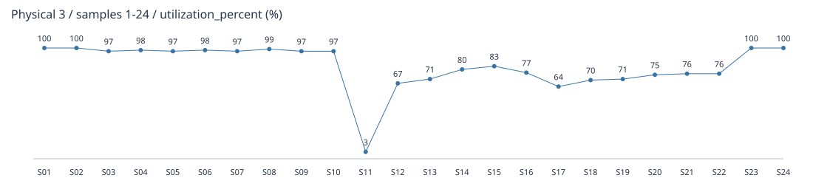

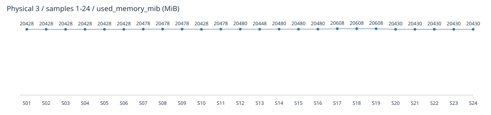

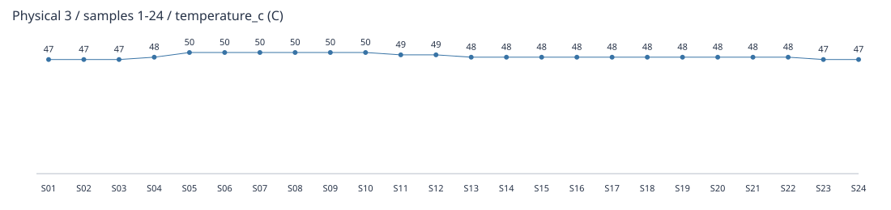

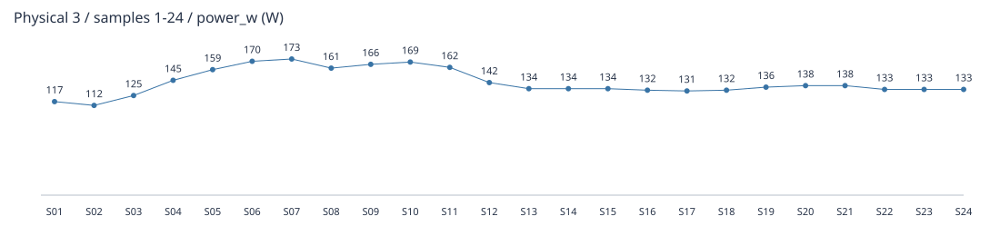

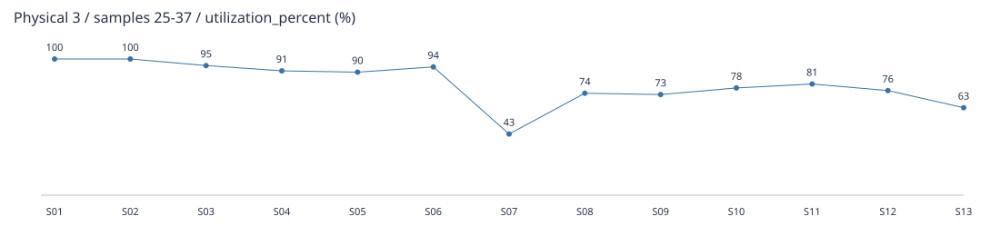

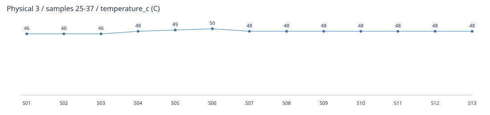

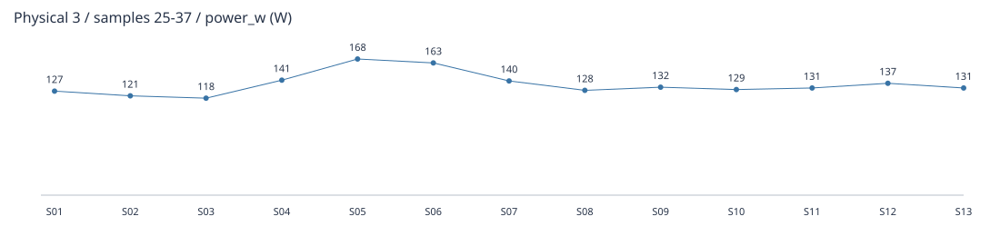

| 样本 | 开始偏移 s | 结束偏移 s | 有效 | 利用率 % | 显存 MiB | 温度 C | 功率 W | 错误 |
| --- | --- | --- | --- | --- | --- | --- | --- | --- |
| 1 | 0.000428 | 0.093735 | True | 100 | 20428 | 47.0 | 117.0 |  |
| 2 | 0.500585 | 0.591210 | True | 100 | 20428 | 47.0 | 112.0 |  |
| 3 | 1.000790 | 1.096368 | True | 97 | 20428 | 47.0 | 125.0 |  |
| 4 | 1.500921 | 1.592920 | True | 98 | 20428 | 48.0 | 145.0 |  |
| 5 | 2.001041 | 2.092867 | True | 97 | 20428 | 50.0 | 159.0 |  |
| 6 | 2.501167 | 2.589784 | True | 98 | 20428 | 50.0 | 170.0 |  |
| 7 | 3.001279 | 3.101129 | True | 97 | 20478 | 50.0 | 173.0 |  |
| 8 | 3.501425 | 3.599524 | True | 99 | 20478 | 50.0 | 161.0 |  |
| 9 | 4.001537 | 4.098535 | True | 97 | 20478 | 50.0 | 166.0 |  |
| 10 | 4.501669 | 4.611117 | True | 97 | 20428 | 50.0 | 169.0 |  |
| 11 | 5.001828 | 5.100418 | True | 3 | 20478 | 49.0 | 162.0 |  |
| 12 | 5.501965 | 5.603111 | True | 67 | 20480 | 49.0 | 142.0 |  |
| 13 | 6.002089 | 6.090831 | True | 71 | 20448 | 48.0 | 134.0 |  |
| 14 | 6.502230 | 6.602696 | True | 80 | 20480 | 48.0 | 134.0 |  |
| 15 | 7.002313 | 7.092838 | True | 83 | 20480 | 48.0 | 134.0 |  |
| 16 | 7.502495 | 7.595289 | True | 77 | 20480 | 48.0 | 132.0 |  |
| 17 | 8.002632 | 8.104345 | True | 64 | 20608 | 48.0 | 131.0 |  |
| 18 | 8.502700 | 8.604149 | True | 70 | 20608 | 48.0 | 132.0 |  |
| 19 | 9.002854 | 9.104857 | True | 71 | 20608 | 48.0 | 136.0 |  |
| 20 | 9.502985 | 9.602131 | True | 75 | 20430 | 48.0 | 138.0 |  |
| 21 | 10.003115 | 10.107748 | True | 76 | 20430 | 48.0 | 138.0 |  |
| 22 | 10.503216 | 10.596974 | True | 76 | 20430 | 48.0 | 133.0 |  |
| 23 | 11.003359 | 11.116593 | True | 100 | 20430 | 47.0 | 133.0 |  |
| 24 | 11.503559 | 11.594775 | True | 100 | 20430 | 47.0 | 133.0 |  |
| 25 | 12.003669 | 12.108655 | True | 100 | 20430 | 46.0 | 127.0 |  |
| 26 | 12.503818 | 12.594683 | True | 100 | 20430 | 46.0 | 121.0 |  |
| 27 | 13.003928 | 13.099235 | True | 95 | 20430 | 46.0 | 118.0 |  |
| 28 | 13.504092 | 13.608276 | True | 91 | 20430 | 48.0 | 141.0 |  |
| 29 | 14.004236 | 14.100313 | True | 90 | 20430 | 49.0 | 168.0 |  |
| 30 | 14.504475 | 14.606142 | True | 94 | 20430 | 50.0 | 163.0 |  |
| 31 | 15.004613 | 15.105837 | True | 43 | 20430 | 48.0 | 140.0 |  |
| 32 | 15.504737 | 15.615808 | True | 74 | 20430 | 48.0 | 128.0 |  |
| 33 | 16.005001 | 16.107145 | True | 73 | 20430 | 48.0 | 132.0 |  |
| 34 | 16.505110 | 16.620352 | True | 78 | 20430 | 48.0 | 129.0 |  |
| 35 | 17.005233 | 17.116183 | True | 81 | 20430 | 48.0 | 131.0 |  |
| 36 | 17.505353 | 17.593030 | True | 76 | 20430 | 48.0 | 137.0 |  |
| 37 | 18.005536 | 18.109281 | True | 63 | 20430 | 48.0 | 131.0 |  |

## 物理卡 7

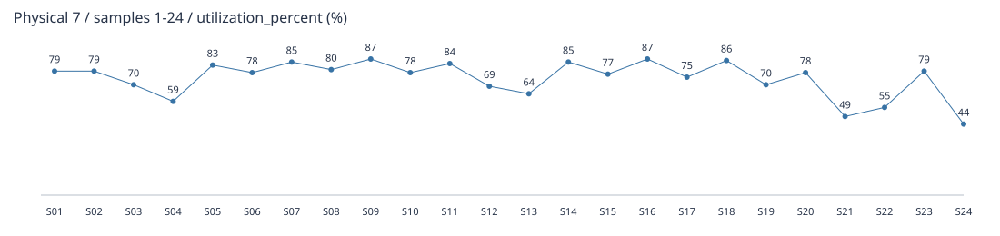

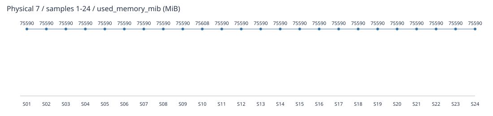

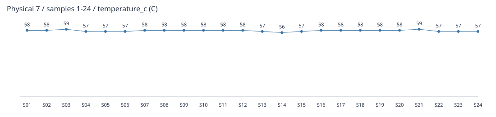

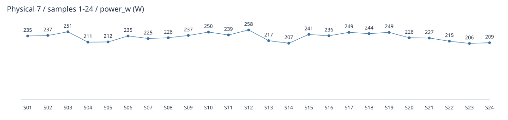

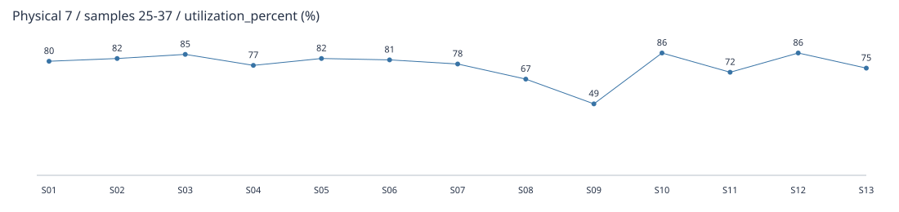

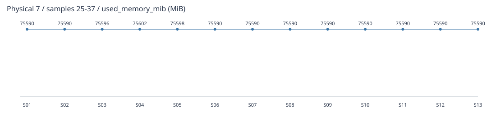

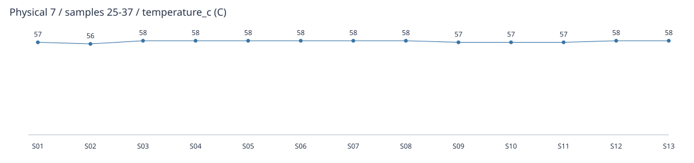

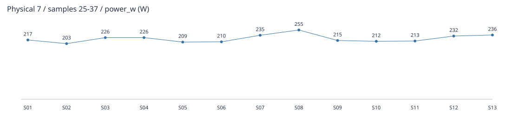

| 样本 | 开始偏移 s | 结束偏移 s | 有效 | 利用率 % | 显存 MiB | 温度 C | 功率 W | 错误 |
| --- | --- | --- | --- | --- | --- | --- | --- | --- |
| 1 | 0.000428 | 0.131843 | True | 79 | 75590 | 58.0 | 235.0 |  |
| 2 | 0.500585 | 0.617137 | True | 79 | 75590 | 58.0 | 237.0 |  |
| 3 | 1.000790 | 1.129711 | True | 70 | 75590 | 59.0 | 251.0 |  |
| 4 | 1.500921 | 1.616930 | True | 59 | 75590 | 57.0 | 211.0 |  |
| 5 | 2.001041 | 2.127475 | True | 83 | 75590 | 57.0 | 212.0 |  |
| 6 | 2.501167 | 2.612900 | True | 78 | 75590 | 57.0 | 235.0 |  |
| 7 | 3.001279 | 3.136509 | True | 85 | 75590 | 58.0 | 225.0 |  |
| 8 | 3.501425 | 3.633253 | True | 80 | 75590 | 58.0 | 228.0 |  |
| 9 | 4.001537 | 4.129081 | True | 87 | 75590 | 58.0 | 237.0 |  |
| 10 | 4.501669 | 4.644402 | True | 78 | 75608 | 58.0 | 250.0 |  |
| 11 | 5.001828 | 5.135973 | True | 84 | 75590 | 58.0 | 239.0 |  |
| 12 | 5.501965 | 5.637585 | True | 69 | 75590 | 58.0 | 258.0 |  |
| 13 | 6.002089 | 6.113152 | True | 64 | 75590 | 57.0 | 217.0 |  |
| 14 | 6.502230 | 6.636986 | True | 85 | 75590 | 56.0 | 207.0 |  |
| 15 | 7.002313 | 7.116196 | True | 77 | 75590 | 57.0 | 241.0 |  |
| 16 | 7.502495 | 7.617754 | True | 87 | 75590 | 58.0 | 236.0 |  |
| 17 | 8.002632 | 8.138876 | True | 75 | 75590 | 58.0 | 249.0 |  |
| 18 | 8.502700 | 8.639599 | True | 86 | 75590 | 58.0 | 244.0 |  |
| 19 | 9.002854 | 9.139976 | True | 70 | 75590 | 58.0 | 249.0 |  |
| 20 | 9.502985 | 9.637227 | True | 78 | 75590 | 58.0 | 228.0 |  |
| 21 | 10.003115 | 10.155002 | True | 49 | 75590 | 59.0 | 227.0 |  |
| 22 | 10.503216 | 10.628167 | True | 55 | 75590 | 57.0 | 215.0 |  |
| 23 | 11.003359 | 11.151372 | True | 79 | 75590 | 57.0 | 206.0 |  |
| 24 | 11.503559 | 11.629924 | True | 44 | 75590 | 57.0 | 209.0 |  |
| 25 | 12.003669 | 12.139325 | True | 80 | 75590 | 57.0 | 217.0 |  |
| 26 | 12.503818 | 12.622447 | True | 82 | 75590 | 56.0 | 203.0 |  |
| 27 | 13.003928 | 13.140685 | True | 85 | 75596 | 58.0 | 226.0 |  |
| 28 | 13.504092 | 13.645648 | True | 77 | 75602 | 58.0 | 226.0 |  |
| 29 | 14.004236 | 14.141745 | True | 82 | 75598 | 58.0 | 209.0 |  |
| 30 | 14.504475 | 14.633165 | True | 81 | 75590 | 58.0 | 210.0 |  |
| 31 | 15.004613 | 15.141193 | True | 78 | 75590 | 58.0 | 235.0 |  |
| 32 | 15.504737 | 15.649551 | True | 67 | 75590 | 58.0 | 255.0 |  |
| 33 | 16.005001 | 16.139319 | True | 49 | 75590 | 57.0 | 215.0 |  |
| 34 | 16.505110 | 16.654618 | True | 86 | 75590 | 57.0 | 212.0 |  |
| 35 | 17.005233 | 17.149736 | True | 72 | 75590 | 57.0 | 213.0 |  |
| 36 | 17.505353 | 17.618348 | True | 86 | 75590 | 58.0 | 232.0 |  |
| 37 | 18.005536 | 18.144895 | True | 75 | 75590 | 58.0 | 236.0 |  |
