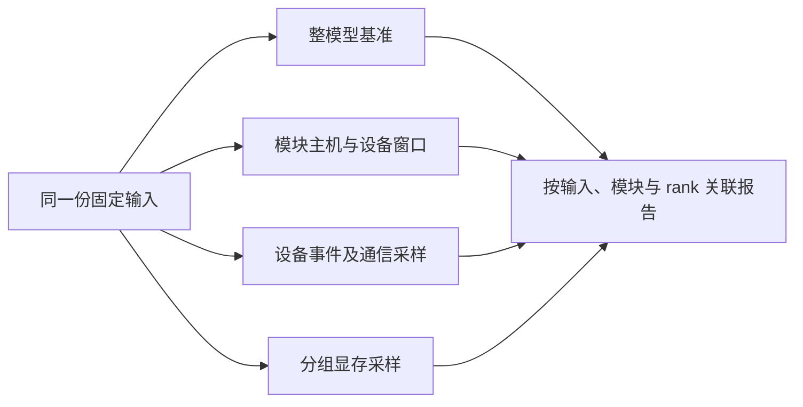

# 找到耗时层，并查看它的运行证据

[返回入门指南](../../inference/README.md) · [指标来源](metrics.md)

`performance --level layer` 在完整模型推理过程中观察你选择的模块。它先测量未插桩的整模型基准，再分别采集层时延、设备事件和显存；一次运行会多次执行模型，因此比 `--level total` 耗时更长。



图中四条分支表示独立重放，并非同时执行。整模型基准回答“整体处理多快”，其余分支帮助定位具体模块；不同重放的时间不能直接相加。

## 第一次逐层运行

按入门指南准备好 `config/local.yaml`，在 `inference` 目录执行。设备 0 仅为示例，输出目录必须不存在。

```bash
python3 run.py performance --config config/local.yaml --device 0 \
  --level layer --layers all --output result/layer-native
```

`all` 表示 Qwen3-Embedding-0.6B 的全部 28 个 Transformer block。也可以用真实模块名选择某几个模块，例如 `--layers layers.0 layers.0.self_attn layers.27`。父模块的统计包含子模块，父子耗时不能相加。

快速确认运行链路时可追加 `--warmup-rounds 1 --measure-rounds 3 --repeats 2`。正式默认是 5/30/3；一轮遍历完整输入集。`--layer-profile-rounds` 控制每次独立诊断的输入轮数，默认 1。短采样用于确认功能，小样本分位数按描述值阅读。

比较 FlagGems 时，使用当前执行身份下的策略：

```bash
python3 run.py performance --config config/local.yaml --device 0 \
  --level layer --layers all --flaggems both \
  --policy result/preview/preview/policy.yaml --output result/layer-compare
```

TP 在同样命令中以 `--parallelism tp --devices 0 1` 替代 `--device 0`，并换用同一 TP 环境的策略。FlagTree/FlagCX 对照沿用[进阶指南](advanced.md)的联合 preview，最多一个组件为 `both`。

## 从报告首页读到具体层

| 入口 | 先看什么 |
|---|---|
| `report.md` | 整模型变化、采样条件、采样扰动、需要关注的层 |
| `layer-index.md` | 指定模块、rank、输入 shape 的时延、显存和事件证据 |
| `layer-details.md` | 全部细表与来源说明 |
| `layer-view.json` | 可供程序读取的筛选视图 |
| `layer/summary.json` | 原始层级汇总，进一步指向各采集 worker |

主机窗口由模块 hooks 间的主机时钟给出；设备窗口由当前流上的 Event 给出，包含执行、等待和主机供给间隙。硬件 kernel、通信和拷贝由独立 profiler 关联，不能将设备窗口直接称为 kernel 时间。

层显存是模块执行窗口内**整个进程分配器**的占用与峰值。父子模块分组重放，避免一个模块重置峰值计数破坏另一个模块的观测。权重 storage、allocated、reserved 和窗口增量分别展示，不把它们相加作为总显存。

TP 按相同 rank、模块、调用及输入工作量配对；各 rank 局部时间不相加作为全局层时延。关联缺失显示 `partial` 或未知，不能用零补齐。实际调用计数可说明组件参与，硬件 kernel fallback 率仍未采集。

## 不重跑模型，切换阅读视图

```bash
# 从层级运行查看整模型基准。
python3 run.py report --source result/layer-compare --level total \
  --output result/total-view

# 只看逻辑 rank 0 上指定模块、指定实际输入 shape。
python3 run.py report --source result/layer-compare --level layer \
  --layers layers.0 --ranks 0 --shapes 4,256 --output result/selected-view

# 生成可搬走的报告与实体证据。
python3 run.py report --source result/layer-compare --level layer \
  --portable --output result/layer-package
```

筛选值必须在来源中存在，shape 从报告中的实际输入 shape 选择；示例 `4,256` 需按实际结果替换。筛选只改变层视图，整模型表仍表示来源运行的完整工作量。只有 total 证据的旧结果不能产生 layer 视图。

普通视图链接到来源目录，来源必须保留。`--portable` 将证据实体复制到新目录，并生成逐文件 SHA-256 的 `package-manifest.json`，可能需要较大磁盘空间。两种方式均保留来源不变，输出目录不能与来源相互包含。

## 重新解析已有 profiler 数据

```bash
python3 run.py report --source result/layer-compare --level layer \
  --reanalyze --output result/layer-reanalyzed
```

该命令隐含实体复制。已有 trace 在 CPU 上解析；trace 缺失但存在可识别的原始 Ascend 采集时，使用来源记录的镜像和驱动管理节点，在副本中尝试导出一次，上限 300 秒。普通报告视图不调用 Docker。

查看 `reanalysis.json` 中的解析结果。重新解析保留原执行状态，无法补出未执行的计时、显存或缺失 rank；这类情况需要按报告提供的命令重新采集。运行记录可能包含输入和机器路径，分享前由操作者检查。
